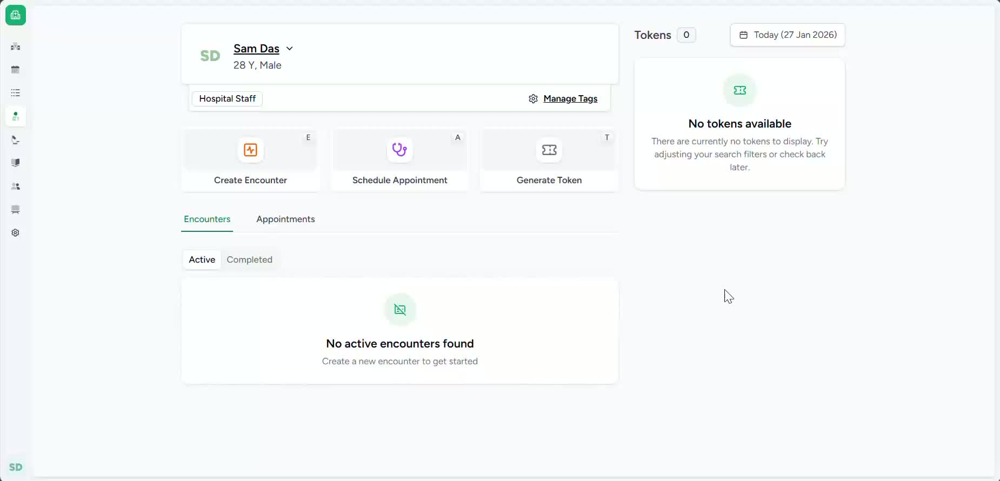
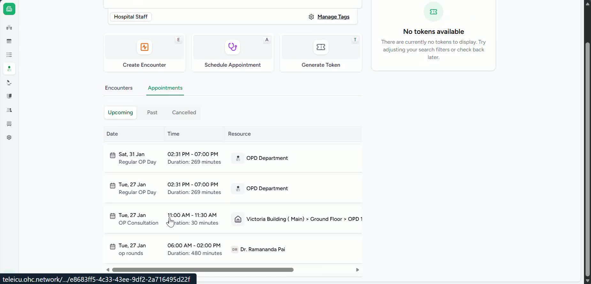
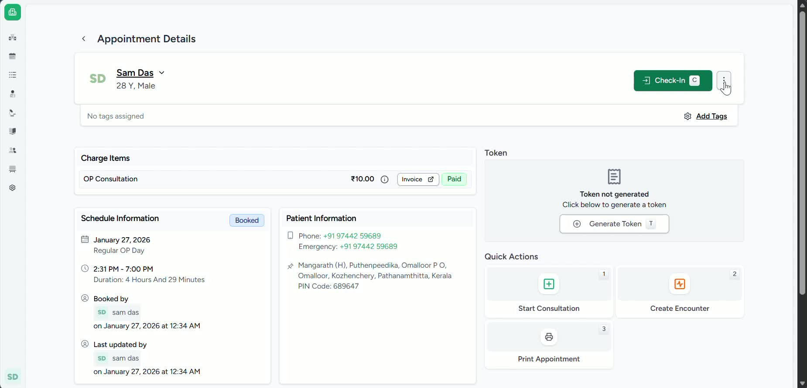
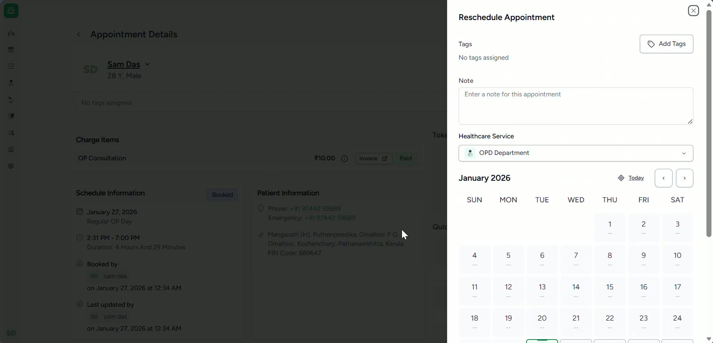
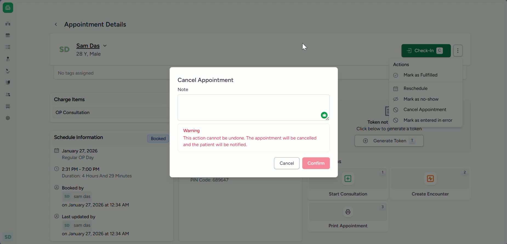

### Objective

This SOP explains how to cancel an appointment, reschedule an appointment, and check-in a patient from the patient homepage. It ensures staff can complete each action accurately and confirm the patient’s appointment status before consultation.

### Key Steps

**1. Open the Patient Homepage and Access Appointments** [0:00](https://loom.com/share/f74d82e13e014a17a467d4eb29cd9e2c?t=0)

- Navigate to the **patient homepage**.

- Click **Appointments** to view the patient’s scheduled visits.

- Use this area to manage appointment changes or patient check-in.

**2. Locate the Appointment to Modify** [0:14](https://loom.com/share/f74d82e13e014a17a467d4eb29cd9e2c?t=14)

- Review the list of **active appointments**.

- Find the appointment you need to **cancel** or **reschedule**.

- Use the **right-hand side** options for the selected appointment.

**3. Reschedule the Appointment** [0:25](https://loom.com/share/f74d82e13e014a17a467d4eb29cd9e2c?t=25)

- Click the **three dots** next to the appointment.

- Choose the option to **reschedule**.

- Select the new appointment date or the **next available slot**.

- Confirm the change when prompted.

**4. Cancel the Appointment** [0:39](https://loom.com/share/f74d82e13e014a17a467d4eb29cd9e2c?t=39)

- From the same **three-dot options menu**, select **Cancel Appointment**.

- Enter the **reason for cancellation** when prompted.

- Confirm the cancellation to complete the action.

- Verify that the appointment is removed or marked as cancelled.

**5. Check In the Patient** [1:03](https://loom.com/share/f74d82e13e014a17a467d4eb29cd9e2c?t=63)

- When the patient arrives at the facility, open the patient’s **appointment details page**.

- Click the **Check In** button.

- Confirm the patient is checked in and ready to be consulted.

### Cautionary Notes
- **Confirm the correct appointment** before rescheduling or cancelling to avoid errors.

- **Cancellation reasons** should be entered accurately, as they may be used for reporting or audit purposes.

- Ensure the patient is **physically present** before using the **Check In** function.

- Double-check the selected **date/time** when rescheduling to prevent booking conflicts.

### Tips for Efficiency
- Use the **three-dot menu** on the appointment row to quickly access reschedule and cancel actions.

- If rescheduling, choose the **next available slot** when appropriate to save time.

- Keep the patient’s appointment page open while making changes to reduce navigation steps.

- Verify the updated appointment status immediately after each action to ensure the system reflects the correct information.

### Link to Loom

[https://loom.com/share/f74d82e13e014a17a467d4eb29cd9e2c](https://loom.com/share/f74d82e13e014a17a467d4eb29cd9e2c)