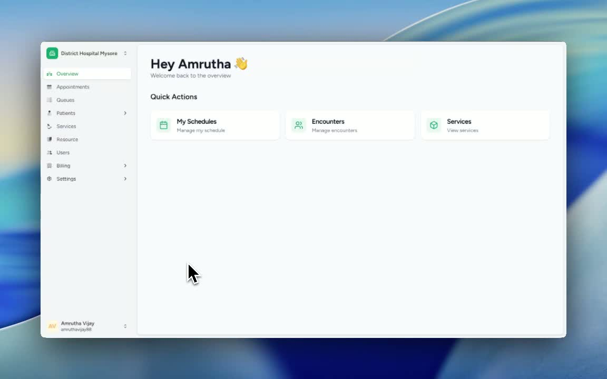
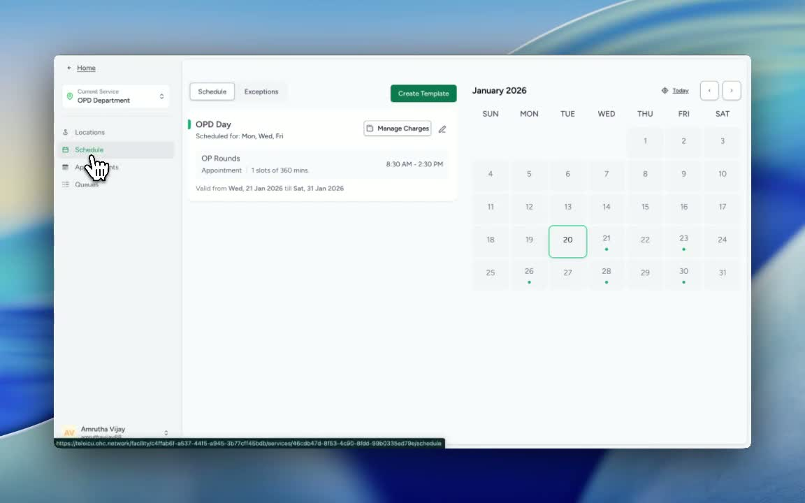
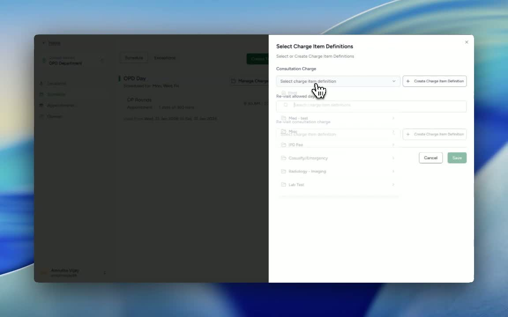
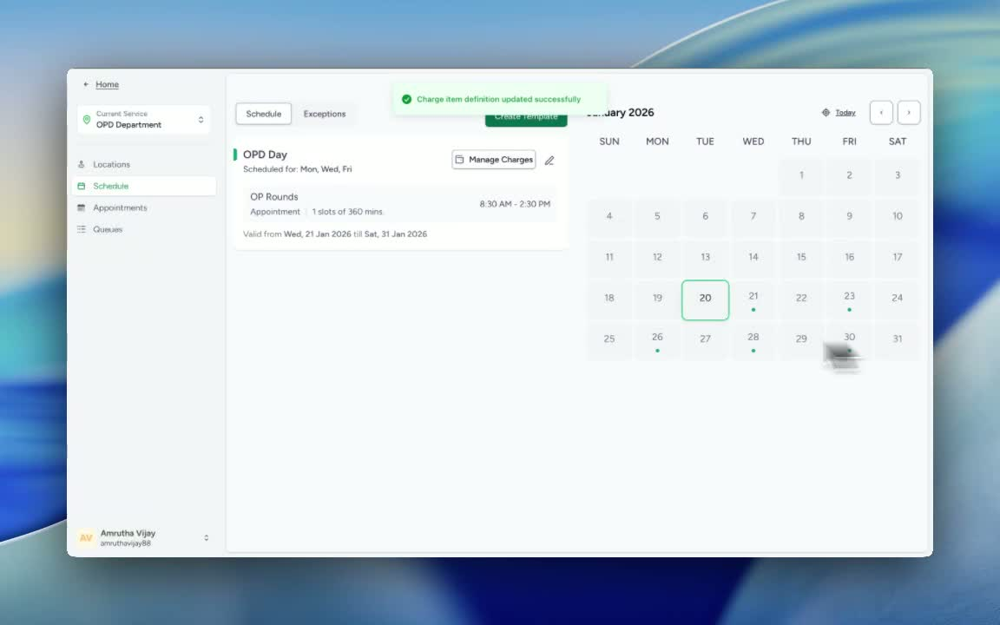

### Objective

This SOP explains how to link an existing charge item definition to a service’s schedule so charges can be applied correctly to appointments. It also covers the option to create a new charge item definition if needed.

### Key Steps

**1. Open the Relevant Service and Navigate to Schedule** [0:03](https://loom.com/share/a9982740383d48ad9a0c7aab04a26f21?t=3)

- Locate and select the **relevant service** you want to update.

- Open the **Schedule** section for that service.

- Confirm you are working in the correct service before making any charge-related changes.

**2. Access Manage Charges** [0:18](https://loom.com/share/a9982740383d48ad9a0c7aab04a26f21?t=18)

- In the **Schedule** area, find the option labeled **Manage Charges**.

- Click **Manage Charges** to open the charge configuration options.

- Review the available actions:

**Create a charge item definition**

- **Link an existing charge item definition**

**3. Link an Existing Charge Item Definition** [0:30](https://loom.com/share/a9982740383d48ad9a0c7aab04a26f21?t=30)

- Choose the option to **link an existing charge item definition**.

- Select the appropriate charge item from the available list (for example, the OP concentration charge item).

- If required, confirm any additional eligibility or hospital-list settings, such as allowing the item for a specific hospital list duration.

- Click **Save** to apply the selection.

**4. Confirm that the Charge item definition was updated** [0:47](https://loom.com/share/a9982740383d48ad9a0c7aab04a26f21?t=47)

- Verify that the system displays a success message.

- Confirm the charge item definition has been updated successfully.

- If the update does not save correctly, repeat the linking steps and ensure the correct charge item and settings were selected.

### Cautionary Notes
- Ensure you are editing the **correct service** before linking charges.

- Double-check the selected charge item definition to avoid linking the wrong charge.

- Review any hospital list or time-based restrictions carefully before saving.

- Do not proceed without confirming the update was saved successfully.

### Tips for Efficiency
- Have the correct charge item definition identified before opening **Manage Charges**.

- Use the existing charge item option when possible to save time instead of creating a new definition.

- Keep a record of which services have linked charge items for easier auditing and future updates.

- After saving, verify the success message immediately to confirm the change took effect.

### Link to Loom

[https://loom.com/share/a9982740383d48ad9a0c7aab04a26f21](https://loom.com/share/a9982740383d48ad9a0c7aab04a26f21)