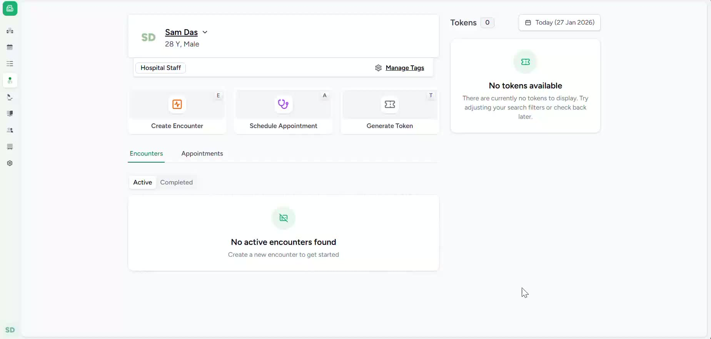
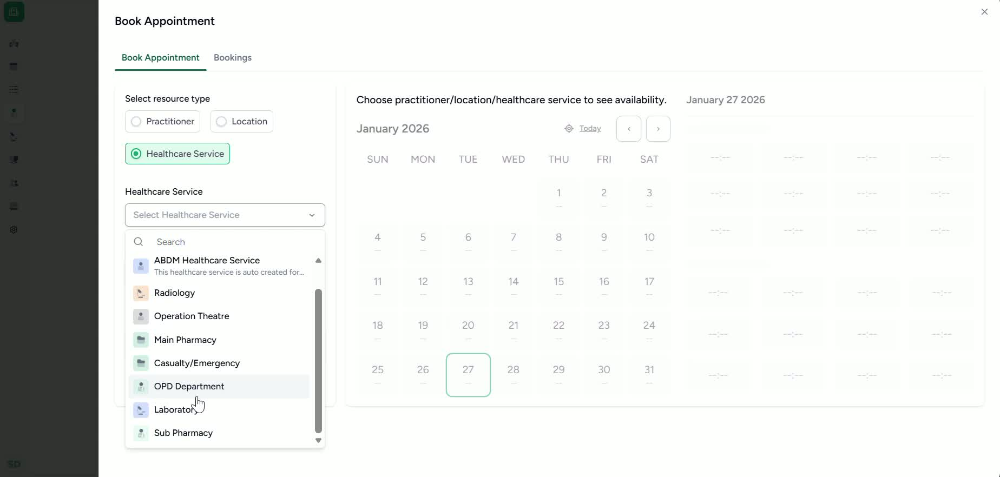

### Objective

To provide a clear, repeatable process for scheduling a patient appointment with a selected health care service in the facility. This SOP also covers confirming the appointment, billing the charges, and printing the appointment details.

### Key Steps

**1. Open the Patient Homepage and Start Appointment Scheduling** [0:00](https://loom.com/share/f2b32a67c968469bb55c23e3c619c2f6?t=0)

- Navigate to the **Patient Homepage**.

- Select **Schedule Appointment**.

- This begins the appointment booking workflow for the patient.

**2. Select the Health Care Service and Required Department** [0:19](https://loom.com/share/f2b32a67c968469bb55c23e3c619c2f6?t=19)

- Choose the appropriate **Health Care Service** from the available options.

- Use the drop-down menu to select the specific service that should be scheduled.

- In the example shown, the **OPD department** is selected.

- The system will automatically select the available slot after the service is chosen.

**3. Confirm the Appointment and Complete Follow-Up Actions** [0:19](https://loom.com/share/f2b32a67c968469bb55c23e3c619c2f6?t=19)

- Review the selected service and automatically assigned slot.

- Click **Confirm Appointment** to finalize the booking.

- After confirmation, the patient appointment is scheduled successfully.

- Proceed to **bill the charges** associated with the appointment.

- **Print the appointment details** for recordkeeping or patient reference.

### Cautionary Notes
- Verify that the correct patient profile is open before scheduling.

- Confirm the selected department/service carefully to avoid booking errors.

- Review the auto-selected slot before clicking **Confirm Appointment**.

- Ensure billing is completed after scheduling so charges are not missed.

- Print or save the appointment details according to facility policy.

### Tips for Efficiency
- Have the patient’s required service and department confirmed before starting.

- Use the auto-selected slot when appropriate to speed up scheduling.

- Keep billing and printing steps immediately after confirmation to reduce follow-up work.

- If your system supports it, use standardized service names to minimize selection errors.

### Link to Loom

[https://loom.com/share/f2b32a67c968469bb55c23e3c619c2f6](https://loom.com/share/f2b32a67c968469bb55c23e3c619c2f6)