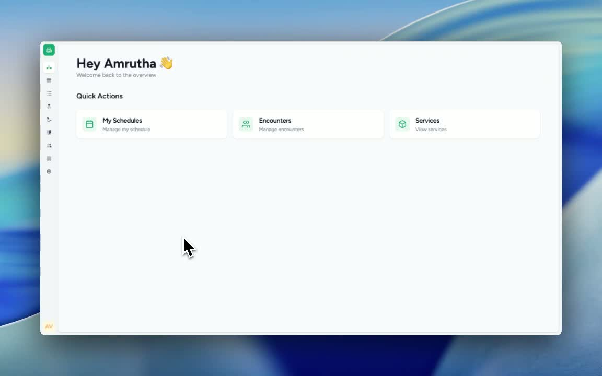
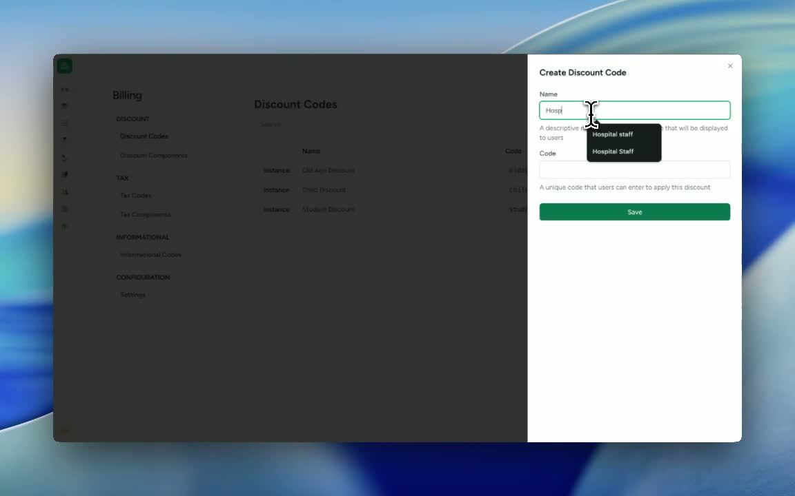
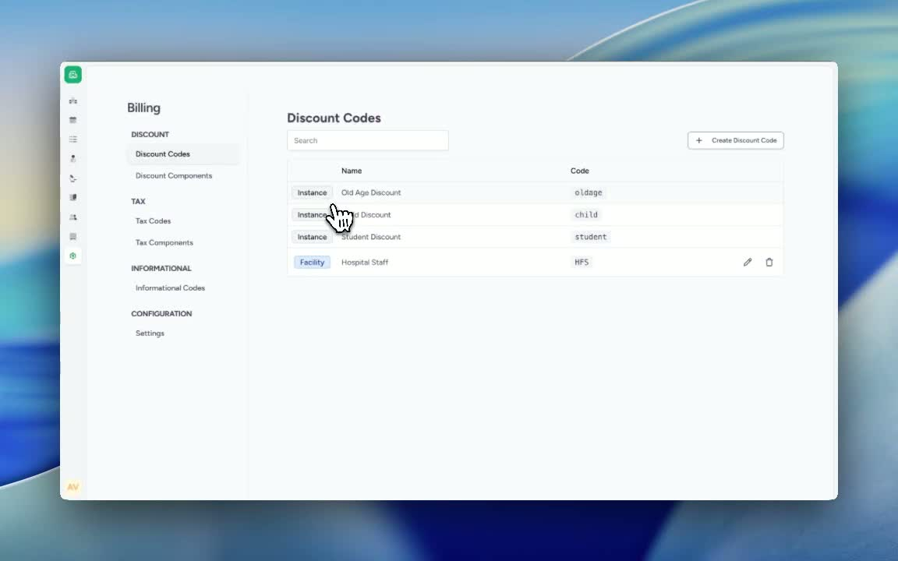
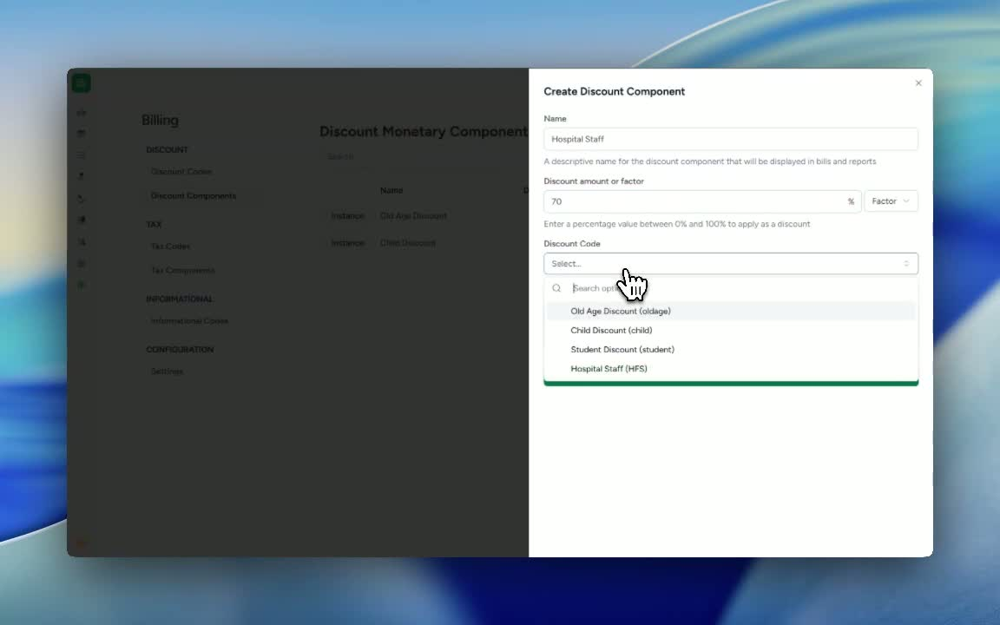

### ObjectiveThis SOP explains how to create a discount code and apply a discount component in the billing settings. It ensures that patients with the specified tag receive the correct discount automatically.

### Key Steps**1. Navigate to Billing Discount Settings** [0:03](https://loom.com/share/35fda1caa9294d8ab6c4f491da3b5ddb?t=3)

- Go to **Settings**.

- Open **Billing**.

- Locate the two discount-related sections:

**Discount Code**

- **Discount Components**

- Start by creating the discount code first.

**2. Create the Discount Code** [0:29](https://loom.com/share/35fda1caa9294d8ab6c4f491da3b5ddb?t=29)

- Select **Discount Code**.

- Click **Create Discount Code**.

- Enter a clear code name for the intended group.

Example: **Hospital Staff**

- Enter a short code for the same

Example: HSF

- Confirm that the discount code has been created successfully.

**3. Create the Discount Component** [0:44](https://loom.com/share/35fda1caa9294d8ab6c4f491da3b5ddb?t=44)

- Go to **Discount Components**.

- Click **Create Discount Component**.

- Enter the component name.

- Choose the discount type:

**Amount** if the discount is a fixed value

- **Factor** if the discount is a percentage

- For a 70% discount, select **Factor** and enter **70%**.

**4. Add the Discount Condition** [1:09](https://loom.com/share/35fda1caa9294d8ab6c4f491da3b5ddb?t=69)

- Open the discount code created earlier.

- Click **Add Condition**.

- Set the condition based on **Patient Tag**.

- Select the required tag:

Example: **Hospital Staff**

- Add the condition and save the configuration.

- Verify that patients with the **Hospital Staff** tag receive the assigned discount automatically.

### Cautionary Notes
- Ensure the discount code is created before configuring the discount component.

- Confirm the correct discount type is selected:

Use **Factor** for percentage-based discounts.

- Use **Amount** for fixed-value discounts.

- Double-check the patient tag name for accuracy, as the discount will only apply to matching tags.

- Save each step before moving to the next to avoid losing configuration changes.

### Tips for Efficiency
- Use consistent naming conventions for discount codes and components so they are easy to identify later.

- Keep a list of approved patient tags to reduce setup errors.

- Test the discount with a sample patient record after saving to confirm the rule works as expected.

- Standardize discount setup for common groups, such as staff or members, to speed up future configurations.

### Link to Loom[https://loom.com/share/35fda1caa9294d8ab6c4f491da3b5ddb](https://loom.com/share/35fda1caa9294d8ab6c4f491da3b5ddb)