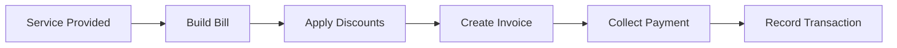

# Billing & Finance

Comprehensive guides for managing billing, invoicing, payments, and discount structures in the Care platform.

## Overview

Handle all financial operations including staff billing, invoice creation, payment collection, and discount code management.

---

## Available Guides

-   **Staff Billing & Payment**

    Complete workflow for building staff bills, creating invoices, and collecting payments.

    [:octicons-arrow-right-24: Read More](staff-billing-invoice-payment.md)

-   **Create Discount Code**

    Set up discount codes and components for hospital staff and special cases.

    [:octicons-arrow-right-24: Read More](create-discount-code.md)

---

## Billing Workflow

---

## Quick Stats

- **Total Guides**: 2
- **Topics Covered**: Invoicing, Payment Collection, Discounts
- **Supported Payment Methods**: Multiple payment modes

---

!!! tip "Discount Management"
    Create reusable discount codes for hospital staff, insurance schemes, or promotional offers to streamline billing operations.
