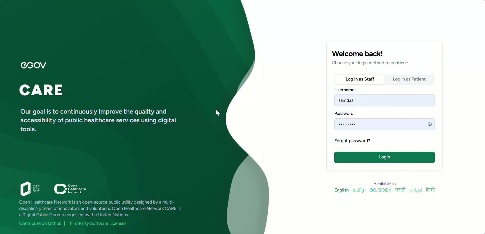
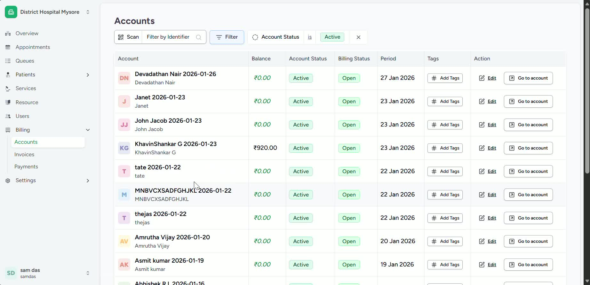
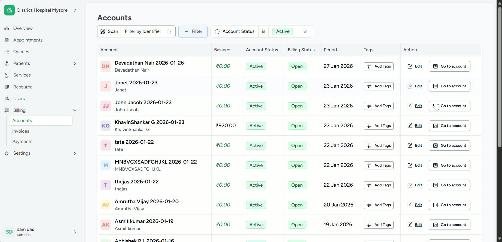
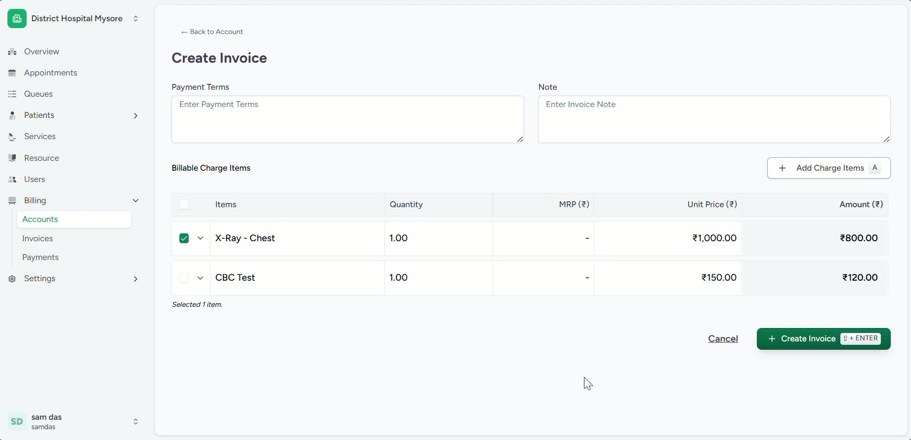
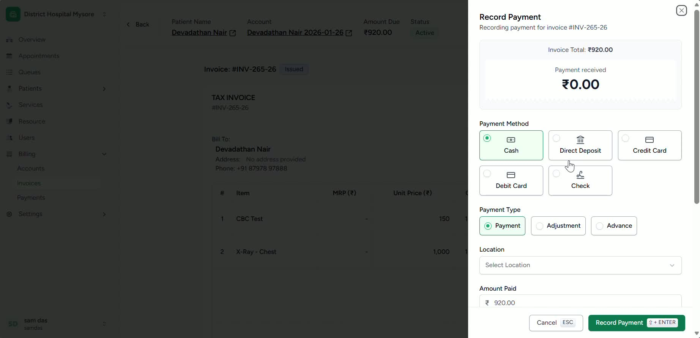
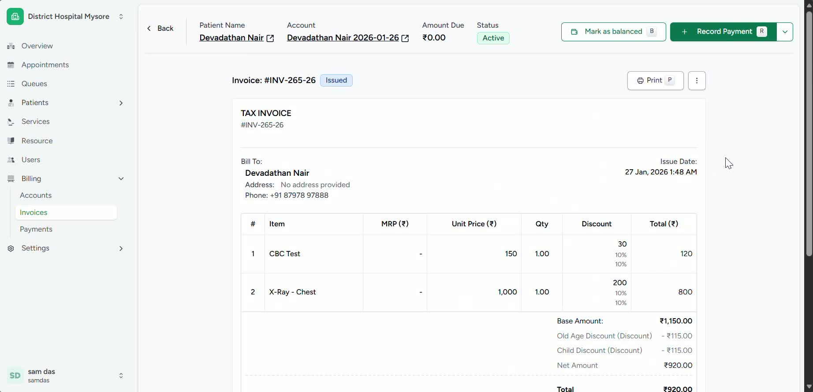

### Objective

This SOP explains how billing staff can access patient accounts, review billable items, create an invoice, collect payment, and mark the account as balanced. It ensures payments are processed accurately and receipts are issued to the patient.

### Key Steps

**1. Open the Billing menu and view billable patient accounts** [0:01](https://loom.com/share/602983df5a2b48fb8b2fd522faa81266?t=1)

- Log in to the system using your staff credentials.

- Navigate to **My Facility**.

- Open **Billing , Accounts **to view patients with outstanding charges.

- Confirm you are in the correct facility before proceeding.

**2. Select the patient account to review charges** [0:15](https://loom.com/share/602983df5a2b48fb8b2fd522faa81266?t=15)

- From the list of patients needing billing, select the appropriate patient.

- Open the patient’s account to review all pending charges.

- Verify the patient and service details before creating an invoice.

**3. Review charge items and choose what to bill** [0:25](https://loom.com/share/602983df5a2b48fb8b2fd522faa81266?t=25)

- Go to **Charge Items** within the patient account.

- Review the listed billable services, such as lab work or X-rays.

- Select the specific items that should be included in the invoice.

- If only some items should be billed, choose only those items before continuing.

**4. Create the invoice for the selected charges** [0:55](https://loom.com/share/602983df5a2b48fb8b2fd522faa81266?t=55)

- Click **Create Invoice** after selecting the desired charge items.

- Confirm the invoice includes the correct services and amounts.

- Ensure the invoice is generated successfully before collecting payment.

**5. Select the payment method in record payment** [1:08](https://loom.com/share/602983df5a2b48fb8b2fd522faa81266?t=68)

- Choose the payment method used by the patient.

- Available payment options may include cash or other methods supported by the system.

- Enter the payment details, including where the money was received if required.

- Click the record payment button which is the confirmation option to complete the transaction.

**6. Print the receipt and provide it to the patient** [1:20](https://loom.com/share/602983df5a2b48fb8b2fd522faa81266?t=80)

- After payment is recorded, the system will generate a receipt.

- Print the receipt.

- Give the printed receipt to the patient for their records.

**7. Mark the account as balanced and verify payment status** [1:39](https://loom.com/share/602983df5a2b48fb8b2fd522faa81266?t=99)

- Click **Mark as Balanced** once payment has been collected and the receipt issued.

- Return to the patient account to confirm the balance has been cleared.

- Verify the account now shows the payment as completed and the account as balanced.

### Cautionary Notes
- Confirm the correct patient is selected before creating an invoice or accepting payment.

- Review all charge items carefully to avoid billing for incorrect or unapproved services.

- Ensure the payment method entered matches the actual method used by the patient.

- **Do not mark the account as balanced** until payment has been successfully recorded and verified.

- Keep printed receipts secure and provide them only to the correct patient.

### Tips for Efficiency
- Review all charge items before creating the invoice to reduce corrections later.

- Use the correct payment method immediately to avoid payment reconciliation issues.

- Print the receipt right after payment is posted to streamline patient checkout.

- Verify the account balance before closing the patient record to prevent follow-up errors.

### Link to Loom

[https://loom.com/share/602983df5a2b48fb8b2fd522faa81266](https://loom.com/share/602983df5a2b48fb8b2fd522faa81266)