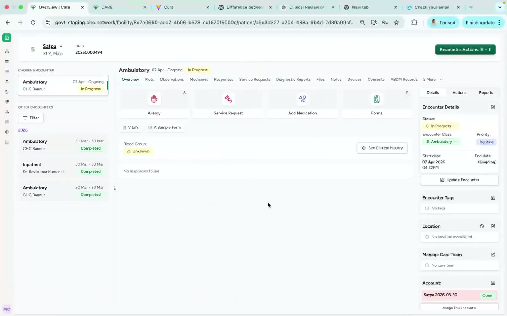
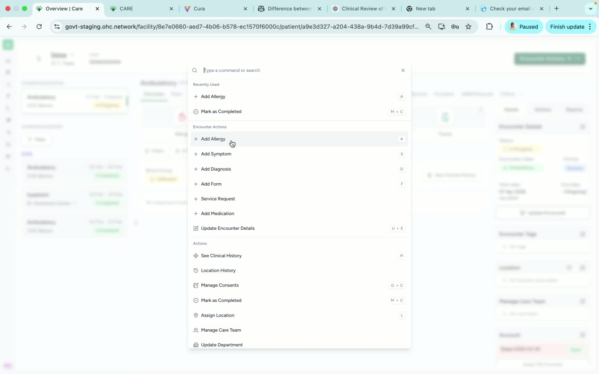
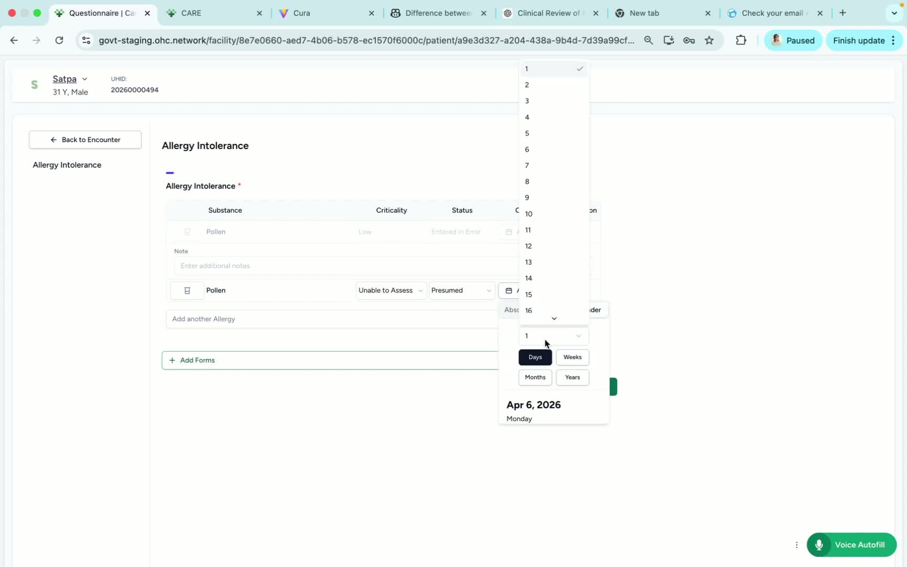
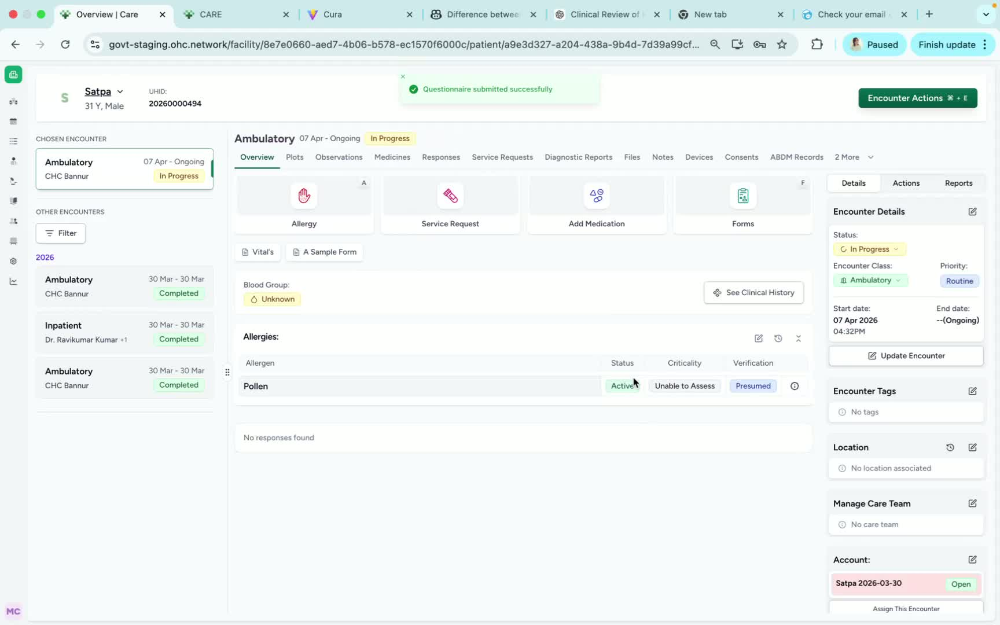

### ObjectiveThis SOP explains how to add an allergy to a patient’s record, including updating key allergy details and reviewing options to edit or remove the allergy afterward. 

### Key Steps**1. Open Encounter Actions and Select Add Allergy** [0:02](https://loom.com/share/b49ed5499bf345e3aa7f0f091bb7c7b7?t=2)

- From the patient encounter, click **Encounter Actions**.

- Select **Add Allergy** from the available options.

- This begins the allergy entry workflow for the patient.

**2. Choose the Allergy and Enter Allergy Details** [0:11](https://loom.com/share/b49ed5499bf345e3aa7f0f091bb7c7b7?t=11)

- Click the **allergy parameter** you want to add.

- Update the following fields as required:

**Criticality**

- **Status**

- **Date**

- Confirm the information is entered correctly before submitting.

**3. Review the Allergy Duration/Date Information** [0:25](https://loom.com/share/b49ed5499bf345e3aa7f0f091bb7c7b7?t=25)

- Verify how long the allergy has been present or how it is being displayed for the patient.

- In the example shown, the allergy appears as being present for **three days**.

- Use this step to confirm the date-related information is accurate before finalizing.

**4. Submit the Allergy and Review Edit/Remove Options** [0:35](https://loom.com/share/b49ed5499bf345e3aa7f0f091bb7c7b7?t=35)

- Submit the allergy to save it to the patient record.

- After submission, review whether the doctor or authorized user can:

Click **Edit** to update the allergy

- Remove the allergy if needed

- Use these options only if the workflow or requirement allows it.

### Cautionary Notes
- Ensure the correct allergy is selected before submitting; incorrect entries may affect patient safety.

- Verify **criticality**, **status**, and **date** carefully before saving.

- Only authorized users should edit or remove allergy information.

- If the system does not permit removal, follow your organization’s escalation or correction process.

### Tips for Efficiency
- Gather the allergy details before opening the encounter to reduce entry time.

- Double-check the selected allergy parameter to avoid rework.

- Use the edit option immediately after submission if a correction is needed and permitted.

- Keep documentation consistent by entering dates in the same format used by your organization.

### Link to Loom[https://loom.com/share/b49ed5499bf345e3aa7f0f091bb7c7b7](https://loom.com/share/b49ed5499bf345e3aa7f0f091bb7c7b7)