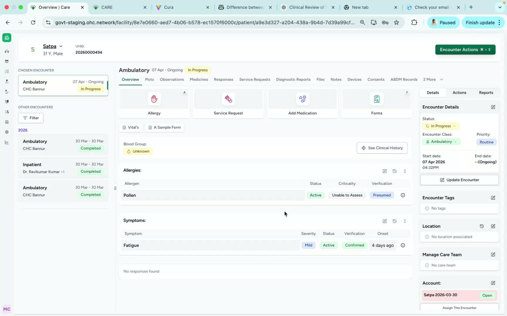
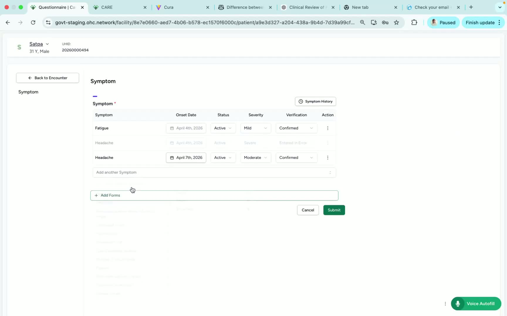
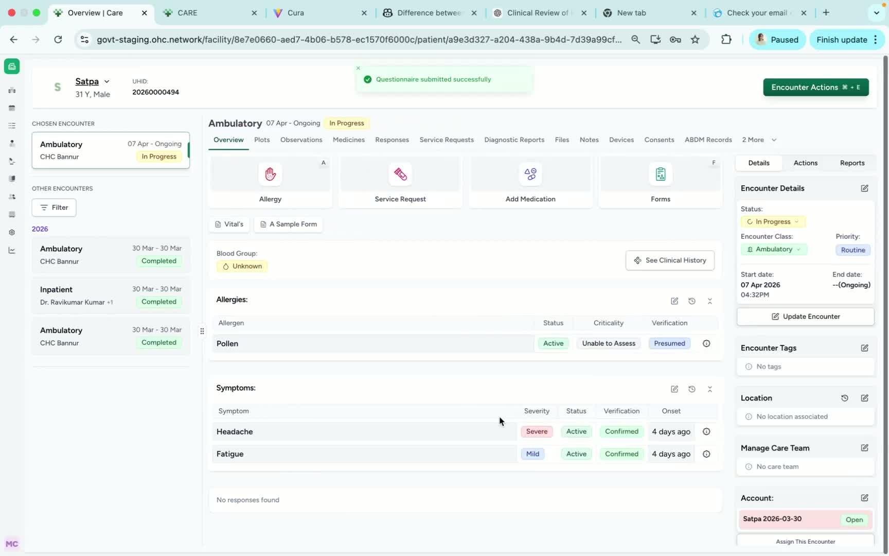

### Objective

This SOP explains how to add a symptom for a patient in Care and how to review or modify that symptom after it has been submitted. It ensures symptoms are documented accurately with the correct onset date, severity, and verification details.

### Key Steps

**1. Open Encounter Actions and select Add Symptom** [0:02](https://loom.com/share/91423608936a48c5b95723aafe08f825?t=2)

- Navigate to **Encounter Actions** for the patient.

- Select **Add Symptom** to begin documenting a new symptom.

- Confirm you are working in the correct patient chart before proceeding.

**2. Select Symptom Details and Submit** [0:12](https://loom.com/share/91423608936a48c5b95723aafe08f825?t=12)

- Choose the **respective symptom** from the available list.

- Enter the **onset date** to indicate when the symptom started.

- Complete the remaining fields, including:

**Severity**

- **Verification**

- Click **Submit** to save the symptom entry.

**3. Review the Saved Symptom and Edit if Needed** [0:30](https://loom.com/share/91423608936a48c5b95723aafe08f825?t=30)

- Verify that the symptom now appears in the patient’s record.

- Use the **Edit** button if changes are needed.

- From the edit option, the doctor can:

Update the symptom details

- Remove the symptom

- Add notes to the symptom

### Cautionary Notes
- Ensure the correct patient record is open before adding or editing symptoms.

- Double-check the onset date, severity, and verification fields before submitting.

- Only authorized clinical staff should edit or remove symptoms.

- Changes made after submission should be reviewed for accuracy and completeness.

### Tips for Efficiency
- Gather symptom details before opening the encounter to reduce entry time.

- Use the edit function immediately if you notice an error after submission.

- Add notes when needed to provide clinical context and reduce follow-up questions.

- Confirm the symptom appears in the record after submission to avoid duplicate entries.

### Link to Loom

[https://loom.com/share/91423608936a48c5b95723aafe08f825](https://loom.com/share/91423608936a48c5b95723aafe08f825)