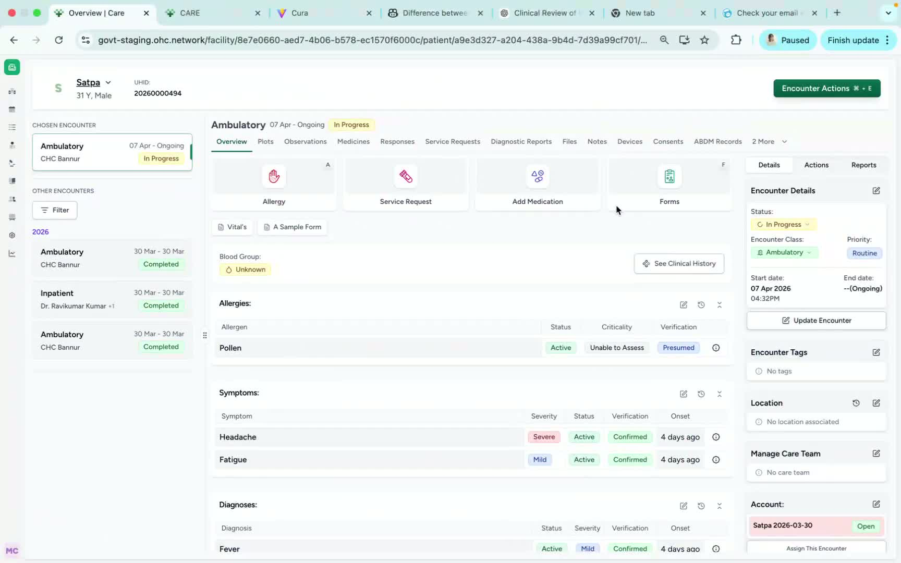
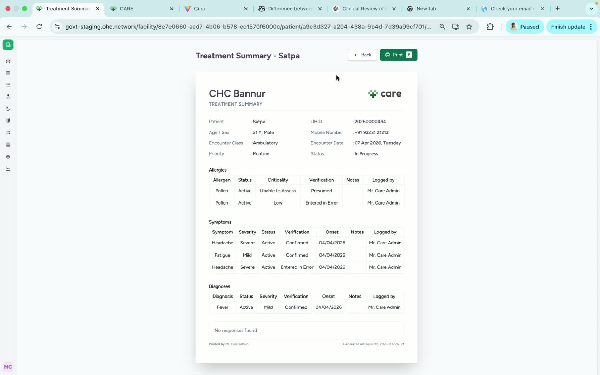

### ObjectiveThis SOP explains how to access the treatment summary from a patient’s dashboard in Care and print it for sharing with the patient. It ensures team members can quickly locate, review, and produce patient’s treatment summary accurately.

### Key Steps**1. Open the Patient Dashboard and Navigate to Reports** [0:02](https://loom.com/share/7af69724981b4c4bb8917d3b336eb268?t=2)

- Log in to Care and open the relevant **patient dashboard**.

- On the **right-hand side**, locate and click **Reports**.

- Confirm you are in the correct patient record before proceeding.

**2. Select the Treatment Summary Report** [0:02](https://loom.com/share/7af69724981b4c4bb8917d3b336eb268?t=2)

- In the Reports section, find the option labeled **Treatment Summary**.

- Click **Treatment Summary** to generate and display the patient’s treatment summary.

- Review the summary on-screen to ensure the correct information appears.

**3. Print or Share the Treatment Summary** [0:24](https://loom.com/share/7af69724981b4c4bb8917d3b336eb268?t=24)

- Use the **Print** option or click **P** if available to create a hard copy.

- Print the summary for patient sharing or recordkeeping as needed.

- Verify the printed copy is legible and complete before handing it to the patient.

### Cautionary Notes
- Ensure you are viewing the correct patient’s dashboard before generating the treatment summary.

- Confirm the summary has fully loaded before printing.

### Tips for Efficiency
- Keep the patient’s dashboard open while navigating to Reports to reduce search time.

- Use the print shortcut if available to speed up the process.

- Review the summary on-screen first to avoid printing the wrong report.

### Link to Loom[https://loom.com/share/7af69724981b4c4bb8917d3b336eb268](https://loom.com/share/7af69724981b4c4bb8917d3b336eb268)