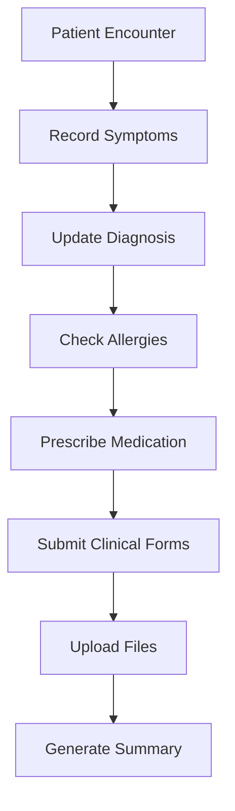

# Clinical Documentation & Treatment

Comprehensive clinical documentation guides covering diagnoses, symptoms, medications, allergies, clinical forms, and AI-powered tools.

## Overview

Maintain accurate and complete clinical records for patient care. This section covers all aspects of clinical documentation from diagnosis to treatment planning.

---

## Available Guides

### Diagnosis & Symptoms

-   **Update Diagnosis**

    Add and update patient diagnoses with ICD codes and details.

    [:octicons-arrow-right-24: Read More](update-diagnosis.md)

-   **Add/Update Symptoms**

    Record and manage patient symptoms during encounters.

    [:octicons-arrow-right-24: Read More](add-update-symptoms.md)

-   **Add/Update Allergies**

    Document patient allergies and adverse reactions for safety.

    [:octicons-arrow-right-24: Read More](add-update-allergy.md)

### Medication Management

-   **Prescribe Medication**

    Create medication prescriptions with dosage and frequency.

    [:octicons-arrow-right-24: Read More](prescribe-medication.md)

-   **View/Administer Medication**

    Track medication administration for inpatients.

    [:octicons-arrow-right-24: Read More](view-administer-medication.md)

### Documentation & Forms

-   **Submit Clinical Forms**

    Complete and submit structured clinical assessment forms.

    [:octicons-arrow-right-24: Read More](submit-clinical-forms.md)

-   **Upload Clinical Files**

    Attach lab reports, images, and documents to patient records.

    [:octicons-arrow-right-24: Read More](upload-clinical-files.md)

-   **Generate Treatment Summary**

    Create comprehensive treatment summaries for reference.

    [:octicons-arrow-right-24: Read More](generate-treatment-summary.md)

### AI-Powered Tools

-   **AI Scribe Voice Autofill**

    Use voice-to-text AI to speed up clinical documentation.

    [:octicons-arrow-right-24: Read More](ai-scribe-voice-autofill.md)

---

## Clinical Documentation Workflow

---

## Quick Stats

- **Total Guides**: 9
- **Topics Covered**: Diagnosis, Symptoms, Medications, Forms, AI Tools
- **Documentation Types**: Structured forms, Free text, Prescriptions, Files

---

!!! tip "AI Scribe Feature"
    Try the AI-powered voice autofill tool to dramatically speed up clinical documentation using voice commands!
