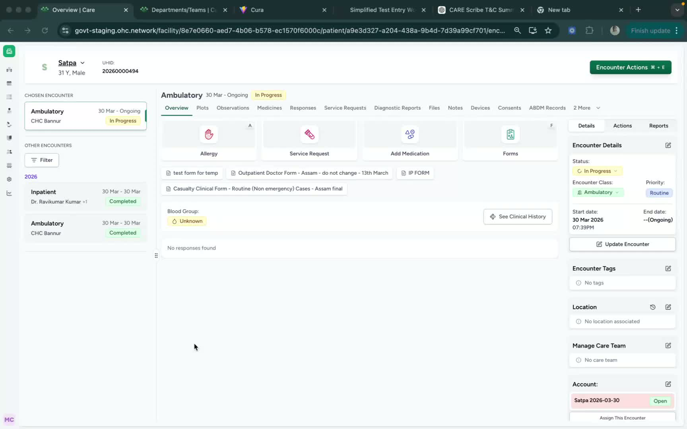
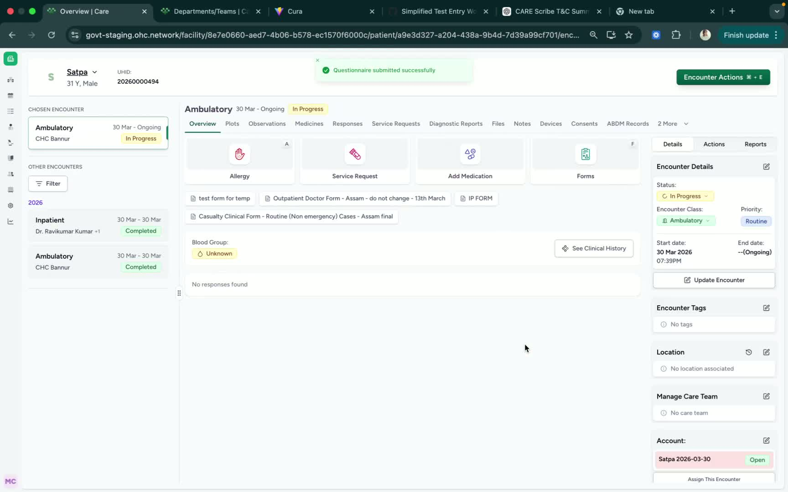

### Objective

This SOP explains how to prescribe medication from the patient encounter page in Care. The prescription will automatically be submitted to pharmacy. It also covers where to verify the medication after submission.

### Key Steps

**1. Open the Patient Encounter Page and Start a Medication Request** [0:01](https://loom.com/share/0c6c8b6eb6044771b166316ad980bd82?t=1)

- From the **Patient Encounter** page, click **Medication**.

- Under **Medication Request**, begin entering the prescription details.

**2. Enter Prescription Details** [0:01](https://loom.com/share/0c6c8b6eb6044771b166316ad980bd82?t=1)

- Type the **medicine name**.

- Enter the **dosage**.

- Update the **frequency** of administration.

- Specify the **number of days** the medication should be given.

- Add any **special notes or instructions** if needed.

**3. Submit the Medication Request** [0:01](https://loom.com/share/0c6c8b6eb6044771b166316ad980bd82?t=1)

- Review all entered prescription details for accuracy.

- Click **Submit** to send the medication request.

- Ensure the request is completed successfully before leaving the page.

**4. Verify the Prescription in Medicines** [0:25](https://loom.com/share/0c6c8b6eb6044771b166316ad980bd82?t=25)

- Go to **Medicines** to view the submitted prescription.

- Confirm the medication appears in the list.

- Use this area to verify that the order was created correctly.

**5. Confirm Pharmacy Receipt** [0:25](https://loom.com/share/0c6c8b6eb6044771b166316ad980bd82?t=25)

- The submitted medication request will go **directly to pharmacy**.

### Cautionary Notes
- **Verify patient identity** before submitting any medication request.

- Double-check the **medicine name, dosage, frequency, and duration** to avoid prescribing errors.

- Add notes only when necessary and ensure they are clear and clinically appropriate.

- Once submitted, the request is routed to pharmacy, so corrections may require a follow-up process.

### Tips for Efficiency
- Prepare all prescription details before opening the medication request to reduce errors.

- Use standardized medication naming and dosing conventions whenever possible.

- Review the order once before clicking **Submit** to avoid rework.

- Check **Medicines** immediately after submission to confirm the order was recorded correctly.

### Link to Loom

[https://loom.com/share/0c6c8b6eb6044771b166316ad980bd82](https://loom.com/share/0c6c8b6eb6044771b166316ad980bd82)