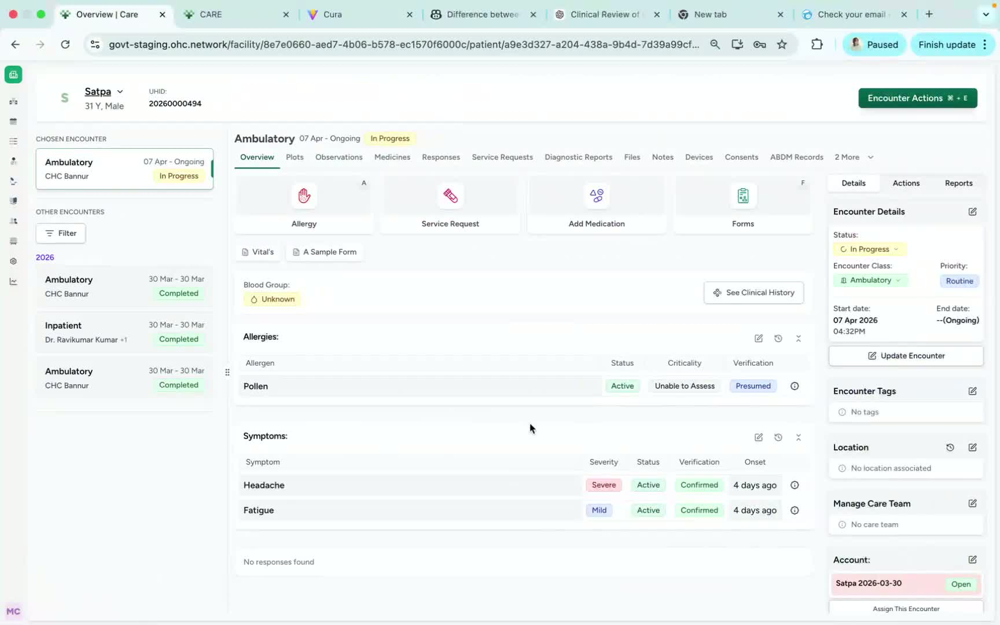
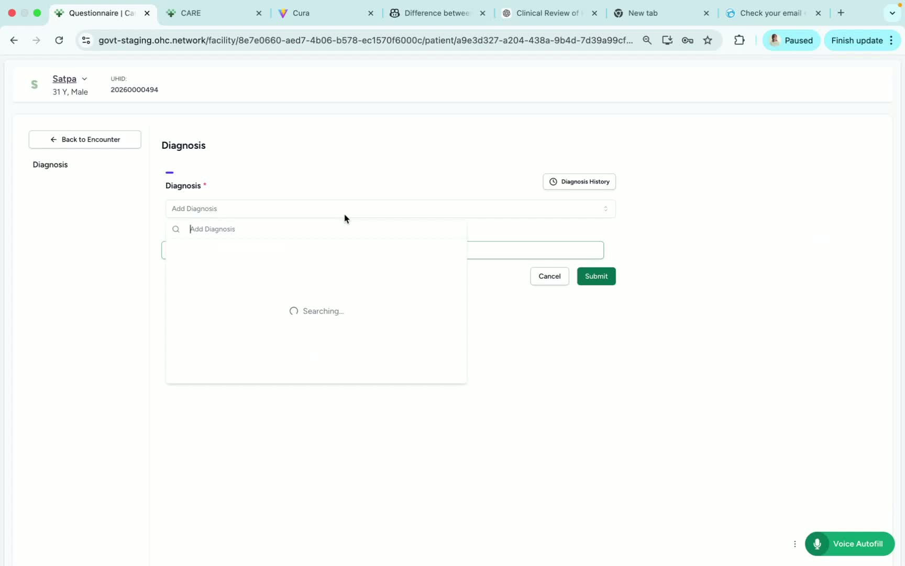
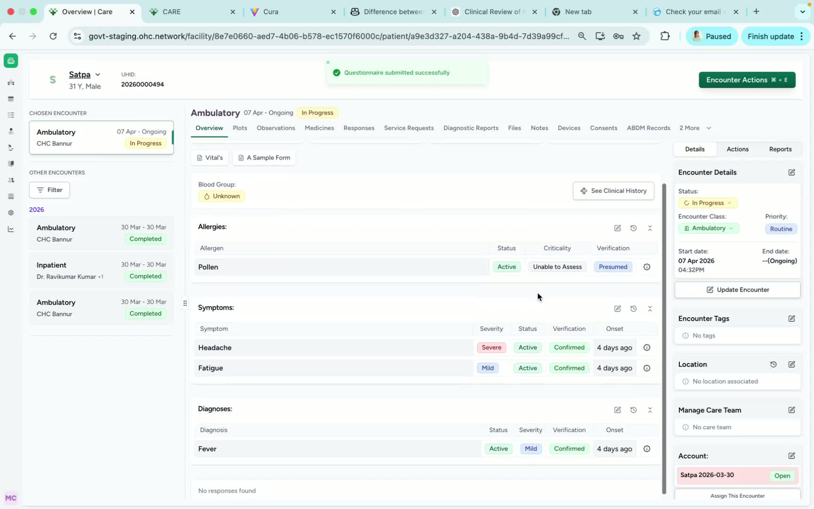

### ObjectiveThis SOP explains how to add or update a diagnosis for a patient in Care, including editing diagnosis details and managing notes or removal if needed. 

### Key Steps**1. Open Encounter Actions and start a new diagnosis update** [0:02](https://loom.com/share/870d7d55e55c44b681b69ce1a6528c44?t=2)

- Navigate to the patient’s encounter record.

- Click **Encounter Actions**.

- Select **Add Diagnosis** to begin updating the patient’s diagnosis.

**2. Select and update diagnosis details** [0:12](https://loom.com/share/870d7d55e55c44b681b69ce1a6528c44?t=12)

- In the **Diagnosis** field, choose the appropriate diagnosis from the drop-down list.

- Update any available fields as needed:

**Answer date**

- **Status**

- **Severity**

- **Notification**

- Review the information for accuracy.

- Submit the update once all required details are complete.

**3. Verify the diagnosis appears on the patient dashboard** [0:35](https://loom.com/share/870d7d55e55c44b681b69ce1a6528c44?t=35)

- Confirm the updated diagnosis displays on the patient dashboard.

- If changes are needed, click the **Edit** option next to the diagnosis.

- From the edit screen, you can:

Add notes

- Remove the diagnosis if it was entered in error or is no longer applicable

### Cautionary Notes
- Ensure the correct patient chart is open before making any diagnosis changes.

- Verify the selected diagnosis and all updated fields before submitting to avoid documentation errors.

- Only remove a diagnosis if it is clinically appropriate and permitted by your organization’s workflow.

- Make sure any notes added are clear, accurate, and compliant with documentation standards.

### Tips for Efficiency
- Gather the diagnosis details before opening the encounter to reduce time spent navigating fields.

- Use the dashboard verification step immediately after submission to confirm the update saved correctly.

- Add notes at the same time as the diagnosis update when possible to avoid returning later.

- If multiple diagnosis updates are needed, complete and review each one before moving to the next.

### Link to Loom[https://loom.com/share/870d7d55e55c44b681b69ce1a6528c44](https://loom.com/share/870d7d55e55c44b681b69ce1a6528c44)