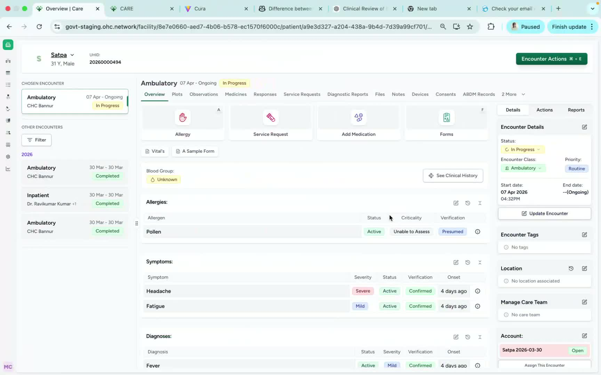
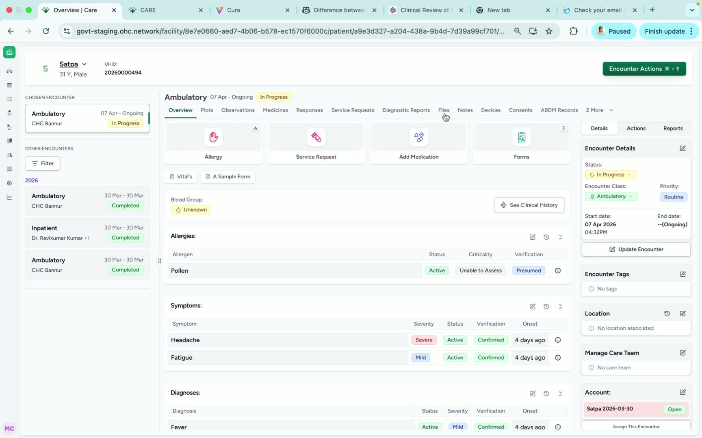
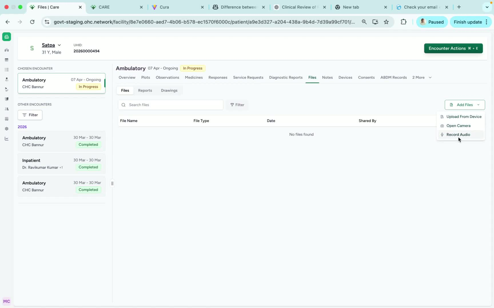
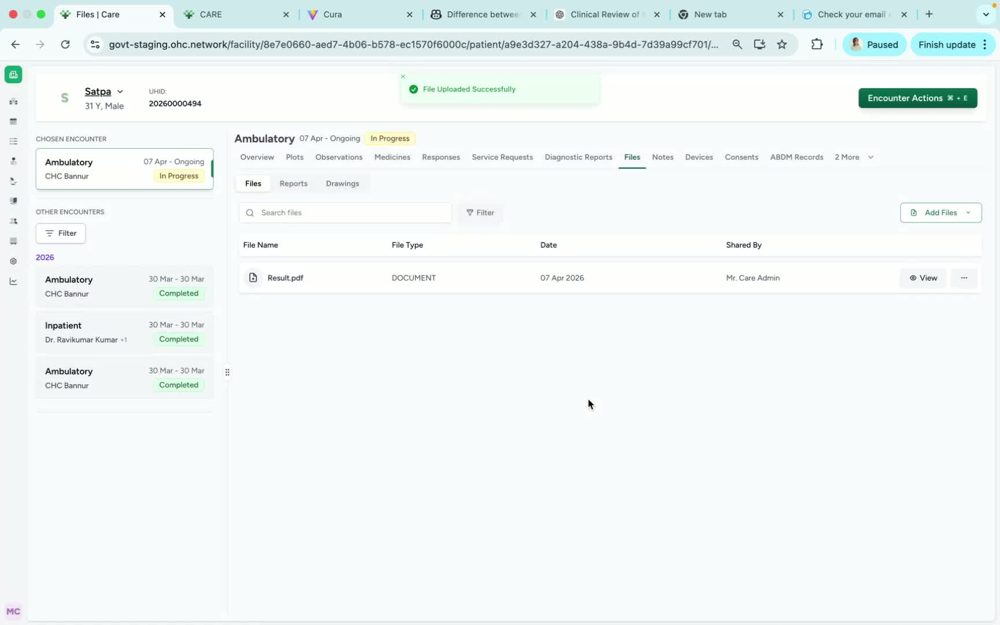

### Objective

This SOP explains how to upload clinical files into Care. It ensures team members can add documents correctly using the available upload options and save them with an appropriate file name.

### Key Steps

**1. Open the Files Section in the Patient Dashboard** [0:03](https://loom.com/share/47df51fd00174d77afb6aab72b03c6a9?t=3)

- From the **patient dashboard**, locate the **Files** option at the top.

- Click **Files** to open the file management area.

- Confirm you are in the correct patient record before proceeding.

**2. Select Add Files** [0:13](https://loom.com/share/47df51fd00174d77afb6aab72b03c6a9?t=13)

- In the Files section, find the **Add Files** option.

- Click **Add Files** to view the available upload methods.

- Review the three available options before choosing the correct one for your task.

**3. Choose the Upload Method** [0:22](https://loom.com/share/47df51fd00174d77afb6aab72b03c6a9?t=22)

- Select one of the available methods:

**Record with audio**

- **Open camera and upload**

- **Upload from device**

- For an existing document saved on your computer or device, choose **Upload from device**.

- Select the relevant document from your device when prompted.

**4. Name and Upload the Document** [0:49](https://loom.com/share/47df51fd00174d77afb6aab72b03c6a9?t=49)

- After selecting the file, enter an **appropriate document name**.

- Verify the file name is clear and descriptive for future reference.

- Complete the upload process.

- Confirm the file appears in Care after upload is finished.

### Cautionary Notes
- Ensure you are uploading the file to the **correct patient record** before proceeding.

- Use a **clear and appropriate file name** so the document can be easily identified later.

- Double-check that the selected file is the correct clinical document before uploading.

- If using camera or audio options, make sure the content captured is complete and readable/audible.

### Tips for Efficiency
- Prepare the file name before starting the upload to save time.

- Keep frequently used clinical documents organized on your device for faster selection.

- Use **Upload from device** for already saved documents to complete the process quickly.

- Verify the upload immediately after completion to avoid duplicate uploads or missing files.

### Link to Loom

[https://loom.com/share/47df51fd00174d77afb6aab72b03c6a9](https://loom.com/share/47df51fd00174d77afb6aab72b03c6a9)