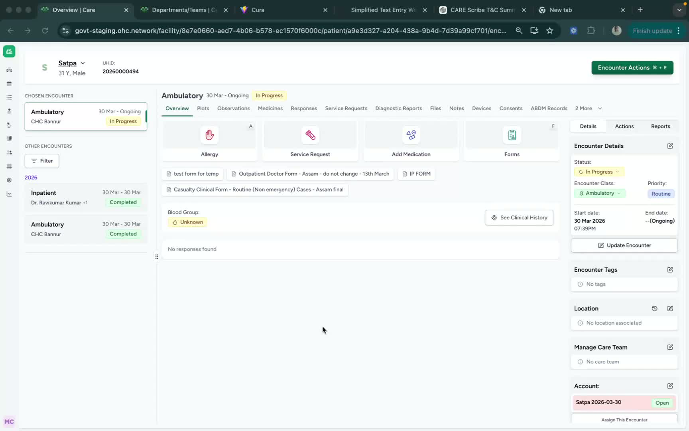
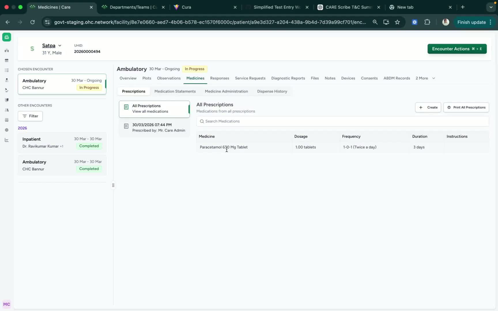
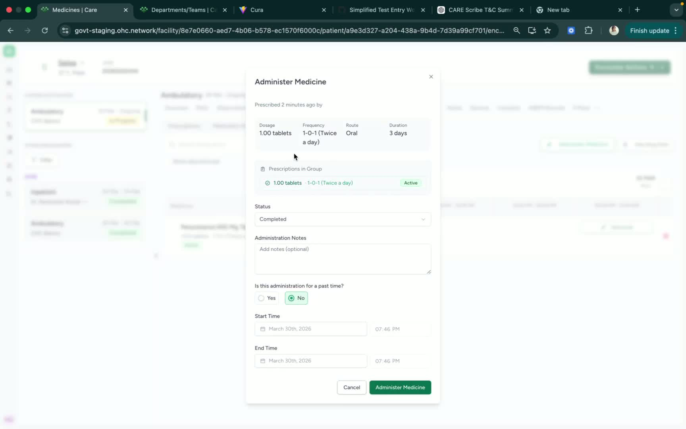
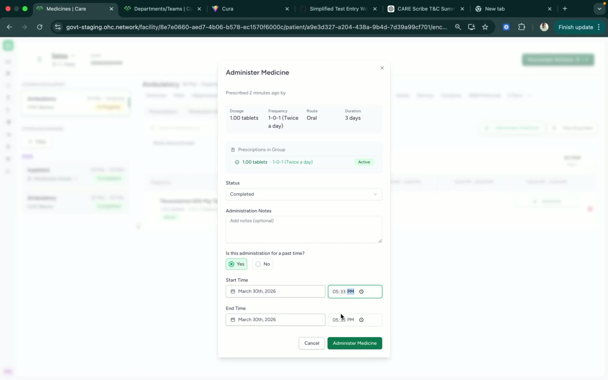

### ObjectiveTo provide a clear, repeatable process for viewing a patient’s prescription and recording medication administration in the Care typically for an inpatient encounter. This SOP ensures medication status and administration times are documented accurately.

### Key Steps
- In the patient dashboard, navigate to **Medicines** section on top.

- Use this section to access prescription details and medication administration options.

**2. Access Medicine Administration** [0:12](https://loom.com/share/ea28f3780a4a4dd489485e83af924437?t=12)

- Review the prescription details displayed on the screen.

- Locate the option labeled **Medicine Administration**.

- Click **Medicine Administration**, then select the **Administer** button to begin recording the medication event.

**3. Review Prescription Details and Update Status** [0:22](https://loom.com/share/ea28f3780a4a4dd489485e83af924437?t=22)

- Confirm the **dosage prescription** and current **status** shown on the administration screen.

- Update the status as needed to reflect the correct administration outcome.

- Ensure the selected status matches the actual medication event being recorded.

**4. Record Past Administration Time if Needed** [0:46](https://loom.com/share/ea28f3780a4a4dd489485e83af924437?t=46)

- If the medication was given at a **past time**, select **Yes** for the same.

- Enter the exact time the medication was administered (for example, **5:30 PM**).

- If applicable, enter the end time as well (for example, **6:00 PM**).

- Verify the time entries before saving.

**5. Submit the Administration Record** [0:46](https://loom.com/share/ea28f3780a4a4dd489485e83af924437?t=46)

- After confirming the dosage, status, and administration time, click **Administer Medicine**.

- This saves the record and documents the time the prescription was administered.

- This is particularly useful in recording details of medicine administration for inpatients. 

### Cautionary Notes
- Always verify the prescription details before submitting the administration record.

- Enter the administration time accurately, especially when documenting a past event.

- Make sure the status selected reflects the actual medication action taken.

- Do not submit the record until all required fields are complete.

### Tips for Efficiency
- Keep the patient’s medication time handy before opening the administration screen.

- Double-check dosage and status together to reduce documentation errors.

- Use a consistent time format when entering administration times.

- Confirm the record immediately after submission to ensure it saved correctly.

### Link to Loom[https://loom.com/share/ea28f3780a4a4dd489485e83af924437](https://loom.com/share/ea28f3780a4a4dd489485e83af924437)