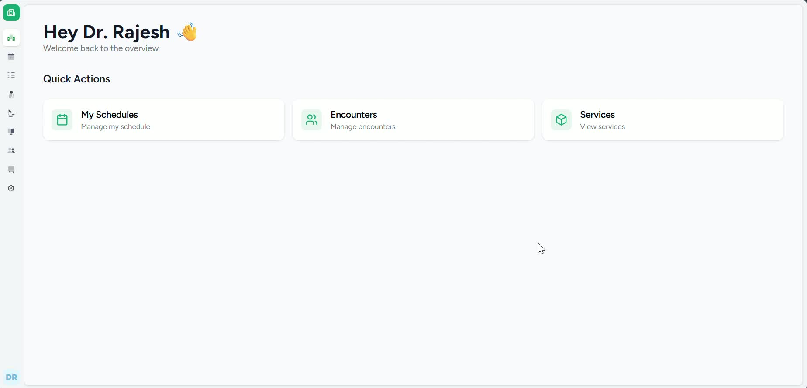
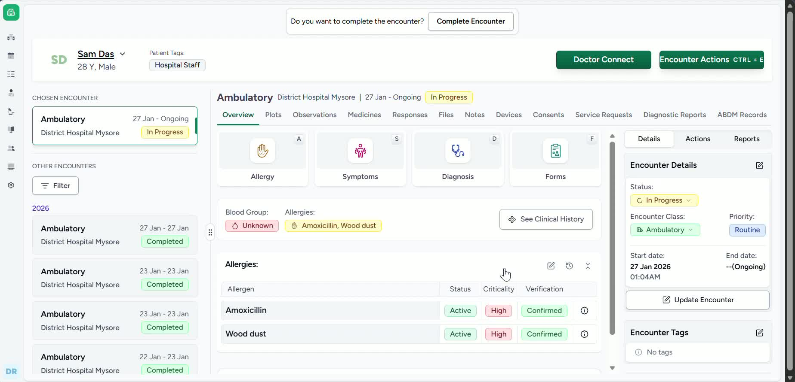
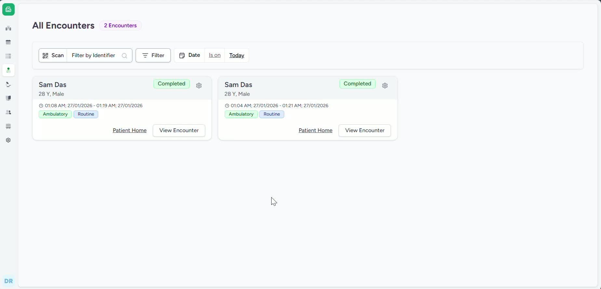
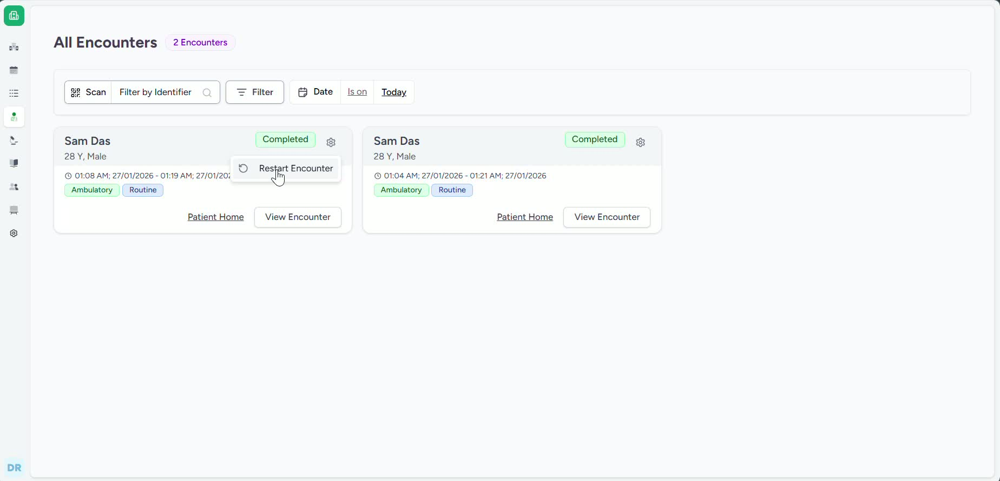

### ObjectiveThis SOP explains how a doctor can locate a patient encounter from the encounter list, complete the encounter, and restart a completed encounter when needed. It is intended to help team members perform these actions accurately and consistently.

### Key Steps**1. Access the patient encounter list** [0:10](https://loom.com/share/9d9df587b84e4b3a93b52c2a88e4acdc?t=10)

- Log in as a doctor.

- Navigate to **Patients**.

- Select **All Encounters**.

- Locate the patient encounter you need to work on from the list.

**2. Open the encounter and complete it** [0:24](https://loom.com/share/9d9df587b84e4b3a93b52c2a88e4acdc?t=24)

- Select the relevant patient encounter.

- Review the encounter details.

- Click **Complete Encounter** or the **End Action** button at the top of the page.

- Confirm the action if prompted.

- The system will load and close the encounter.

**3. Restart a completed encounter** [0:44](https://loom.com/share/9d9df587b84e4b3a93b52c2a88e4acdc?t=44)

- Open the **Completed Encounter** card.

- Click the **Settings** icon on the card.

- Select **Restart Encounter**.

- The encounter will reopen so patient details can be updated if needed.

**4. Verify restart availability and update details** [0:59](https://loom.com/share/9d9df587b84e4b3a93b52c2a88e4acdc?t=59)

- Confirm the encounter is eligible for restart, as the option is only available in specific cases.

- After restarting, update patient details as required.

- Save any changes before exiting the encounter.

### Cautionary Notes
- **Complete Encounter** should only be used when the encounter is truly finished.

- The **Restart Encounter** option is not available for every completed encounter; it appears only in specific situations.

- After restarting an encounter, review patient information carefully before making updates.

- Ensure you are logged in with the correct doctor role before attempting these actions.

### Tips for Efficiency
- Use the **All Encounters** view to quickly find the correct patient record.

- Check the encounter status first so you know whether to complete or restart it.

- If you frequently work with completed encounters, use the **Settings** icon to access available actions faster.

- Update patient details immediately after restarting to avoid missing required changes.

### Link to Loom[https://loom.com/share/9d9df587b84e4b3a93b52c2a88e4acdc](https://loom.com/share/9d9df587b84e4b3a93b52c2a88e4acdc)