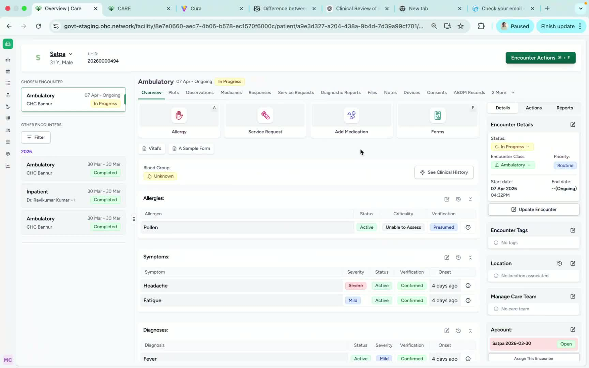
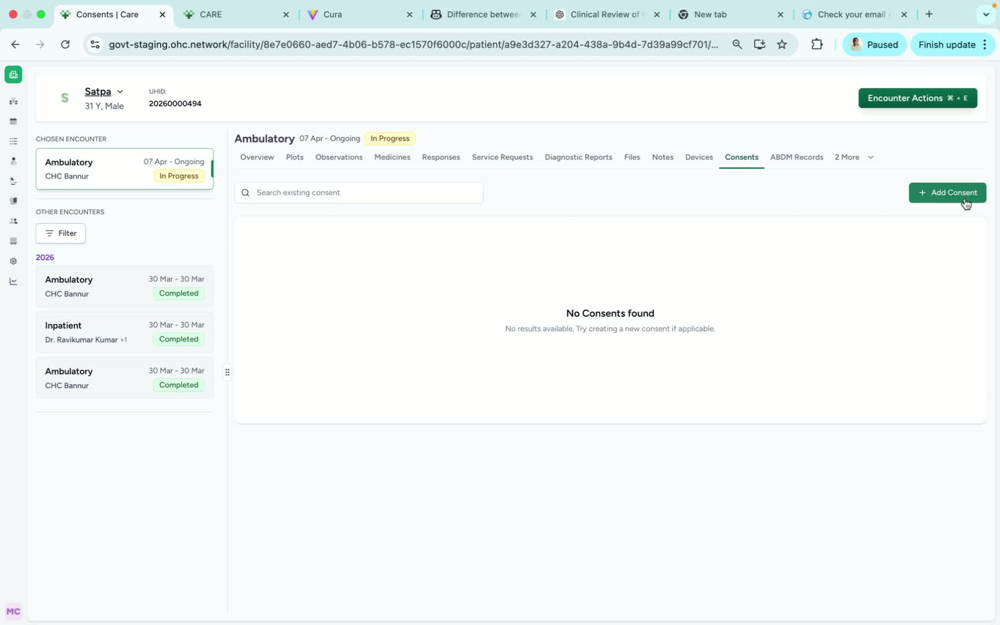
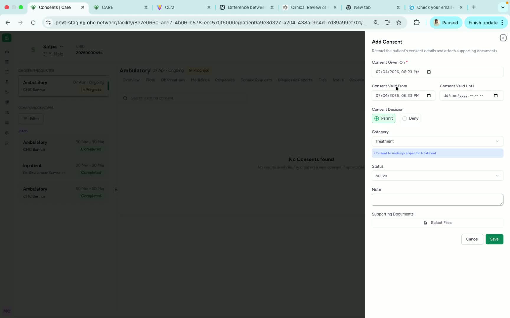
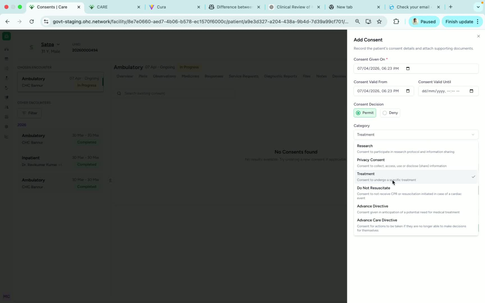
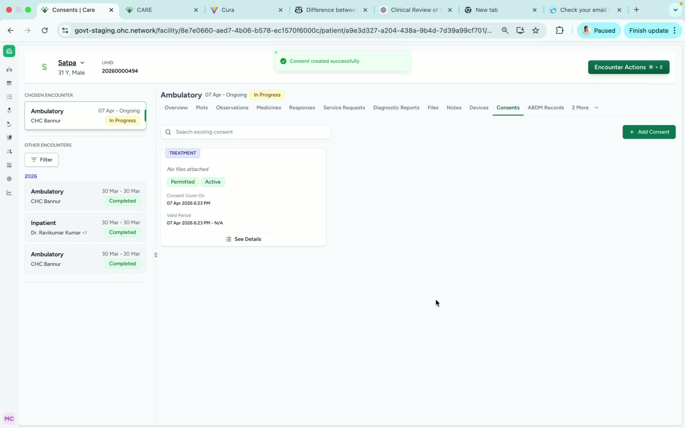

### ObjectiveThis SOP explains how to record a patient’s consent in the Care patient dashboard. It ensures the consent record is entered accurately, including consent date, category, status, notes, and supporting files when needed.

### Key Steps**1. Open the Patient Consent section** [0:02](https://loom.com/share/f9151363487541a89fc72722a257a35f?t=2)

- From the **Patient Dashboard**, locate the **Consent** option.

- Click **Consent** to open the patient consent area.

- Confirm you are working in the correct patient record before proceeding.

**2. Start a new consent entry** [0:13](https://loom.com/share/f9151363487541a89fc72722a257a35f?t=13)

- Click the **Add Consent** button.

- Begin entering the consent details in the form that appears.

- Make sure you are adding a new consent record, not editing an unrelated entry.

**3. Enter the consent date and validity period** [0:24](https://loom.com/share/f9151363487541a89fc72722a257a35f?t=24)

- Enter the **date the consent was given**.

- If applicable, update the **valid from / valid till** dates.

- Note that the validity period is **optional** and does not have to be completed if not required.

**4. Record consent decision and category** [0:47](https://loom.com/share/f9151363487541a89fc72722a257a35f?t=47)

- Select the **consent decision**:

**Permitting** or **Denying** the consent.

- Choose the correct **consent category**:

**Research**

- **Privacy**

- **Treatment**

- In this example, the consent is for a **specific treatment**.

**5. Add status, notes, and supporting files** [0:47](https://loom.com/share/f9151363487541a89fc72722a257a35f?t=47)

- Update the **status** of the consent record as needed.

- Add any relevant **notes** to provide context or clarification.

- Attach any **files** if supporting documentation is required.

**6. Save the consent record** [1:01](https://loom.com/share/f9151363487541a89fc72722a257a35f?t=61)

- Review all entered details for accuracy.

- Click **Save** to store the patient consent record.

- Confirm the consent has been successfully updated in Care.

### Cautionary Notes
- Ensure you are in the correct patient profile before adding consent.

- The consent date should reflect the actual date the patient gave consent.

- Only complete the validity dates if they are relevant to the consent record.

- Select the correct consent category to avoid documentation errors.

- Attach files only when supporting documentation is needed and available.

### Tips for Efficiency
- Gather all consent details before opening the form to reduce back-and-forth.

- Use notes to capture any special conditions or clarifications in one place.

- Attach supporting documents at the time of entry so the record is complete.

- Double-check the consent decision and category before saving to avoid corrections later.

### Link to Loom[https://loom.com/share/f9151363487541a89fc72722a257a35f](https://loom.com/share/f9151363487541a89fc72722a257a35f)