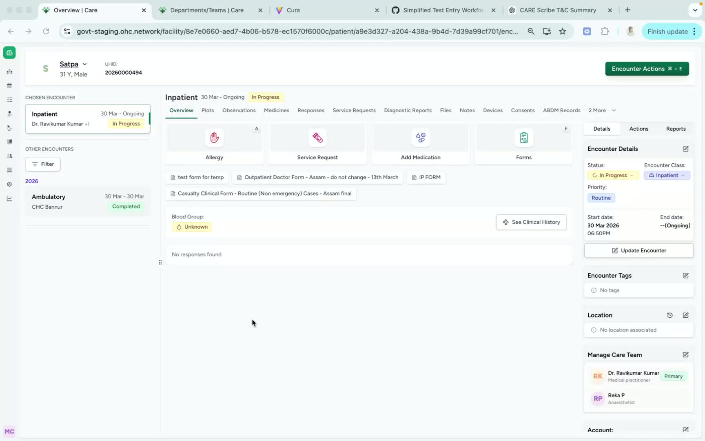
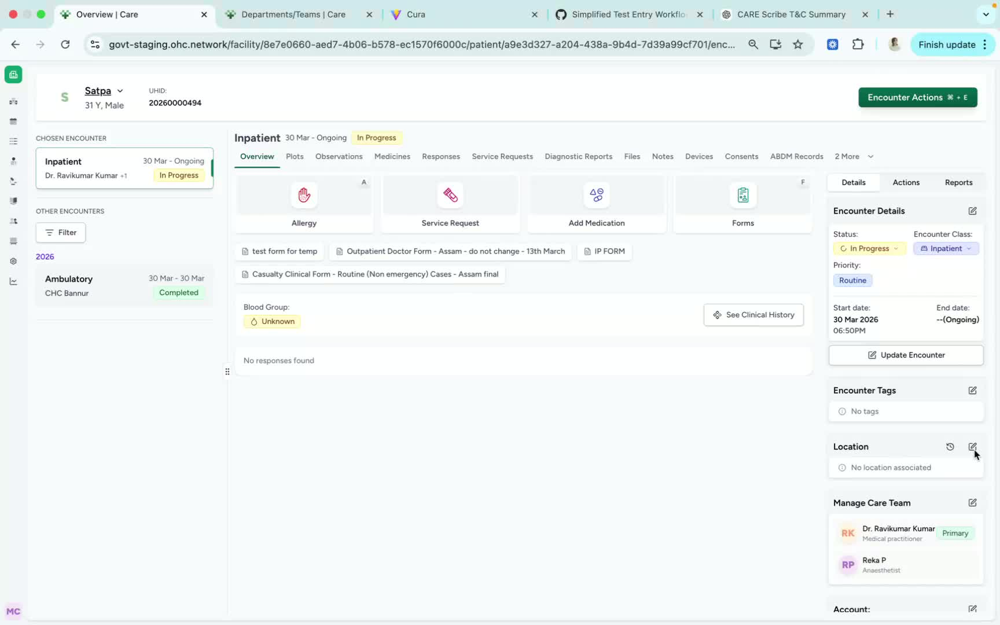
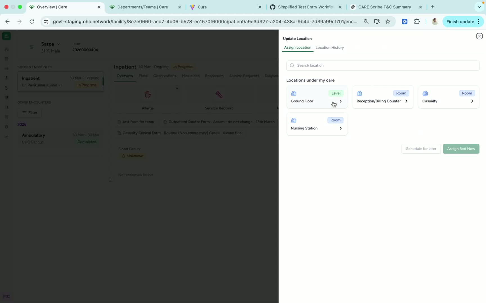

### Objective

This SOP explains how to assign a room, ward, or bed location to a patient from the Patient Encounter page. Following these steps ensures the patient’s assigned location is recorded correctly and can be viewed later in the location section.

### Key Steps

**1. Open the Location Assignment Area** [0:02](https://loom.com/share/2c186e9f63ec497cbc939d265db84d36?t=2)

- Navigate to the **Patient Encounter** page.

- Locate the **right-hand side** of the page.

- Prepare to assign a location for the patient currently in care.

**2. View Available Facility Locations** [0:10](https://loom.com/share/2c186e9f63ec497cbc939d265db84d36?t=10)

- Click the **Location** button.

- Review the available facility locations, including:

Rooms

- Wards

- Other location options displayed in the system

- Select the appropriate area where the patient should be assigned.

**3. Select the Specific Bed and Confirm Assignment** [0:21](https://loom.com/share/2c186e9f63ec497cbc939d265db84d36?t=21)

- Click the desired location, such as **Ground Level**.

- Select the specific bed, for example **Bed Number 2**.

- Click **Design Bed Now** to assign the bed to the patient.

- Click **Save** to complete the process.

- Verify that the bed assignment was successful by checking the **Location** section in the Patient Encounter page.

### Cautionary Notes
- Ensure the correct patient encounter is open before assigning a location.

- Double-check the selected room, ward, and bed before clicking **Save** to avoid assigning the wrong location.

- Confirm the assignment appears in the location section after saving.

- If the bed is already occupied or unavailable, choose another valid bed before proceeding.

### Tips for Efficiency
- Have the patient’s intended room/bed information ready before starting.

- Verify the assignment immediately after saving to reduce the need for corrections later.

- Standardize location naming conventions within the facility to make selection faster and more accurate.

### Link to Loom

[https://loom.com/share/2c186e9f63ec497cbc939d265db84d36](https://loom.com/share/2c186e9f63ec497cbc939d265db84d36)