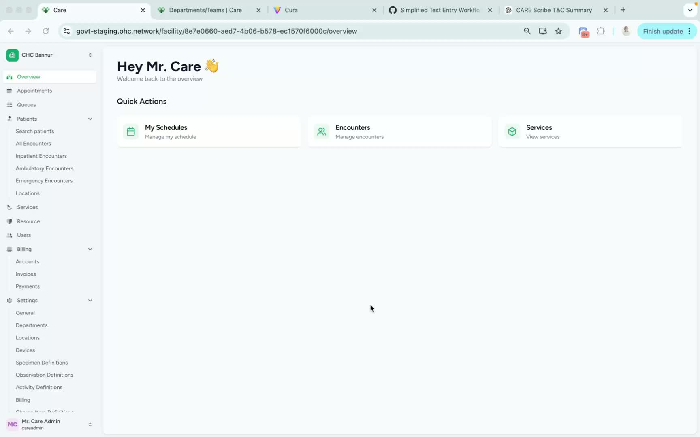
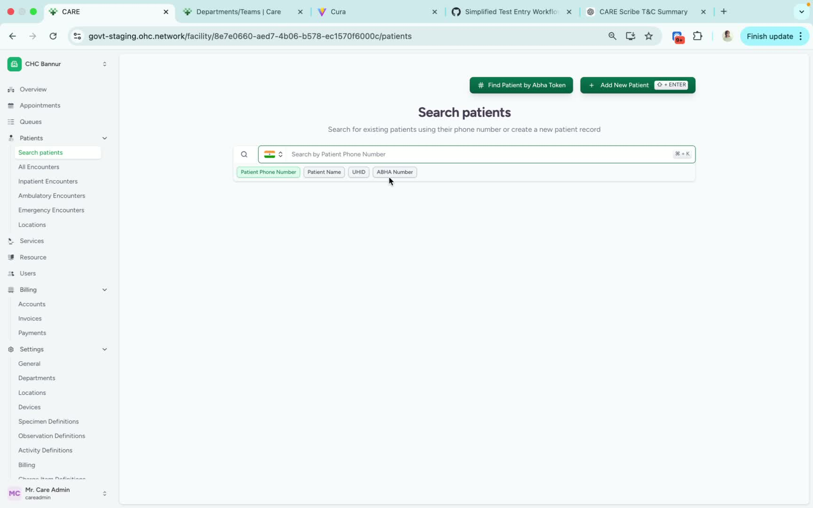
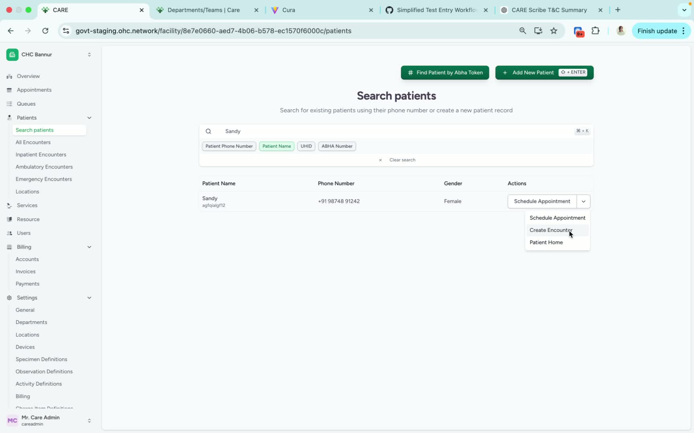
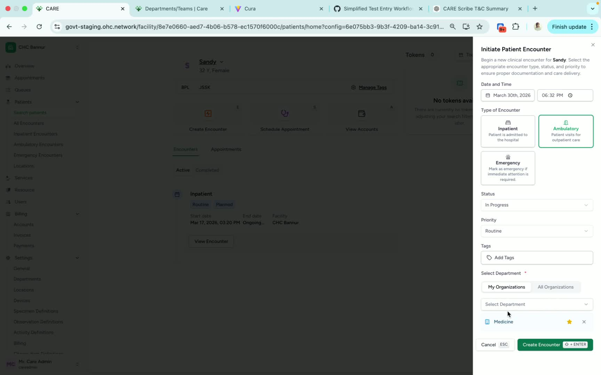

### ObjectiveThis SOP outlines the steps to create a patient encounter in the CARE system, ensuring accurate documentation and tracking of patient interactions.

### Key Steps**Step 1: Access Patient Search** [0:00](https://loom.com/share/c471c3bab27940e19670af50d988c437?t=0)

- Navigate to the left navigation bar in the CARE system.

- Click on **Search Patients**.

- You can use any patient identifier for the search.

**Step 2: Search for Patient** [0:12](https://loom.com/share/c471c3bab27940e19670af50d988c437?t=12)

- In this example, search using the patient's name.

- Wait for the patient details to appear on the screen.

**Step 3: Create Encounter** [0:23](https://loom.com/share/c471c3bab27940e19670af50d988c437?t=23)

- Under the **Actions** section, find and click on **Create Encounter**.

- A new form will appear for you to fill out.

**Step 4: Fill Encounter Details** [0:30](https://loom.com/share/c471c3bab27940e19670af50d988c437?t=30)

- Select the type of encounter from the dropdown menu.

- Change the status if necessary.

- Add the relevant department associated with the encounter.

**Step 5: Finalize Encounter Creation** [0:30](https://loom.com/share/c471c3bab27940e19670af50d988c437?t=30)

- After filling in all required fields, click on **Create Encounter** to save the information.

### Cautionary Notes
- Ensure that all patient identifiers are entered correctly to avoid errors.

- Double-check the encounter type and status before finalizing the creation.

### Tips for Efficiency
- Familiarize yourself with common patient identifiers to speed up the search process.

- Use keyboard shortcuts where possible to navigate the CARE system more quickly.

### Link to Loom[https://loom.com/share/c471c3bab27940e19670af50d988c437](https://loom.com/share/c471c3bab27940e19670af50d988c437)