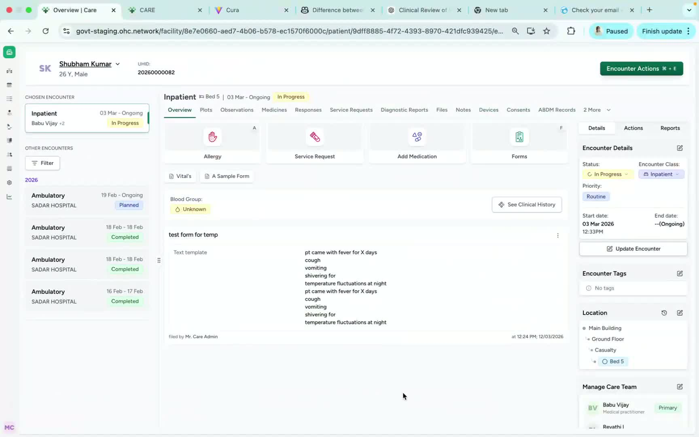
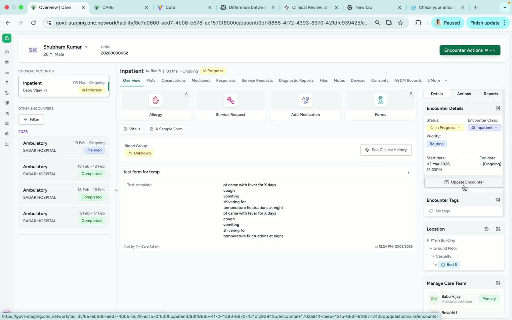
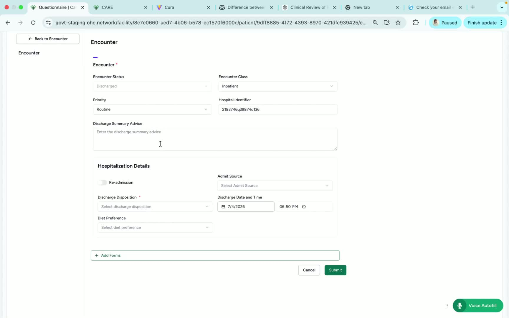
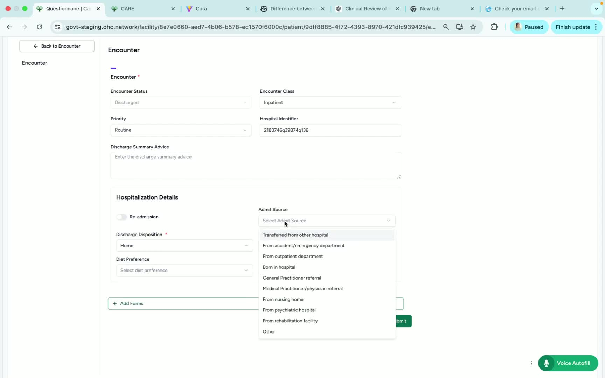
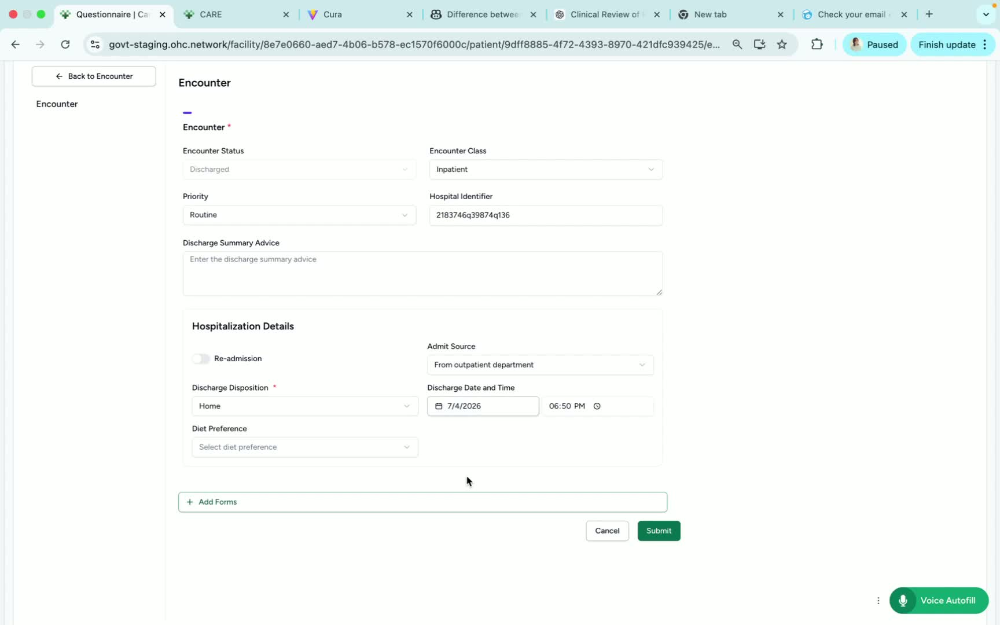

### ObjectiveThis SOP explains how to discharge a patient encounter in the Patient Encounter page using the Update Encounter option. It ensures the encounter status is updated correctly and any relevant discharge details are completed before closing the encounter.

### Key Steps**1. Open the Patient Encounter and access Update Encounter** [0:02](https://loom.com/share/c867a5afd1c643ed80bec876334b575e?t=2)

- Navigate to the **Patient Encounter** page.

- Locate the **right-hand side** of the screen.

- Click **Update Encounter** to begin the discharge process.

**2. Mark the encounter as discharged** [0:14](https://loom.com/share/c867a5afd1c643ed80bec876334b575e?t=14)

- In the Update Encounter window, find **Markful Discharge**.

- Click **Markful Discharge**.

- Confirm that the encounter status changes automatically to **Discharged**.

**3. Enter discharge details** [0:27](https://loom.com/share/c867a5afd1c643ed80bec876334b575e?t=27)

- Update the **discharge disposition/reason** for the patient’s discharge.

- Enter the reason clearly and accurately (for example, patient leaving to go home).

- Review the field to ensure it reflects the correct discharge outcome.

**4. Update additional encounter information** [0:43](https://loom.com/share/c867a5afd1c643ed80bec876334b575e?t=43)

- Review and update **Admit Source** if needed.

- Update the **discharge date/time** as required.

- Make sure any other encounter details are accurate before submitting.

**5. Add diet preference and submit** [0:54](https://loom.com/share/c867a5afd1c643ed80bec876334b575e?t=54)

- If applicable, update the patient’s **diet preference**.

- Click **Submit** to save the discharge information.

- Verify the encounter is marked as **complete** and the encounter can be closed.

### Cautionary Notes
- Ensure the discharge reason and other encounter details are accurate before submitting.

- Once the encounter is marked discharged, confirm the status changed correctly before moving on.

- Do not submit until all required fields have been reviewed and updated.

### Tips for Efficiency
- Gather discharge details before opening the Update Encounter window to reduce back-and-forth.

- Double-check the discharge disposition, admit source, and discharge date/time before clicking Submit.

- Use a consistent discharge reason format to keep records clear and easy to review.

### Link to Loom[https://loom.com/share/c867a5afd1c643ed80bec876334b575e](https://loom.com/share/c867a5afd1c643ed80bec876334b575e)