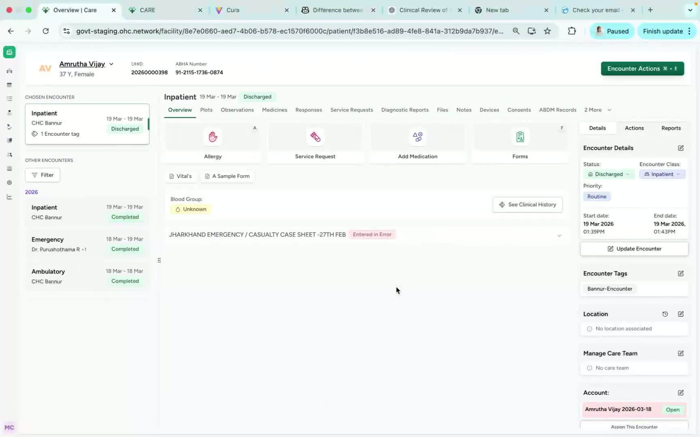
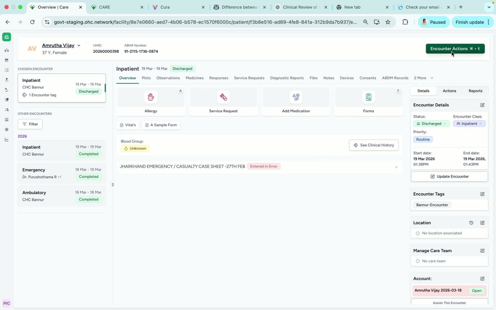
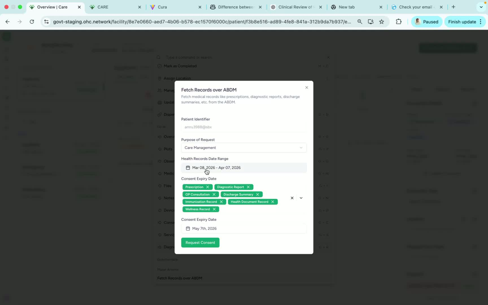
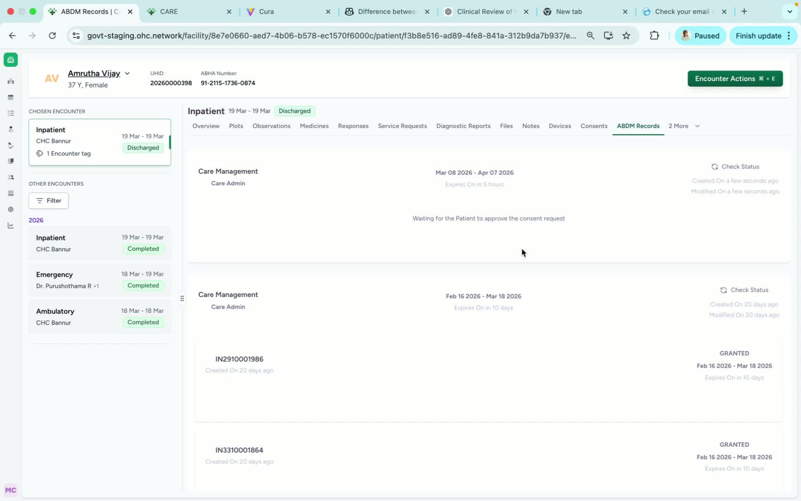

### ObjectiveThis SOP explains how to request and retrieve patient health records through ABDM from the patient dashboard in Care. It ensures team members can submit consent correctly, monitor request status, and access fetched records efficiently.

### Key Steps**1. Open the Patient Dashboard and Access Encounter Actions** [0:02](https://loom.com/share/6333522c81e94647a8fed52e0065fa99?t=2)

- Navigate to the **Patient Dashboard**.

- Locate **Encounter Actions** in the **top-right corner** of the dashboard.

- This is the starting point for initiating an ABDM record request.

**2. Select the Fetch Records via ABDM Option** [0:18](https://loom.com/share/6333522c81e94647a8fed52e0065fa99?t=18)

- Click **Encounter Actions**.

- From the available options, select **Fetch Records over ABDM**.

- This opens the request form for retrieving records from linked facilities.

**3. Choose the Purpose of the Request** [0:26](https://loom.com/share/6333522c81e94647a8fed52e0065fa99?t=26)

- In the request form, find the field labeled **Purpose of Request**.

- Select the appropriate purpose based on the use case.

- Example: choose **Care Management** if the records are needed for ongoing care coordination.

- Ensure the selected purpose matches the actual reason for access.

**4. Set the Health Record Date Range** [0:40](https://loom.com/share/6333522c81e94647a8fed52e0065fa99?t=40)

- Locate the **Health Record Date Range** field.

- Enter the date range for the records you want to retrieve.

- Use the period that best matches the records needed across other facilities.

- Example: select records from **March 8 to April 7** if those dates cover the required history.

**5. Enter the Consent Expiry Date** [0:53](https://loom.com/share/6333522c81e94647a8fed52e0065fa99?t=53)

- Find the **Consent Expiry Date** field.

- Set the date on which the consent should expire.

- Choose a date that gives enough time for the request to be processed.

- Example: set consent to expire **today or tomorrow** depending on operational need.

**6. Submit the Consent Request** [1:03](https://loom.com/share/6333522c81e94647a8fed52e0065fa99?t=63)

- Review all entered details before submitting.

- Click **Request Consent** to send the ABDM consent request.

- Confirm that the system shows the consent request as **successfully submitted**.

**7. Open ABDM Records and Check Request Status** [1:15](https://loom.com/share/6333522c81e94647a8fed52e0065fa99?t=75)

- After submitting consent, go to the **ABDM Records** option.

- Click it to view the records requested through ABDM.

- Select **Check Status** to monitor the request.

- Note that this step may take some time while the system processes the request.

**8. View the Fetched Health Records** [1:41](https://loom.com/share/6333522c81e94647a8fed52e0065fa99?t=101)

- Once the status is updated, open the fetched records from the ABDM records section.

- Verify that the health records have been retrieved successfully.

- Review the records for completeness and relevance to the original request.

### Cautionary Notes
- Ensure the **purpose of request** is selected accurately before submitting consent.

- Double-check the **date range** and **consent expiry date** to avoid incomplete or invalid requests.

- The **Check Status** action may take time; do not assume failure immediately after submission.

- Access and use records only in accordance with patient consent and applicable privacy policies.

### Tips for Efficiency
- Prepare the required date range and consent expiry date before opening the request form.

- Use a consistent workflow: **Encounter Actions → Fetch Records over ABDM → Request Consent → ABDM Records → Check Status**.

- If records are needed for care management, select that purpose first to reduce errors.

- Keep the requested date range as specific as possible to retrieve only relevant records.

### Link to Loom[https://loom.com/share/6333522c81e94647a8fed52e0065fa99](https://loom.com/share/6333522c81e94647a8fed52e0065fa99)