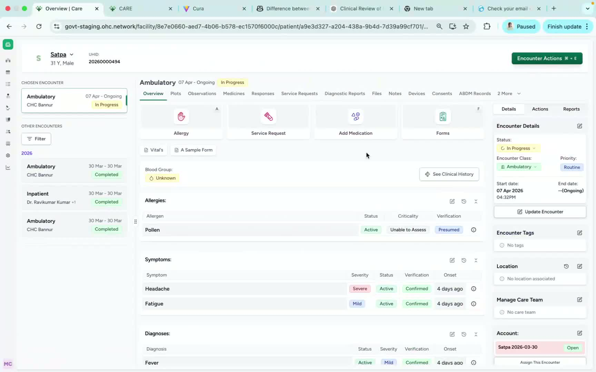
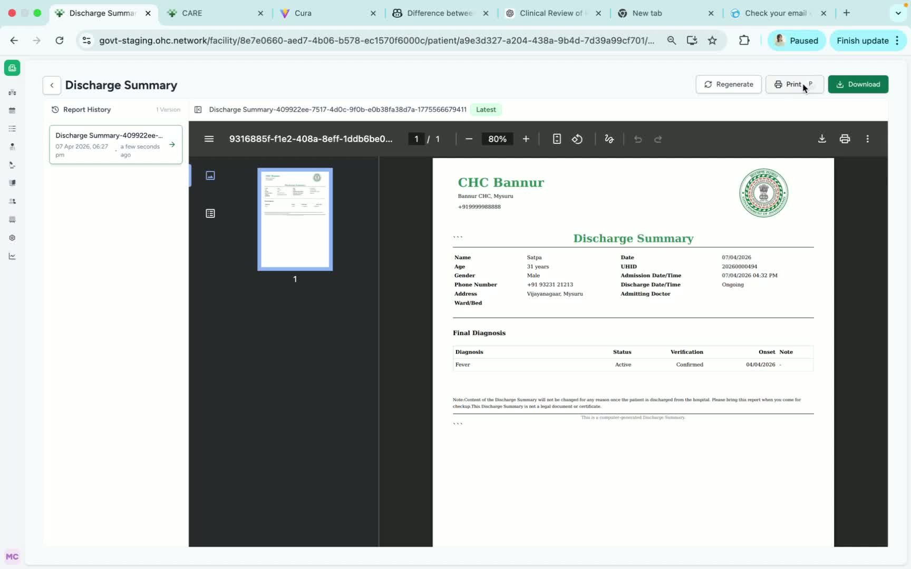

### ObjectiveThis SOP explains how to generate a discharge summary from a patient encounter in Care and print it if needed. It is intended to help team members complete the task quickly and consistently.

### Key Steps**1. Open the Patient Encounter** [0:02](https://loom.com/share/55dde51dd2e7459a8c673596f20e3581?t=2)

- From the **Patient Dashboard**, navigate to the relevant **patient encounter**.

- Confirm you are working in the correct patient record before proceeding.

- Locate the **reports** section on the **right-hand side** of the screen.

**2. Generate the Discharge Summary** [0:32](https://loom.com/share/55dde51dd2e7459a8c673596f20e3581?t=32)

- In the right-hand options area, select the option to **generate the discharge summary**.

- Review the summary once it opens to ensure it is the correct document for the encounter.

**3. Print the Discharge Summary** [0:32](https://loom.com/share/55dde51dd2e7459a8c673596f20e3581?t=32)

- To print the discharge summary, click **Print**.

- Confirm the printer settings if prompted.

- Complete the print action and verify the document has been sent successfully.

### Cautionary Notes
- Ensure the correct patient encounter is open before generating or printing any document.

- Verify the discharge summary content before printing to avoid distributing incorrect information.

- Follow your organization’s privacy and documentation policies when handling patient records.

### Tips for Efficiency
- Keep the patient encounter open and ready before starting to reduce navigation time.

- Use the print option only after confirming the summary is accurate.

- If printing frequently, confirm the default printer is set correctly in advance.

### Link to Loom[https://loom.com/share/55dde51dd2e7459a8c673596f20e3581](https://loom.com/share/55dde51dd2e7459a8c673596f20e3581)