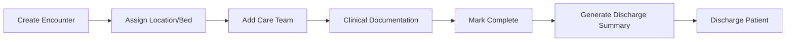

# Patient Encounter Management

Complete guides for managing patient encounters from creation through discharge, including consent, care team management, and ABDM integration.

## Overview

Patient encounters represent episodes of care. This section covers the entire encounter lifecycle including creation, documentation, team management, and discharge processes.

---

## Available Guides

### Encounter Creation & Setup

-   **Create Encounter**

    Initiate a new patient encounter in the Care system.

    [:octicons-arrow-right-24: Read More](create-encounter.md)

-   **Create Encounter Tag**

    Set up tags to categorize and organize encounters.

    [:octicons-arrow-right-24: Read More](create-encounter-tag.md)

-   **Add Patient Consent**

    Record patient consent for treatments and data sharing.

    [:octicons-arrow-right-24: Read More](add-patient-consent.md)

### Encounter Management

-   **Access/Complete/Restart**

    Navigate, complete, and restart patient encounters as needed.

    [:octicons-arrow-right-24: Read More](accessing-completing-restarting.md)

-   **Mark Encounter Complete**

    Properly close and mark an encounter as complete.

    [:octicons-arrow-right-24: Read More](mark-complete.md)

-   **View Previous Encounters**

    Access and review patient's historical encounter records.

    [:octicons-arrow-right-24: Read More](view-previous-encounters.md)

### Location & Team Management

-   **Assign Location/Bed**

    Allocate beds and locations to patients during their stay.

    [:octicons-arrow-right-24: Read More](assign-location-bed.md)

-   **Manage Care Team**

    Add and manage the care team members for a patient encounter.

    [:octicons-arrow-right-24: Read More](manage-care-team.md)

### Discharge & Integration

-   **Discharge Patient**

    Complete the patient discharge process and update status.

    [:octicons-arrow-right-24: Read More](discharge-patient.md)

-   **Generate Discharge Summary**

    Create and print comprehensive discharge summaries.

    [:octicons-arrow-right-24: Read More](generate-discharge-summary.md)

-   **Fetch Records via ABDM**

    Retrieve patient health records through ABDM integration.

    [:octicons-arrow-right-24: Read More](fetch-records-abdm.md)

---

## Encounter Lifecycle

---

## Quick Stats

- **Total Guides**: 11
- **Topics Covered**: Creation, Management, Discharge, ABDM Integration
- **Workflow Stages**: 7 (Create → Assign → Document → Complete → Discharge)
