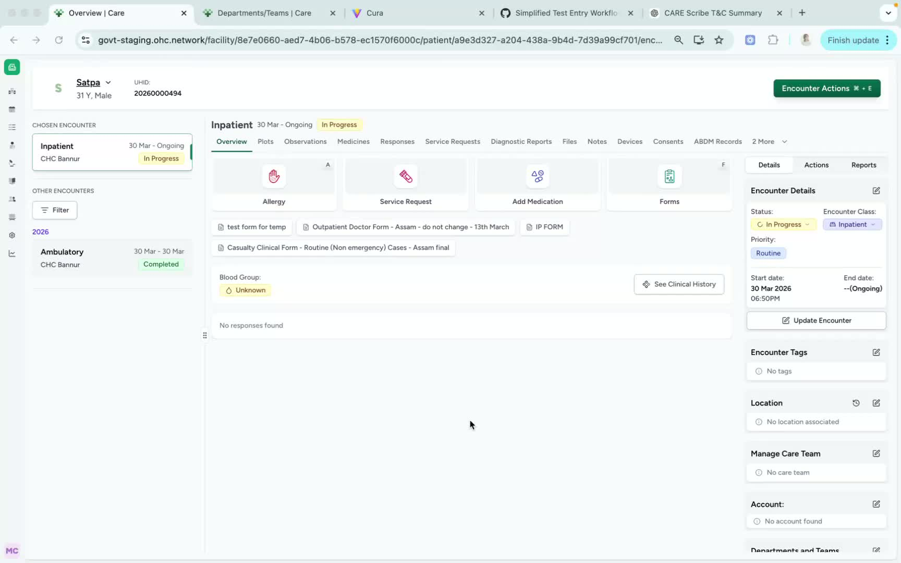
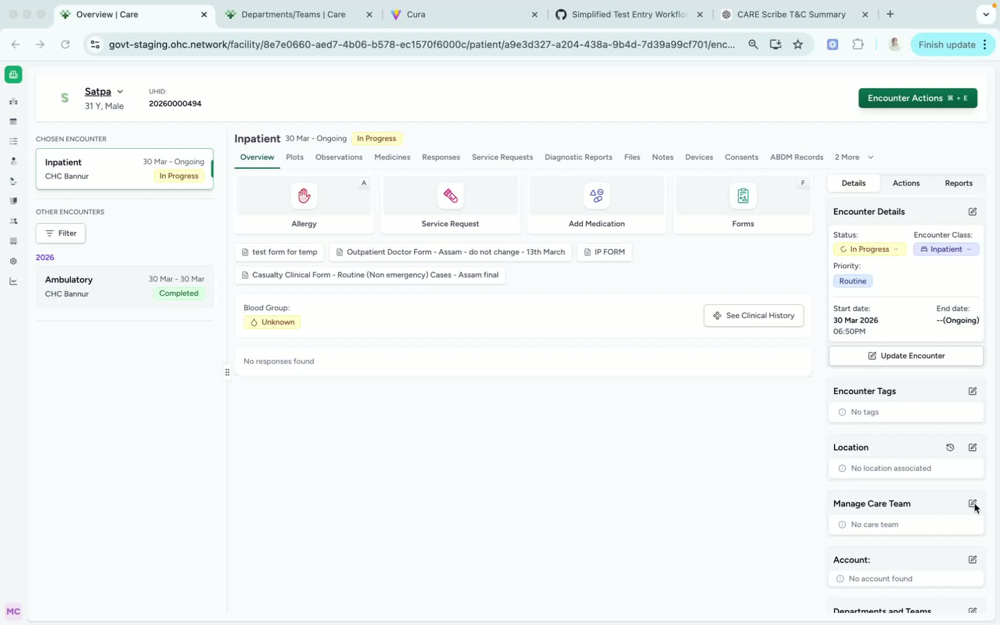
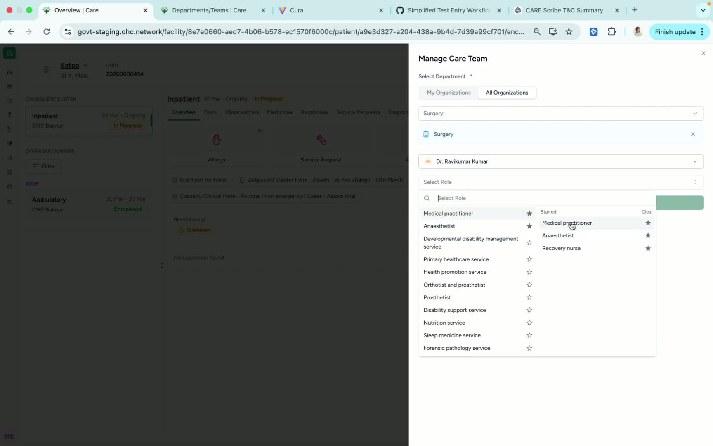
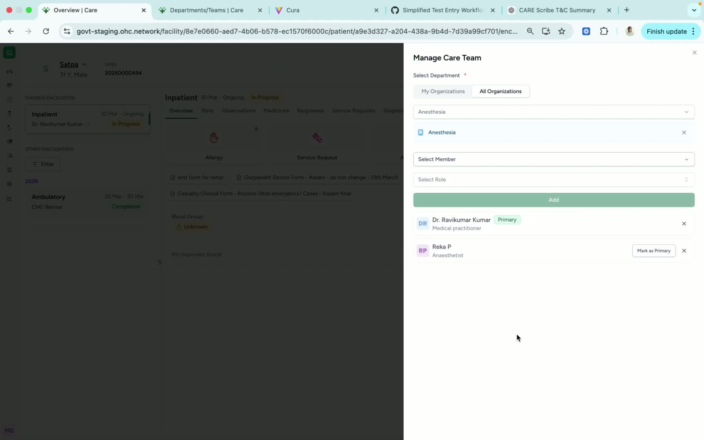

### ObjectiveThis SOP explains how to add one or more doctors to a patient’s Managed Care Team from the patient encounter page. It also covers how to designate or change the primary doctor when needed.

### Key Steps**1. Open the Managed Care Team section** [0:02](https://loom.com/share/b544dea739c142e5afbe6d56e5547fec?t=2)

- Navigate to the **patient encounter page**.

- On the **right-hand side**, locate the **Managed Care Team** option.

- Confirm you are working in the correct patient record before making any changes.

**2. Enter edit mode and select the department** [0:12](https://loom.com/share/b544dea739c142e5afbe6d56e5547fec?t=12)

- Click the **Edit** button in the Managed Care Team section.

- Select the **relevant department** from the available list.

- Example: choose **Surgery Department** if the care team member belongs there.

**3. Add the doctor to the care team** [0:12](https://loom.com/share/b544dea739c142e5afbe6d56e5547fec?t=12)

- After selecting the department, add the **relevant doctor’s name**.

- Verify the doctor is associated with the correct department before saving.

- Ensure the selected doctor matches the patient’s care requirements.

**4. Add multiple doctors if needed** [0:23](https://loom.com/share/b544dea739c142e5afbe6d56e5547fec?t=23)

- If the patient requires support from more than one department, add **multiple doctors** to the Managed Care Team.

- Repeat the department and doctor selection process for each additional provider.

- Example: add **Dr. Rekha** from the **Anesthesia Department** in addition to the surgery doctor.

**5. Mark a doctor as primary** [0:50](https://loom.com/share/b544dea739c142e5afbe6d56e5547fec?t=50)

- If one doctor should be the main point of contact, designate that doctor as **Primary**.

- Select the doctor you want to assign as primary, such as **Dr. Avikumar**.

- If the primary doctor needs to change, click the primary selection button for the new doctor, such as **Dr. Rekha**.

### Cautionary Notes
- **Do not** add a doctor without confirming the correct department.

- Make sure the **primary doctor** is assigned intentionally, as this may affect communication and responsibility.

- If multiple doctors are added, verify that each one is relevant to the patient’s care plan.

- Always review the final Managed Care Team list before exiting the page.

### Tips for Efficiency
- Prepare the list of required doctors and departments before opening the encounter page.

- Add all needed providers in one edit session to reduce repeated updates.

- Confirm the primary doctor last, after all team members have been added.

- Double-check spelling and department selection to avoid correction later.

### Link to Loom[https://loom.com/share/b544dea739c142e5afbe6d56e5547fec](https://loom.com/share/b544dea739c142e5afbe6d56e5547fec)