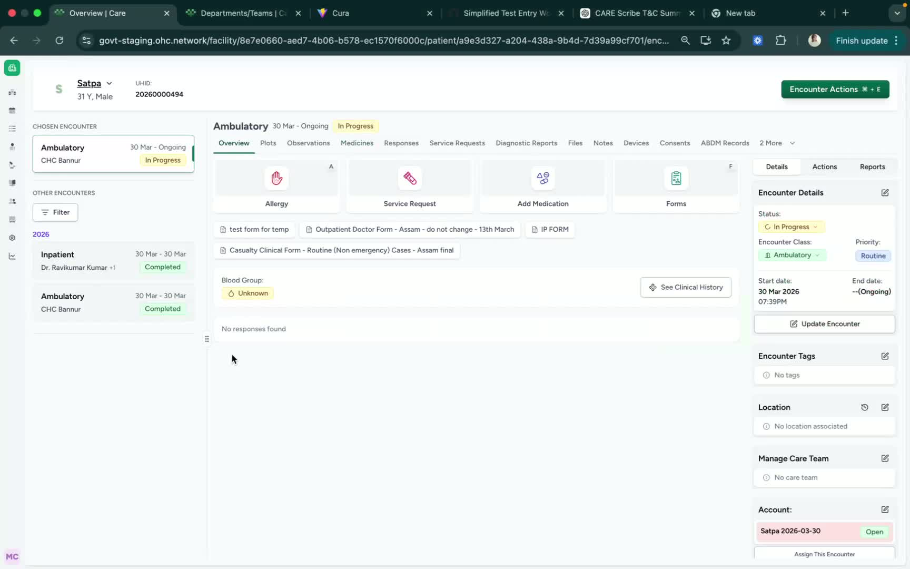
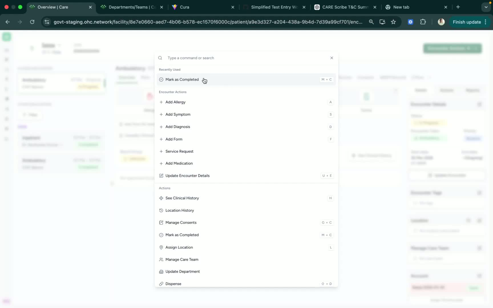
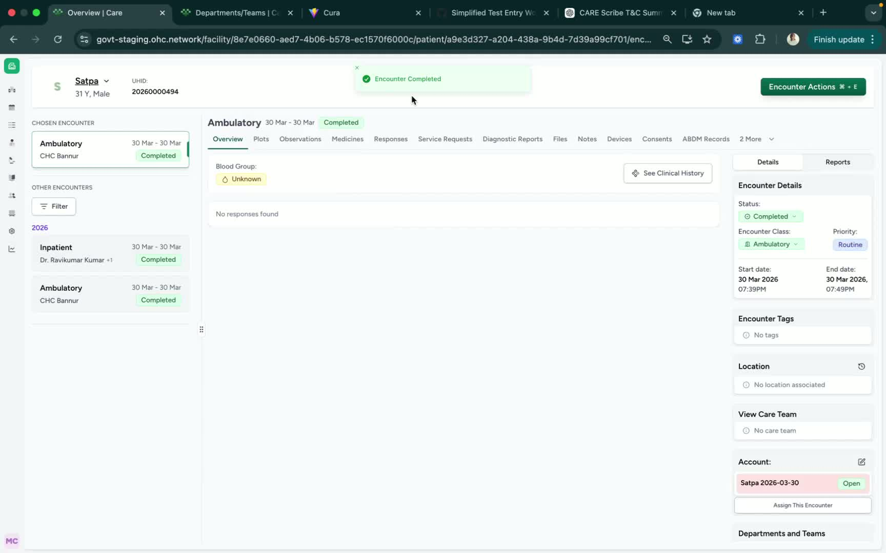

### ObjectiveThis SOP explains how to mark a patient encounter as complete after the doctor-patient interaction has ended. It provides both the menu-based method and the keyboard shortcut for efficient completion.

### Key Steps**1. Open Encounter Actions** [0:02](https://loom.com/share/d29e1b1061c44270bb3f7c9afbd6a660?t=2)

- Navigate to the relevant encounter record.

- Click **Encounter Actions** to open the available options.

- Locate the option labeled **Mark as Completed**.

**2. Mark the Encounter as Completed** [0:12](https://loom.com/share/d29e1b1061c44270bb3f7c9afbd6a660?t=12)

- Confirm that the doctor’s interaction with the patient is fully finished.

- Select **Mark as Completed** from the **Encounter Actions** menu.

- Alternatively, use the keyboard shortcut **M + C** to complete the same action.

- Verify that the encounter status updates to **Completed**.

**3. Confirm Completion** [0:27](https://loom.com/share/d29e1b1061c44270bb3f7c9afbd6a660?t=27)

- Check the encounter status to ensure it now displays as **marked complete**.

- If the status does not update, repeat the action or verify you selected the correct encounter.

### Cautionary Notes
- Only mark an encounter as complete after all doctor-patient interaction is finished.

- Ensure you are working in the correct encounter before applying the completion action.

- If using the keyboard shortcut, press the keys as intended to avoid triggering the wrong action.

### Tips for Efficiency
- Use the **M + C** shortcut when you need to complete encounters quickly.

- Confirm the encounter status immediately after completion to avoid follow-up corrections.

- Keep the **Encounter Actions** menu location in mind for cases where the shortcut is unavailable.

### Link to Loom[https://loom.com/share/d29e1b1061c44270bb3f7c9afbd6a660](https://loom.com/share/d29e1b1061c44270bb3f7c9afbd6a660)