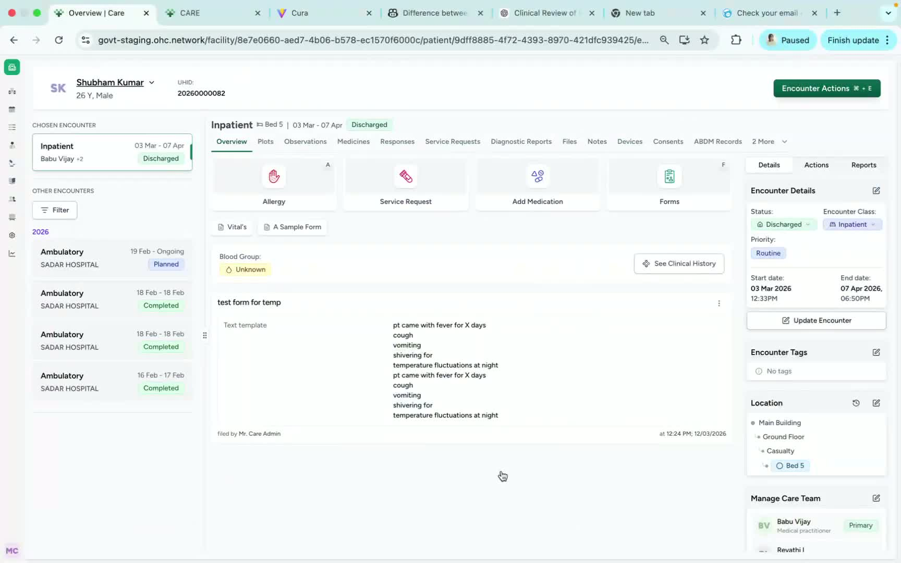
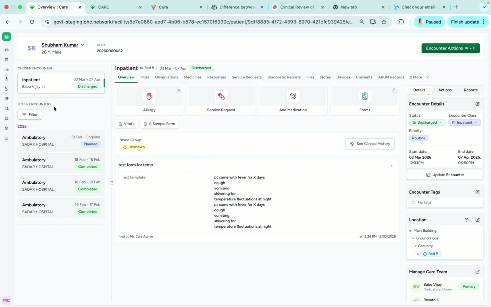
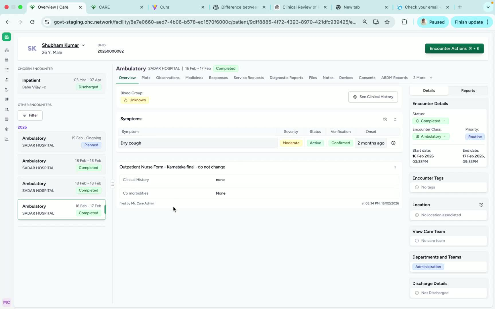

### Objective

To help team members locate and review a patient’s previous encounters from the patient dashboard. This SOP explains how to identify the current encounter and open earlier encounters to view what was updated in each one.

### Key Steps

**1. Open the Patient Dashboard** [0:02](https://loom.com/share/63b50ad1cdc54e739674ffcf8790f889?t=2)

- Navigate to the **patient dashboard** for the selected patient.

- Locate the **left-hand side panel**, where encounter information is displayed.

- Confirm that the dashboard is showing the patient’s encounter history.

**2. Identify the Current Encounter** [0:02](https://loom.com/share/63b50ad1cdc54e739674ffcf8790f889?t=2)

- Find the **chosen encounter**, which represents the **current encounter**.

- Verify the patient’s status if needed (for example, the transcript notes the patient is **discharged** in this case).

- Use the current encounter as the reference point before reviewing earlier records.

**3. Review the List of Previous Encounters** [0:26](https://loom.com/share/63b50ad1cdc54e739674ffcf8790f889?t=26)

- Look below or alongside the current encounter to see the **other encounters listed**.

- These entries represent the patient’s **previous encounters**.

- Scan the list to identify the encounter you want to review.

**4. Open a Previous Encounter** [0:26](https://loom.com/share/63b50ad1cdc54e739674ffcf8790f889?t=26)

- Click on the desired **previous encounter** from the list.

- Wait for the encounter details to load.

- Review the information shown for that specific encounter.

**5. Check What Was Updated in That Encounter** [0:26](https://loom.com/share/63b50ad1cdc54e739674ffcf8790f889?t=26)

- After opening the encounter, review the record to see **what was updated** during that visit.

- Compare the selected encounter with the current encounter if needed.

- Use this information to understand the patient’s history and changes over time.

**6. Confirm Access to Encounter History** [0:42](https://loom.com/share/63b50ad1cdc54e739674ffcf8790f889?t=42)

- Verify that you can successfully access and review prior encounters.

- If needed, repeat the process for additional encounters.

- This completes the process for viewing previous patient encounters.

### Cautionary Notes
- Ensure you are viewing the correct patient before opening any encounter.

- Previous encounters may contain sensitive clinical information; access and review them according to your organization’s privacy and security policies.

- If an encounter does not open or appears missing, confirm the patient record and permissions before escalating the issue.

### Tips for Efficiency
- Start with the current encounter to orient yourself before reviewing older records.

- Use the encounter list on the left-hand side to move quickly between visits.

- If you need to compare changes across visits, open encounters in chronological order for easier review.

### Link to Loom

[https://loom.com/share/63b50ad1cdc54e739674ffcf8790f889](https://loom.com/share/63b50ad1cdc54e739674ffcf8790f889)