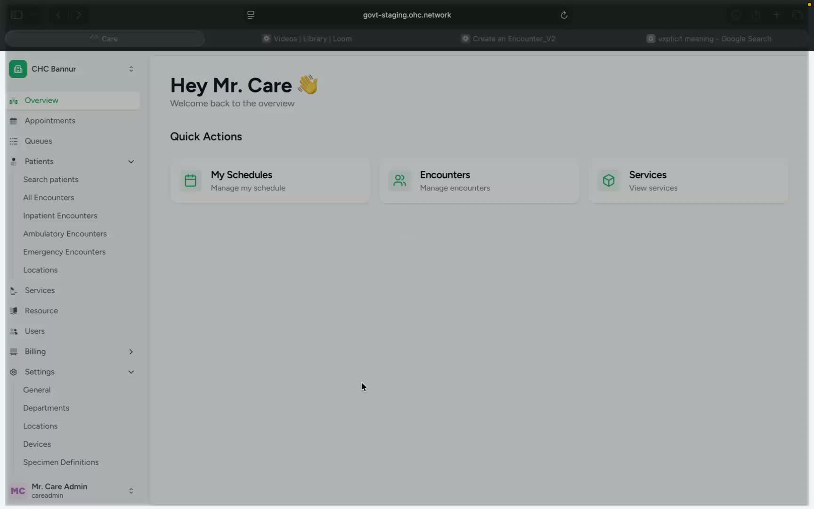
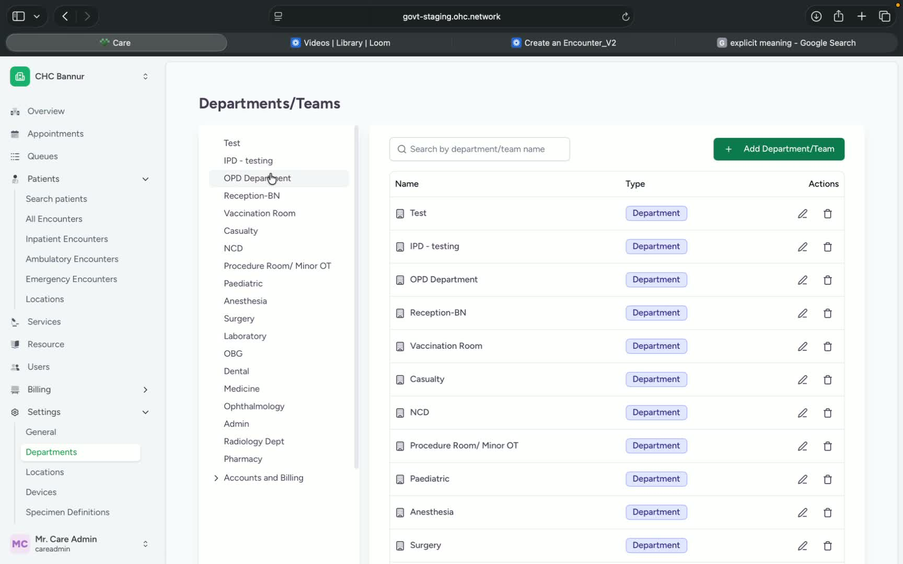
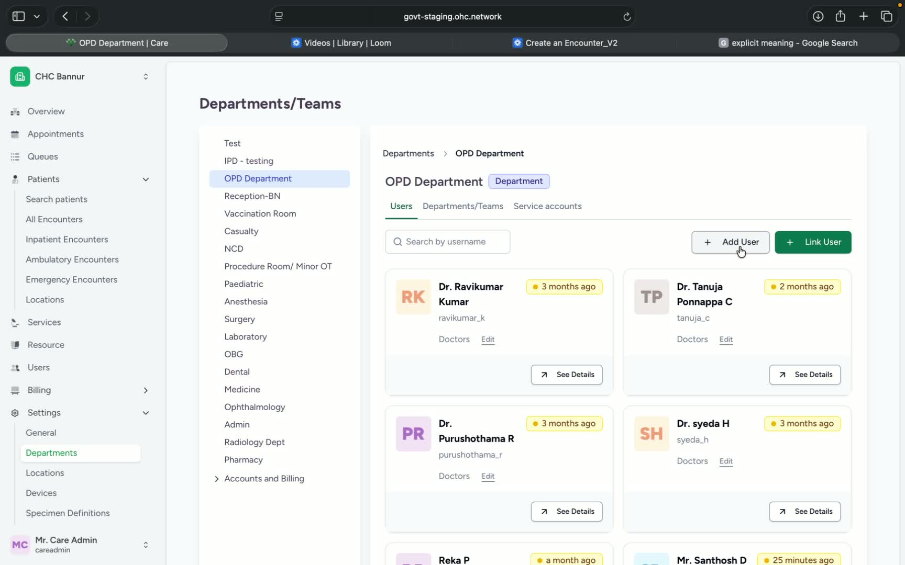
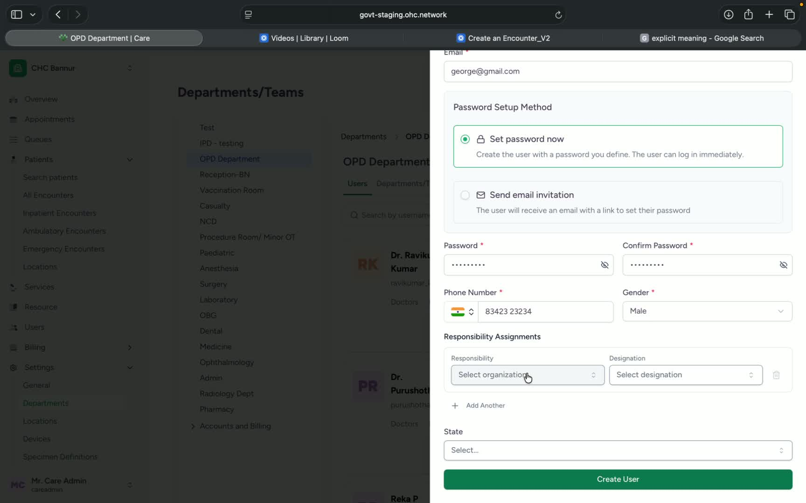
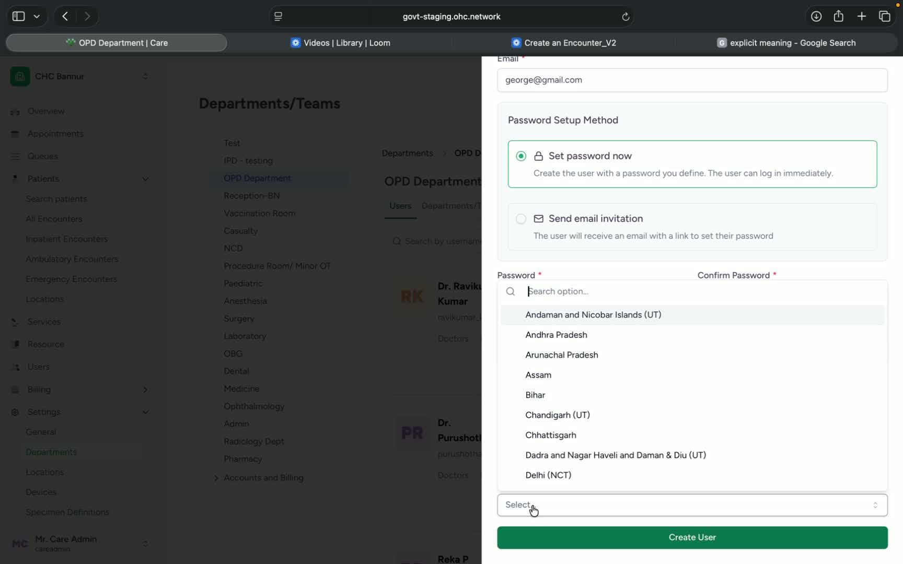
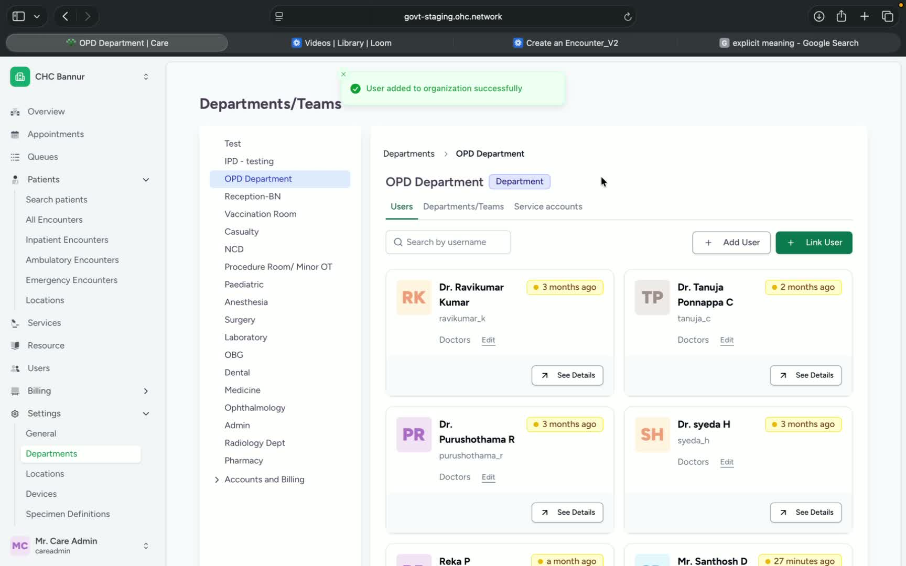

### Objective

This SOP explains how to add a new user or link an existing user to a department in CARE. It ensures the user is assigned the correct responsibility, access level, and organizational details before saving.

### Key Steps

**1. Open the Departments area** [0:00](https://loom.com/share/537ce7ad667841ca99cfe330d6239afb?t=0)

- In the left navigation bar, click **Departments**.

- This is the starting point for managing users within a department.

**2. Select the department and open Users** [0:11](https://loom.com/share/537ce7ad667841ca99cfe330d6239afb?t=11)

- Click the **relevant department**.

- Open the **Users** tab.

- Choose one of the two available actions:

**Add a user** for a new person.

- **Link user** for an existing person already in CARE.

**3. Add a new user** [0:19](https://loom.com/share/537ce7ad667841ca99cfe330d6239afb?t=19)

- Click **Add user**.

- Enter optional **prefix** or **suffix** if needed.

- Type the user’s:

**Name**

- **Username**

- **Password**

- **Phone number**

**4. Assign the user’s responsibility and access level** [1:02](https://loom.com/share/537ce7ad667841ca99cfe330d6239afb?t=62)

- Select the appropriate **responsibility** for the user, such as:

Doctor

- Nurse

- Administrator

- Staff

- Choose the correct **access level** based on what the user should be able to do:

**Member** for read-only access

- **Manager** to create users below their hierarchy

- **Admin** to create users of similar hierarchy

- Confirm the access level matches the user’s role in the organization.

**5. Complete user details and create the user** [1:41](https://loom.com/share/537ce7ad667841ca99cfe330d6239afb?t=101)

- Select the required **state** and **district**.

- Review the user’s role assignment for the hospital.

- Click **Create user** to save the new user in the department.

**6. Link an existing user to the department** [2:11](https://loom.com/share/537ce7ad667841ca99cfe330d6239afb?t=131)

- To link a user already in CARE, use the **Link user** option.

- Search for the existing user.

- Select the appropriate **role** for that user.

- Click **Add to organization** to complete the linking process.

### Cautionary Notes
- Ensure the selected **responsibility** matches the user’s actual job function.

- Verify the **access level** carefully before creating or linking the user to avoid unauthorized permissions.

- Double-check the **state** and **district** fields before saving.

- Use **Link user** only for users who already exist in CARE; use **Add user** for new users.

### Tips for Efficiency
- Gather all user details before starting: name, username, phone number, role, and access level.

- Confirm the department first so you do not need to repeat the setup.

- Use the correct hierarchy level to reduce later permission changes.

- For existing users, search by the most specific identifier available to save time.

### Link to Loom

[https://loom.com/share/537ce7ad667841ca99cfe330d6239afb](https://loom.com/share/537ce7ad667841ca99cfe330d6239afb)