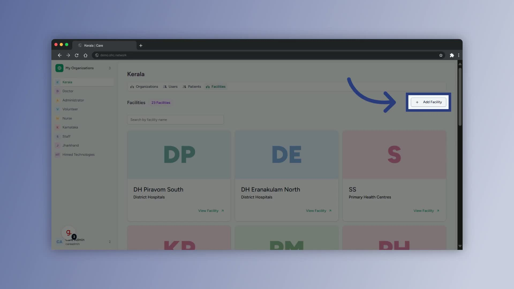
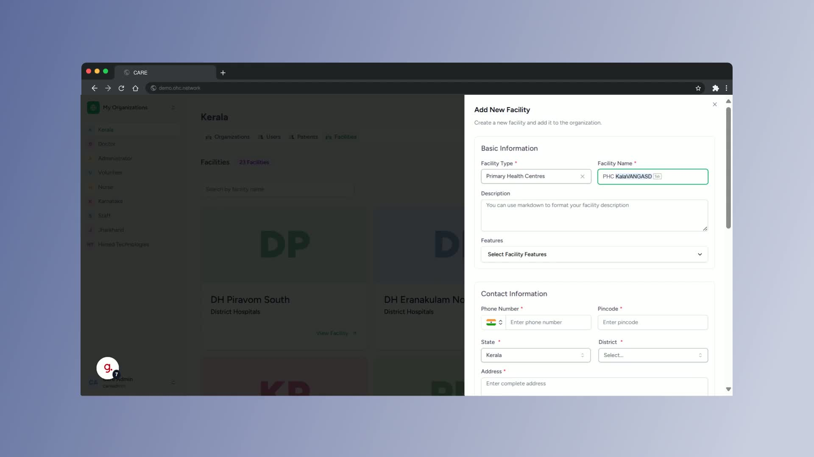
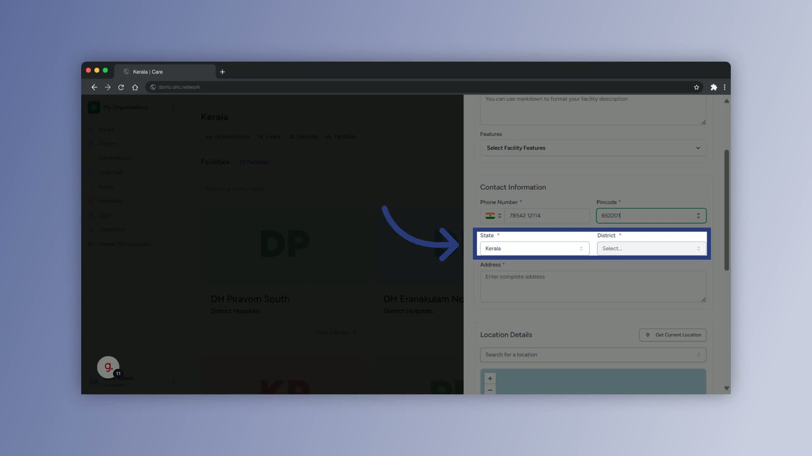
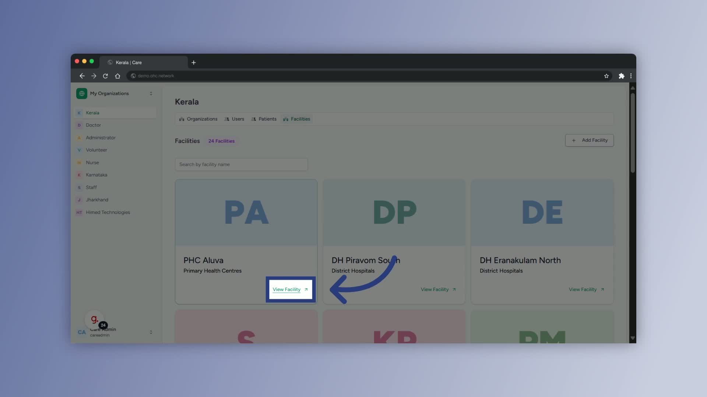
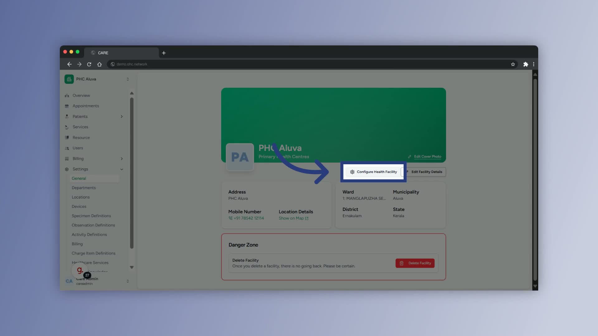

### ObjectiveThis SOP explains how to add a new health facility record in the system and complete the basic configuration details. Following these steps helps ensure facility information is accurate, complete, and ready for operational use.

### Key Steps
- Login as the Administrator, you will be taken to the Admin Dashboard

- Click on Governance

- You’ll be taken to groups you're affiliated with, including State, District, Block, Municipality, Corporation, Panchayat, and Ward-level governance bodies. Select the relevant group. 

- Navigate to the facilities button on the top and then you’ll be taken to a page with **Add Facility** button.

- Select the appropriate facility type.

- For this process, choose **Primary Health Centers** as the facility type.

- Confirm the selection before proceeding to the next step.

**2. Enter the facility details** [0:41](https://loom.com/share/7e246b2f62214b53aadcb4abea8ae222?t=41)

- Enter the **official name** of the facility.

- Update the **contact number**.

- Enter the **PIN code**.

- Select the correct **state**, **district**, and **local body**.

- Verify that all location and contact fields are accurate before continuing.

**3. Add the address and geolocation** [0:57](https://loom.com/share/7e246b2f62214b53aadcb4abea8ae222?t=57)

- Enter the facility’s **full address**.

- Click **Get Current Location** to configure the facility’s geolocation.

- Review the location details to ensure they match the facility’s actual site.

- Select **Create Facility** to save the new record.

- Confirm that the newly created facility appears in the facility list, then click **View Facility**.

**4. Update the cover photo** [1:14](https://loom.com/share/7e246b2f62214b53aadcb4abea8ae222?t=74)

- Open the facility record and click **Edit Cover Photo**.

- Upload the required image in the pop-up window.

- Click **Save** to apply the new cover photo.

- Confirm the image displays correctly on the facility profile.

**5. Link the health facility ID** [1:25](https://loom.com/share/7e246b2f62214b53aadcb4abea8ae222?t=85)

- Click **Configure Health Facility** from the facility profile.

- Enter the **Health Facility ID**.

- Click **Link Facility ID** to complete the configuration.

- Verify that the ID is successfully linked and saved in the system.

### Cautionary Notes
- Ensure the facility type is selected correctly before creating the record.

- Double-check all entered details, especially the official name, contact number, PIN code, and address, to avoid record errors.

- Use the correct geolocation so the facility can be accurately mapped in the system.

- Confirm that uploads and ID linking are saved successfully before exiting the record.

### Tips for Efficiency
- Prepare the facility’s official details in advance to reduce data entry time.

- Keep the facility’s address, contact information, and Health Facility ID readily available before starting.

- Verify each section immediately after saving to catch errors early.

- Use the facility list and view page to quickly confirm that the new record was created correctly.

### Link to Loom[https://loom.com/share/7e246b2f62214b53aadcb4abea8ae222](https://loom.com/share/7e246b2f62214b53aadcb4abea8ae222)