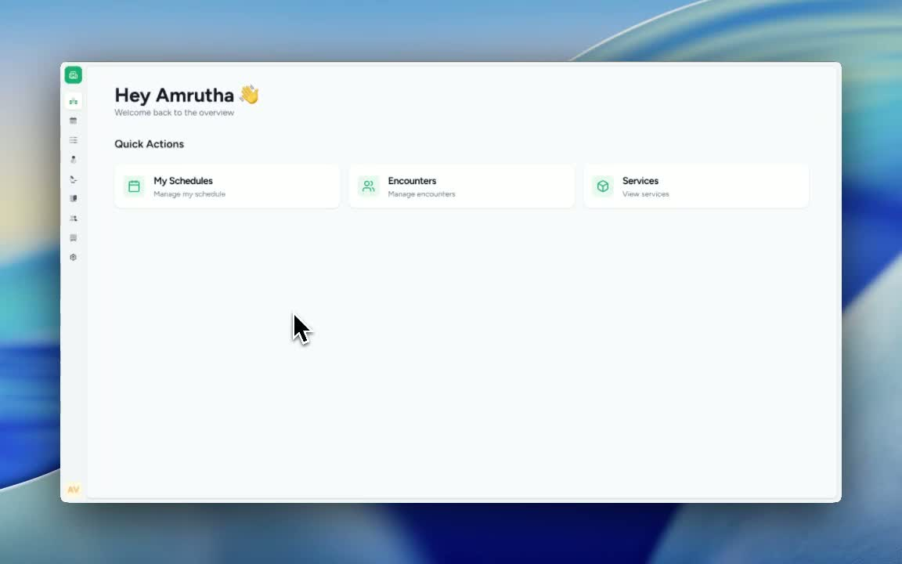
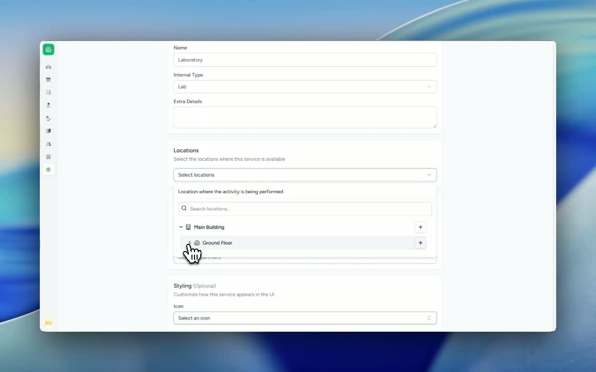
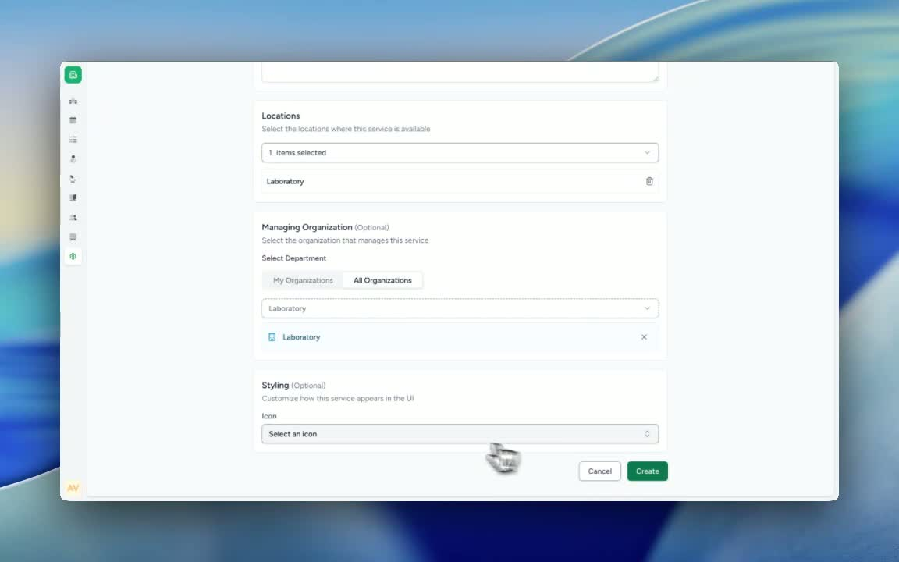

### ObjectiveThis SOP explains how to create a new healthcare service in Care, including naming the service, assigning its type, linking the correct location and department, and selecting an icon. Following these steps ensures the service is properly configured and accessible to the right users.

### Key Steps**1. Open the Healthcare Services setup area** [0:02](https://loom.com/share/37a19e5edb9647fbb99288180d8387d3?t=2)

- Navigate to **Settings** in Care.

- Select **Healthcare Services**.

- Click **Add Healthcare Service** to begin creating a new service.

**2. Enter the service details** [0:02](https://loom.com/share/37a19e5edb9647fbb99288180d8387d3?t=2)

- Type the **name of the service** in the name field.

- In this example, the service is named **Laboratory**.

- Choose the appropriate **internal type** for the service.

Example: select **Lab**.

- Note: It could be **Pharmacy** if the healthcare service was pharmacy

**3. Link the service to the correct location** [0:35](https://loom.com/share/37a19e5edb9647fbb99288180d8387d3?t=35)

- Select the **location** where this healthcare service should be available.

- Choose the relevant site or floor from the list.

Example: **Main Building – Ground Floor**.

- Confirm that the location is linked successfully.

**4. Link the department or organization** [0:35](https://loom.com/share/37a19e5edb9647fbb99288180d8387d3?t=35)

- Select the **department** that should have access to the healthcare service.

- In this example, link the **Lab** department.

- Verify that the department is now associated with the service.

**5. Choose an icon and create the service** [0:59](https://loom.com/share/37a19e5edb9647fbb99288180d8387d3?t=59)

- Select an **icon** that best represents the healthcare service.

- Review all entered details for accuracy.

- Click **Create** to save the new healthcare service.

- Confirm that the service has been created successfully.

### Cautionary Notes
- Ensure the **service name** is clear and consistent with your organization’s naming standards.

- Double-check the **internal type**, **location**, and **department** before clicking **Create**.

- Make sure the selected location and department are correct, as these determine who can access the service.

- Avoid creating duplicate services with similar names unless intentionally required.

### Tips for Efficiency
- Use a standardized naming convention for easier searching and reporting.

- Choose icons consistently across services to improve recognition for users.

- Verify linked locations and departments immediately after creation to catch configuration errors early.

### Link to Loom[https://loom.com/share/37a19e5edb9647fbb99288180d8387d3](https://loom.com/share/37a19e5edb9647fbb99288180d8387d3)