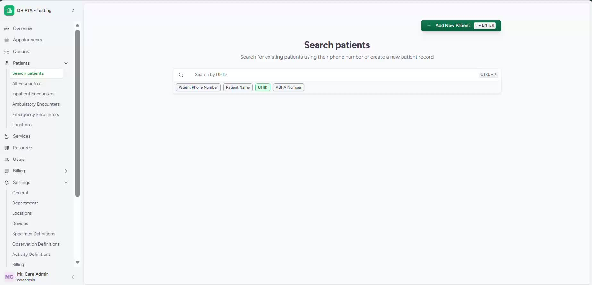
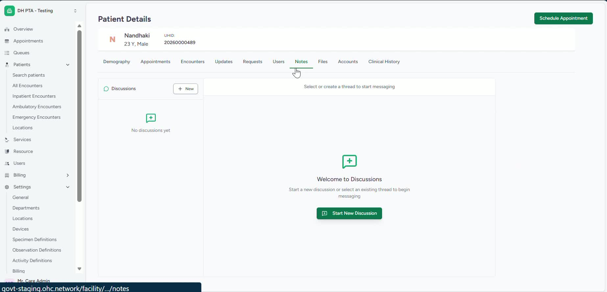
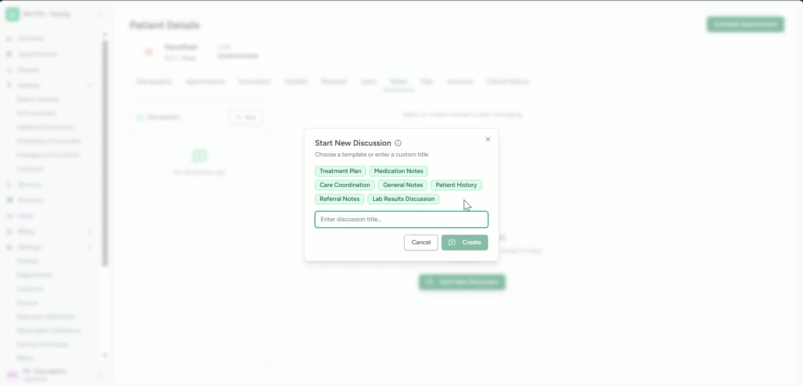
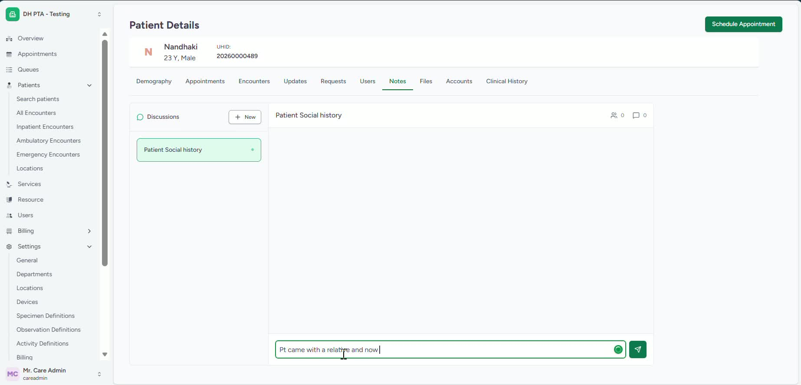

### ObjectiveThis SOP explains how to access a patient profile, open the patient notes section, and create or use conversation threads to document patient-related information. It helps team members organize non-clinical and social notes clearly within the patient record.

### Key Steps**1. Search for the Patient and Open the Profile** [0:00](https://loom.com/share/844b431417314a3192b99fa61a5dae25?t=0)

- Search for the correct patient in the system.

- Open the patient’s profile.

- Navigate to the** Notes** section, towards the right section of the profile.

- Confirm you are in the correct patient record before adding any notes.

**2. Start a New Conversation Thread** [0:14](https://loom.com/share/844b431417314a3192b99fa61a5dae25?t=14)

- In the Patient Notes area, begin a **new conversation thread**.

- Use the thread feature to organize notes as a discussion or chart thread.

- Add a new thread when you need a separate note topic or documentation category.

**3. Use Presets or Create a Custom Thread** [0:24](https://loom.com/share/844b431417314a3192b99fa61a5dae25?t=24)

- Choose from available preset categories if they match the note topic.

- If needed, create a custom thread such as **Patient Social History**.

- Use separate threads to divide notes by topic for easier review later.

- Select the thread type that best fits the information being documented.

**4. Document Patient Information in the Thread** [0:57](https://loom.com/share/844b431417314a3192b99fa61a5dae25?t=57)

- Enter relevant patient details into the conversation thread.

- Include social, any non-clinical or other important context as appropriate.

- Example: document information such as the patient arriving with a relative or being left alone.

- Use the thread to capture any religious, social, or non-clinical notes that may be relevant to care.

### Cautionary Notes
- Ensure you are documenting in the correct patient profile before entering any notes.

- Use only appropriate, professional language when recording patient information.

- Keep notes relevant to patient care and avoid unnecessary or unrelated details.

- Follow your organization’s privacy and documentation policies when adding sensitive information.

### Tips for Efficiency
- Use preset thread categories whenever possible to save time.

- Create custom threads only when a preset does not fit the documentation need.

- Keep notes organized by topic so they are easier to find and review later.

- Document information as soon as possible to reduce the chance of missing details.

### Link to Loom[https://loom.com/share/844b431417314a3192b99fa61a5dae25](https://loom.com/share/844b431417314a3192b99fa61a5dae25)