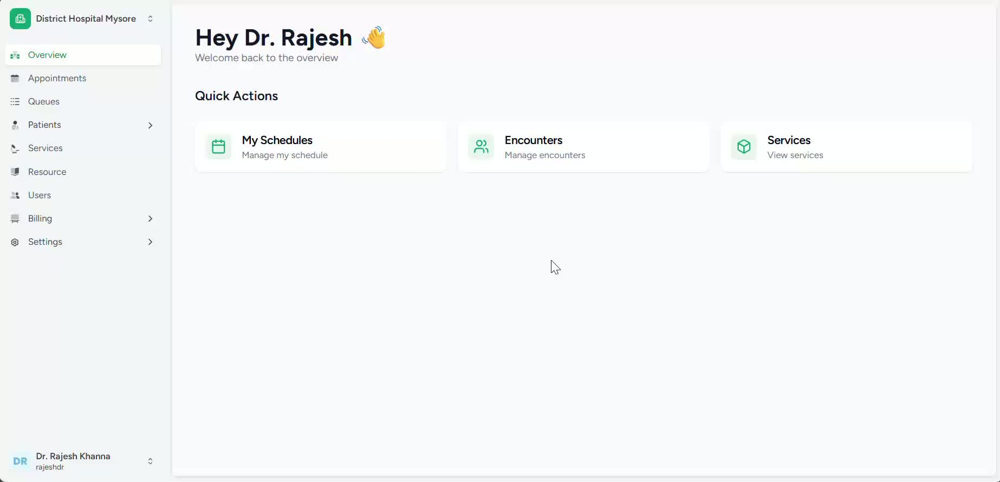
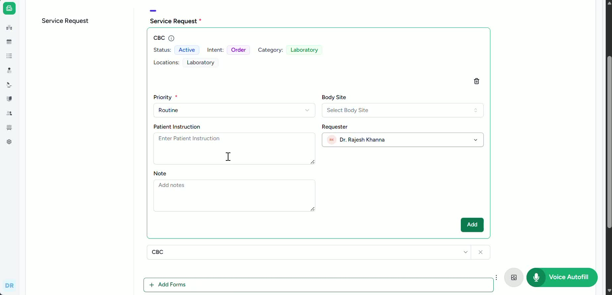
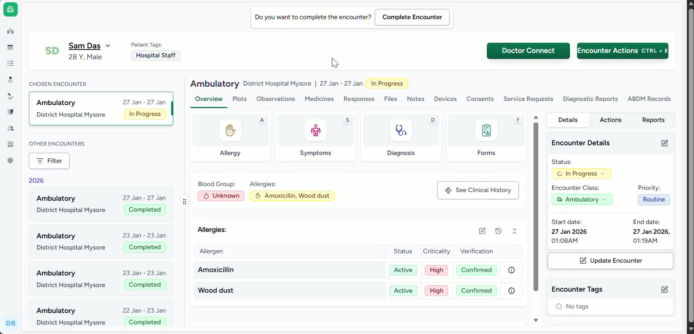
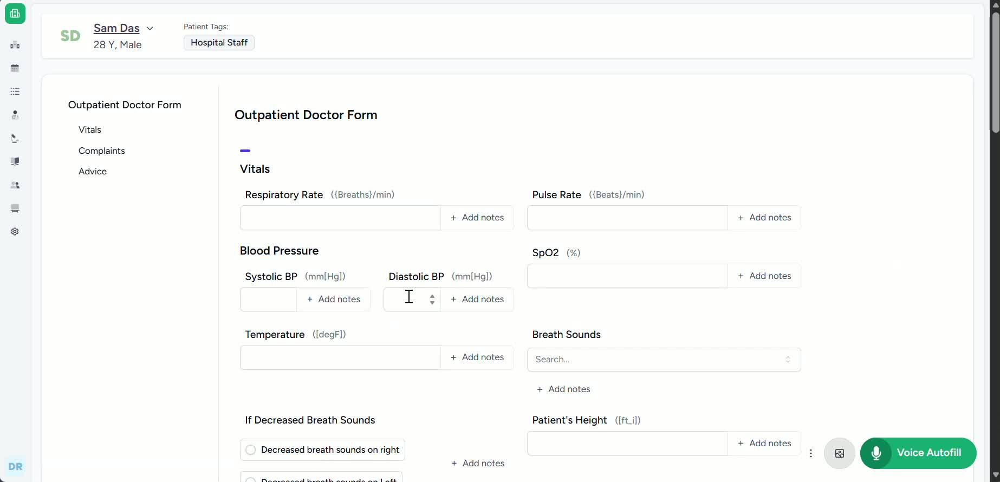

### Objective

This SOP explains how a doctor can raise a lab test request for a patient using either from the patient dashboard or the form. It ensures the request is submitted correctly so it can be processed by the lab team.

### Key Steps
- Go to the **Patient List**.

- Locate the patient for whom the lab test request needs to be raised.

- Select the correct patient record before proceeding.

- Verify you have chosen the right patient to avoid sending the request to the wrong case.

**2. Raise the Lab Request from the Patient Record** [0:30](https://loom.com/share/d0f65bb1b02748ed8867d07d6ab3000a?t=30)

- After selecting the patient, you will be taken to the patient dashboard. 

- Navigate to the service request button and select the relevant service request category, here in this case it’s laboratory. 

- Select the relevant lab test that’s available in this facility and also mark any patient instructions if required for this patient. 

- Recheck the entries and submit. Confirm that the request is sent to the lab process for further handling.

**3. Use the Patient Form as an Alternate Request Method** [0:44](https://loom.com/share/d0f65bb1b02748ed8867d07d6ab3000a?t=44)

- Alternate way of raising a service request is by submitting a request via the consultation** form**.

- Update the form during the consultation as needed.

- Ensure the form is saved or updated properly so the request is captured.

**4. Enter the Request in the Investigation Suggestion Section** [1:07](https://loom.com/share/d0f65bb1b02748ed8867d07d6ab3000a?t=67)

- Enter the lab test request there.

- Confirm the request details are accurate and complete.

- Submit the form so the lab request is recorded and can be processed.

### Cautionary Notes
- Always confirm the correct patient before raising any request.

- Make sure the request is entered in the appropriate section to avoid delays.

- Do not assume the request has been sent unless the service request or form update is completed and submitted successfully.

- Follow your organization’s workflow for lab request approval or routing, if applicable.

### Tips for Efficiency
- Use the patient list method for quick request submission when the patient is already selected.

- Use the patient form method during live consultations to document the request immediately.

- Keep patient details and investigation suggestions accurate to reduce follow-up corrections.

- Standardize how requests are entered so the lab team can process them faster.

### Link to Loom

[https://loom.com/share/d0f65bb1b02748ed8867d07d6ab3000a](https://loom.com/share/d0f65bb1b02748ed8867d07d6ab3000a)