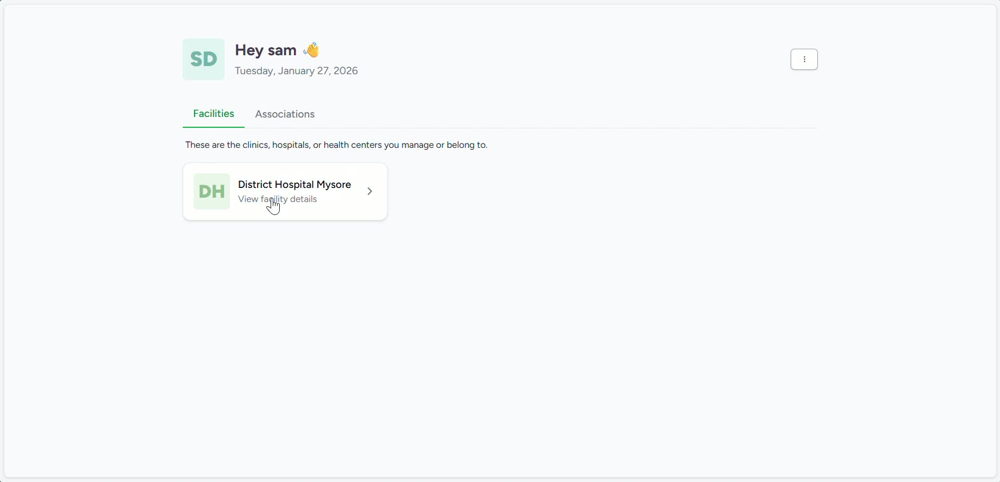
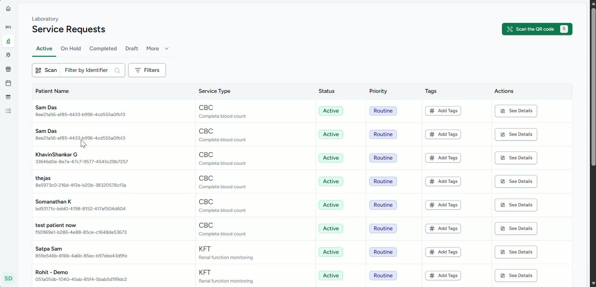
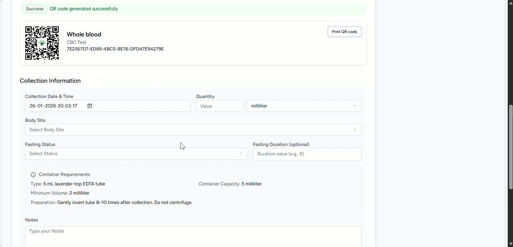
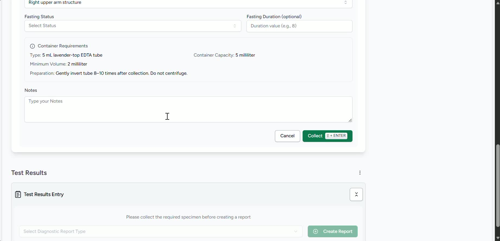
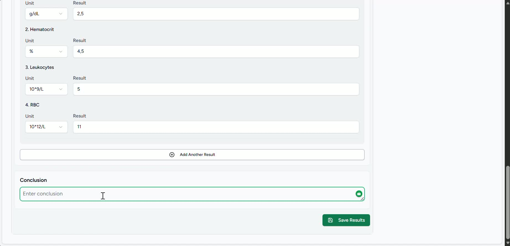
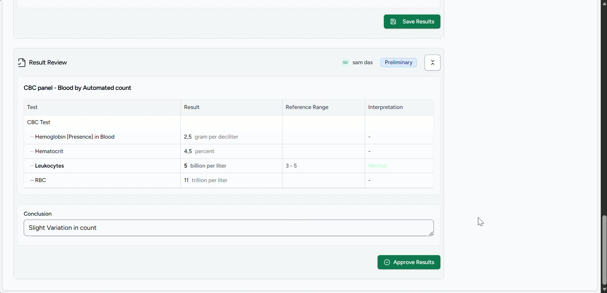
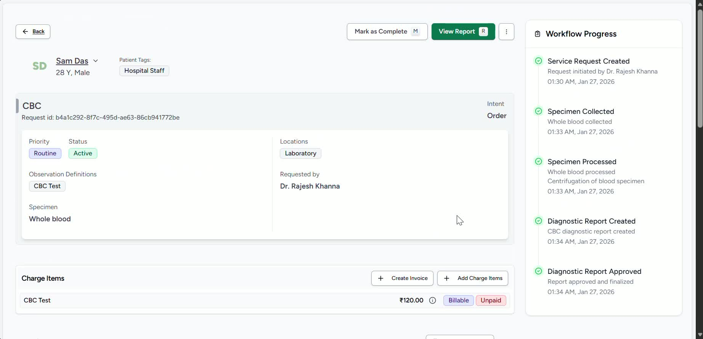

### Objective

To provide lab technicians with a clear, repeatable process for reviewing laboratory service requests, documenting specimen collection, entering test results, and publishing approved reports. This SOP ensures accurate record keeping, proper approval workflow, and timely availability of results to doctors.

### Key Steps

**1. Open Laboratory Services and Review Requests** [0:11](https://loom.com/share/f40a739818534470bab0341befb03065?t=11)

- Navigate to **Services** and select **Laboratory Services**.

- Click **View Request** to display all laboratory requests raised by doctors.

- Identify the specific patient and test request you need to process.

- Open the request details to confirm the ordered test and any linked charges.

**2. Verify Request Details Before Processing** [0:24](https://loom.com/share/f40a739818534470bab0341befb03065?t=24)

- Click **See Details** for the selected patient request.

- Confirm the requested test name and any associated charge items.

- Review the request carefully to ensure you are working on the correct patient and test.

- Proceed only after verifying the request information is accurate.

**3. Record Specimen Collection Information** [0:48](https://loom.com/share/f40a739818534470bab0341befb03065?t=48)

- Select the appropriate assessment or request record.

- Click **Collect Specimen**.

- Enter the specimen details, including:

Type/quantity of specimen collected

- Collection location/source

- Fasting status, if applicable

- Any relevant notes or observations

- Ensure all required fields are completed before saving.

**4. Confirm Specimen Collection** [1:13](https://loom.com/share/f40a739818534470bab0341befb03065?t=73)

- After the specimen has been collected and details entered, click **Collect**.

- Add any additional steps or instructions related to the test, if required.

- Verify the collection status is updated correctly in the system.

- Continue to result entry only after collection is confirmed.

**5. Enter Test Results and Create the Report** [1:13](https://loom.com/share/f40a739818534470bab0341befb03065?t=73)

- Once the test is completed, enter the laboratory results in the system.

- Click **Create Report** to generate the result entry screen.

- Load or input the test results as required.

- Add conclusions or interpretations, if applicable.

- Save the report to generate a preliminary version.

**6. Submit for Review and Approval** [1:47](https://loom.com/share/f40a739818534470bab0341befb03065?t=107)

- After saving the results, confirm that a **preliminary report** has been generated.

- Preliminary report is for review by the senior lab technician or pathologist.

- Wait for approval before publishing the result.

- Do not release the report to doctors until pathologist’s approval is completed.

**7. Approve and Publish the Final Report** [2:13](https://loom.com/share/f40a739818534470bab0341befb03065?t=133)

- Once the senior reviewer/pathologist approves the result, the report becomes publishable.

- They can click the **Approve** button as required by the system.

- Publish the report so it becomes visible to doctors in the patient record.

**8. Mark the Report Complete and Verify Availability** [2:27](https://loom.com/share/f40a739818534470bab0341befb03065?t=147)

- Click **Mark as Done** or the equivalent completion action.

- Confirm the report is now available to doctors in the patient’s file.

- Check the patient timeline to ensure the laboratory activity and report status are recorded.

- Verify the final workflow status reflects completion.

### Cautionary Notes
- Always verify the patient and test request before entering specimen or result data.

- Do not publish results until they have been reviewed and approved by the appropriate senior staff.

- Ensure fasting status, specimen source, and notes are accurate, as these may affect interpretation.

- Avoid overwriting or editing approved results unless your organization’s policy allows it.

- Confirm the report is visible in the patient record after marking it complete.

### Tips for Efficiency
- Review all pending requests in one session to reduce navigation time.

- Best to double check the values and enter collection details immediately and while entering to Care after specimen collection to reduce errors.

- Save draft/preliminary results promptly so reviewers can begin approval sooner.

- Check the patient timeline after completion to confirm the workflow was recorded correctly.

### Link to Loom

[https://loom.com/share/f40a739818534470bab0341befb03065](https://loom.com/share/f40a739818534470bab0341befb03065)