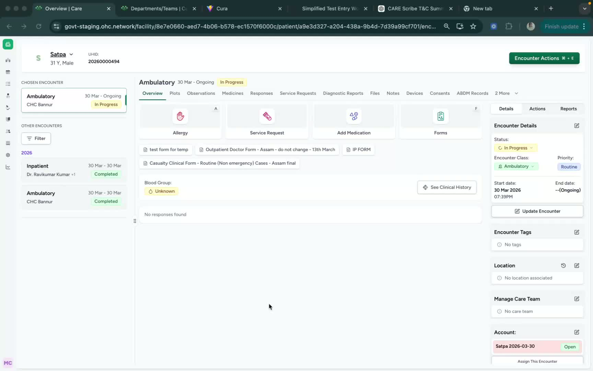
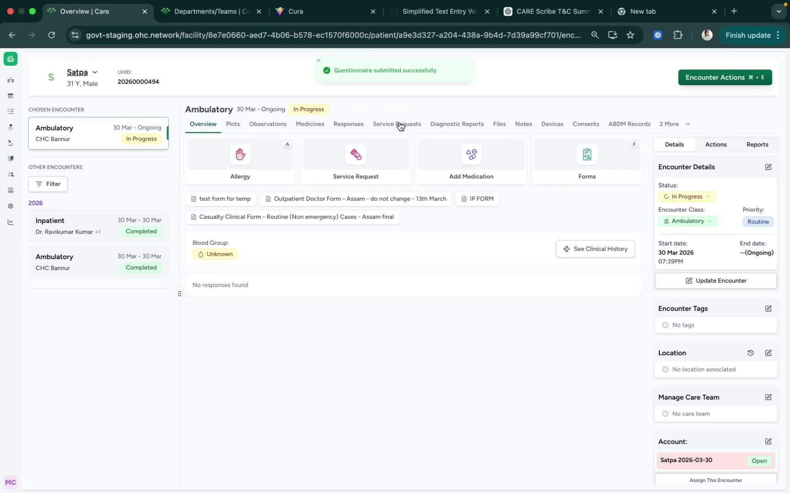

### Objective

To guide a practitioner or team member through creating a service request from the patient encounter page in Care. This SOP covers ordering lab investigations, procedures, and radiology-related investigations so they can be viewed under Service Request.

### Key Steps

**1. Open the Patient Encounter Page and Select Service Request** [0:02](https://loom.com/share/00c7aebc1cf54cbea8de32ed647bd7dd?t=2)

- Navigate to the **Patient Encounter** page.

- Click on **Service Request** to begin creating a new request.

- Use this section when you need to place an order during the patient encounter.

**2. Choose the Type of Service Request** [0:02](https://loom.com/share/00c7aebc1cf54cbea8de32ed647bd7dd?t=2)

- Select the appropriate request type based on the clinical need.

- Available options include:

**Lab investigations** (for example, a CBC)

- **Procedures**

- **Radiology-related investigations**

- Ensure the selected request matches the intended service before proceeding.

**3. Submit and Review the Service Request** [0:43](https://loom.com/share/00c7aebc1cf54cbea8de32ed647bd7dd?t=43)

- After entering the request, confirm that it has been added under **Service Request**.

- Review the list to verify the request is visible and correctly recorded.

- Remember that service requests are typically created by a **practitioner**.

### Cautionary Notes
- Ensure you are on the correct **Patient Encounter** before placing any request.

- Double-check the request type to avoid ordering the wrong investigation or procedure.

- Confirm the request is saved and visible under **Service Request** before ending the encounter.

- Only authorized practitioners should place service requests.

### Tips for Efficiency
- Use the **Service Request** section directly from the patient encounter page to save time.

- Keep common orders, such as CBC or standard radiology requests, readily available for quick selection.

- Verify the request immediately after submission to reduce follow-up corrections.

- Standardize request entry practices across practitioners to improve consistency.

### Link to Loom

[https://loom.com/share/00c7aebc1cf54cbea8de32ed647bd7dd](https://loom.com/share/00c7aebc1cf54cbea8de32ed647bd7dd)