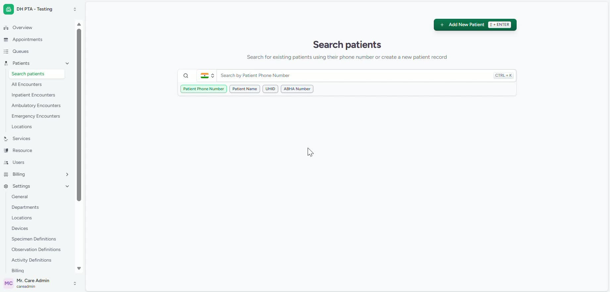
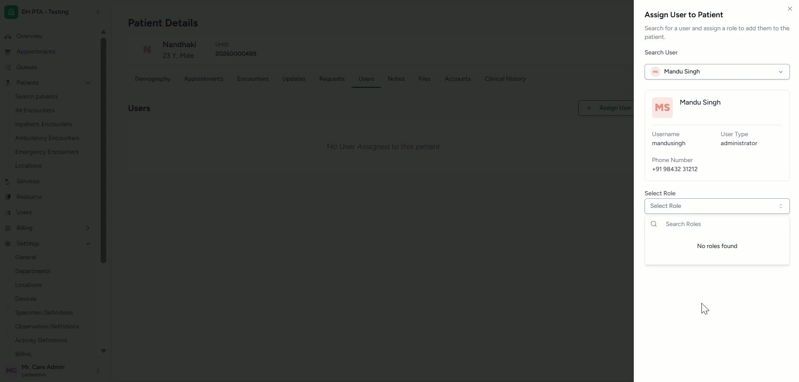
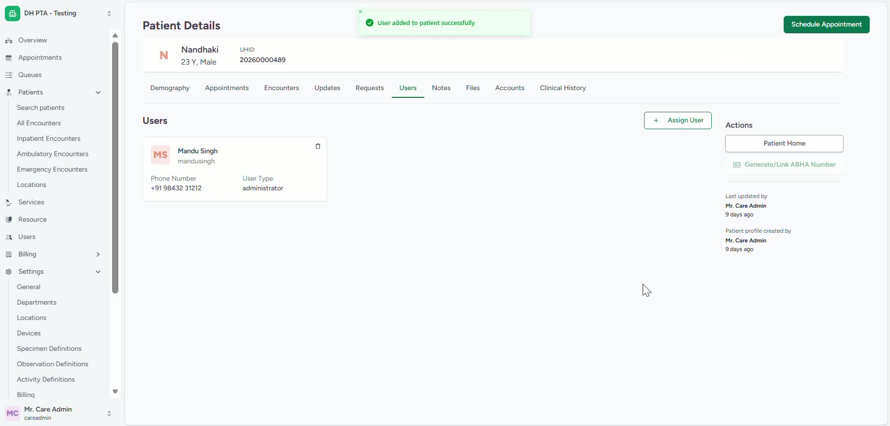

### ObjectiveThis SOP explains how to assign a user, such as a volunteer or ASHA worker, to a specific patient record. The goal is to ensure the assigned user can manage that patient within the system.

### Key Steps**1. Locate the Patient Record** [0:12](https://loom.com/share/0d2c7a2e555a4ecda0775bfd7721be4a?t=12)

- Open the patient assignment feature.

- Search for the patient you want to assign.

- Confirm you have selected the correct patient before proceeding.

**2. Select the User Role** [0:12](https://loom.com/share/0d2c7a2e555a4ecda0775bfd7721be4a?t=12)

- Identify the type of user role you want to assign (for example, volunteer or ASHA worker).

- Use the role list to find the appropriate role, or search for it directly if available.

- Make sure the selected role matches the intended user type.

**3. Choose the User and Assign Them** [0:42](https://loom.com/share/0d2c7a2e555a4ecda0775bfd7721be4a?t=42)

- Select the user from the available list.

- Assign the selected user to the patient record.

- Verify that the assignment action is completed successfully.

**4. Confirm the Assignment** [0:54](https://loom.com/share/0d2c7a2e555a4ecda0775bfd7721be4a?t=54)

- Check that the user now appears as assigned to the patient.

- Confirm the user has permission to manage the patient record.

- Save or exit the screen only after verifying the assignment is correct.

### Cautionary Notes
- Ensure the correct patient is selected before assigning a user.

- Verify the user role carefully to avoid assigning the wrong type of user.

- Confirm the assignment after completion to prevent access or management issues.

### Tips for Efficiency
- Use the search function to quickly find the patient or user role.

- Keep a consistent process for verifying patient identity before assignment.

- Assign only users who are authorized to manage the patient record.

### Link to Loom[https://loom.com/share/0d2c7a2e555a4ecda0775bfd7721be4a](https://loom.com/share/0d2c7a2e555a4ecda0775bfd7721be4a)