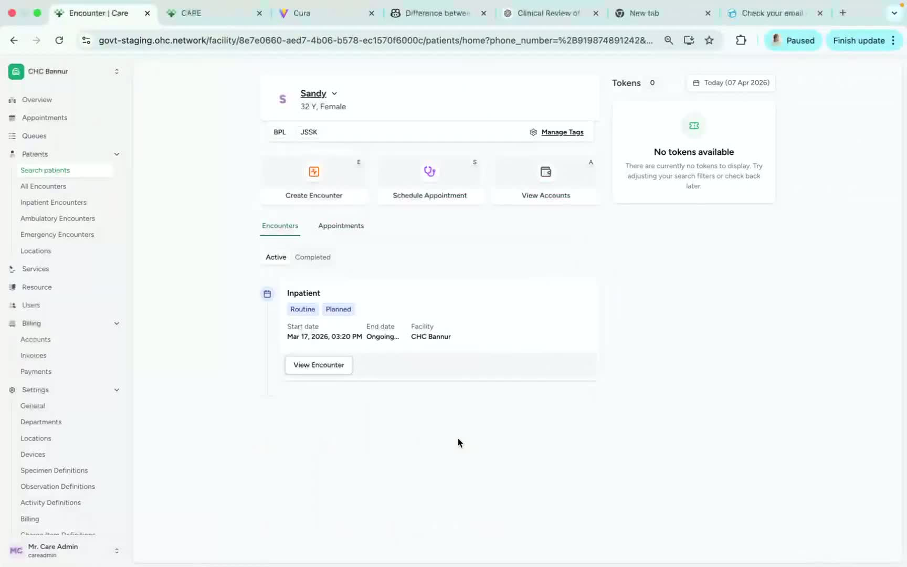
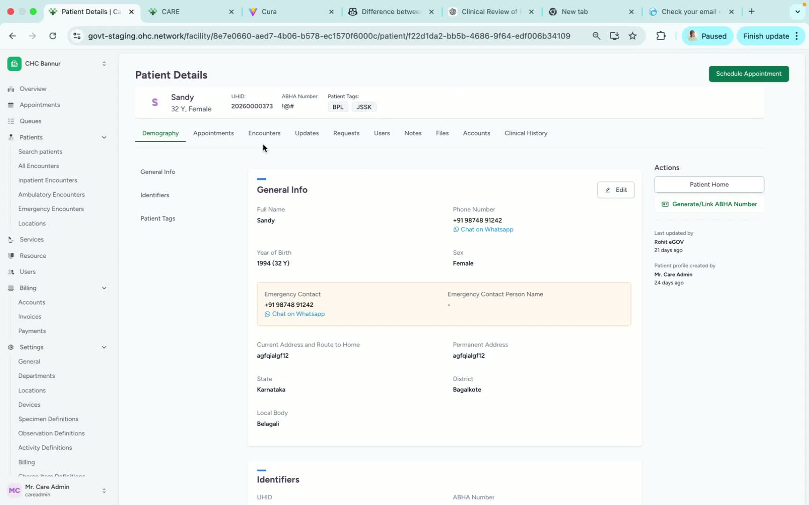
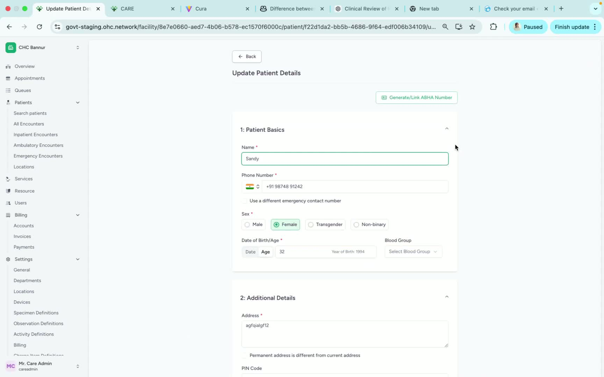
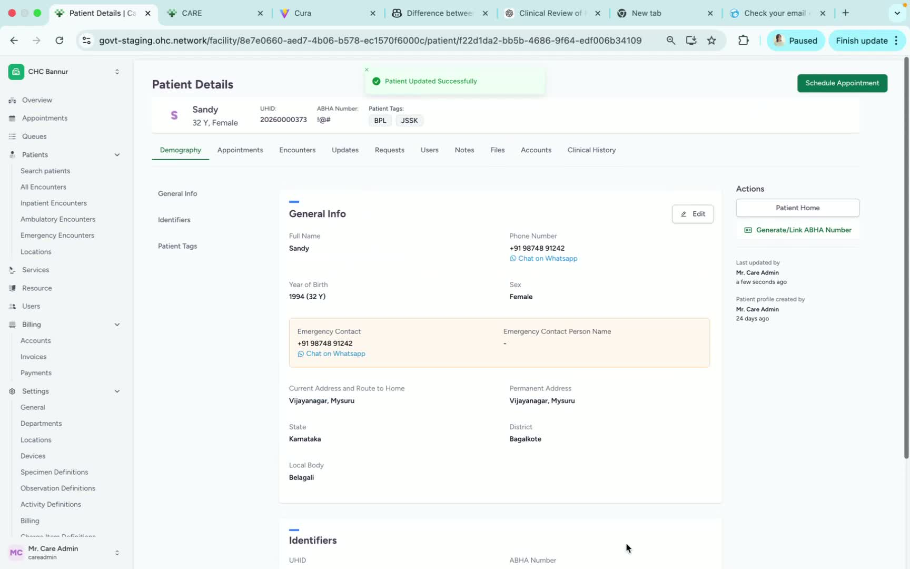

### ObjectiveThis SOP explains how to update a registered patient’s demography details in the system. It guides the user through opening the patient profile, accessing the edit function, making changes, and saving the updates.

### Key Steps**1. Open the Patient Profile** [0:02](https://loom.com/share/b41125f280bb4b0e86f155883fddd3ad?t=2)

- Locate the registered patient in the system.

- Click on the patient’s profile to open their record.

- Confirm you are viewing the correct patient before making any changes.

**2. Access the Edit Option** [0:11](https://loom.com/share/b41125f280bb4b0e86f155883fddd3ad?t=11)

- Review the patient’s existing details on the profile page.

- Find the **Edit** option on the record.

- Click **Edit** to enable changes to the patient’s demography information.

**3. Update the Demography Details** [0:22](https://loom.com/share/b41125f280bb4b0e86f155883fddd3ad?t=22)

- Modify the required fields as needed.

- Example: update the patient’s address or any other demographic information.

- Review the changes carefully before saving.

- Click **Update** to save the revised details.

**4. Confirm the Update Was Saved** [0:38](https://loom.com/share/b41125f280bb4b0e86f155883fddd3ad?t=38)

- Verify that the updated information appears correctly on the patient profile.

- Ensure the changes were successfully applied.

- If needed, repeat the edit process to correct any remaining errors.

### Cautionary Notes
- Always confirm you have opened the correct patient profile before editing.

- Double-check all updated demographic details for accuracy before clicking **Update**.

- Avoid making unnecessary changes to patient records.

- Follow your organization’s privacy and data-handling policies when accessing patient information.

### Tips for Efficiency
- Gather the correct patient information before opening the profile to reduce editing time.

- Make all needed demographic changes in one session before saving.

- Review the profile after updating to confirm the changes were applied correctly.

- Use a consistent process for every patient record to reduce errors.

### Link to Loom[https://loom.com/share/b41125f280bb4b0e86f155883fddd3ad](https://loom.com/share/b41125f280bb4b0e86f155883fddd3ad)