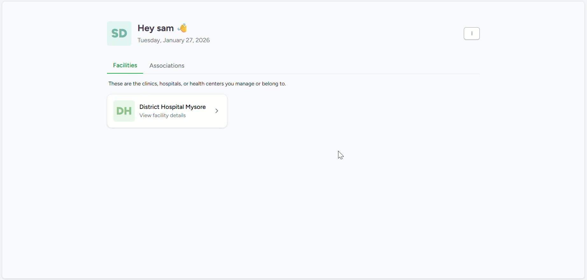
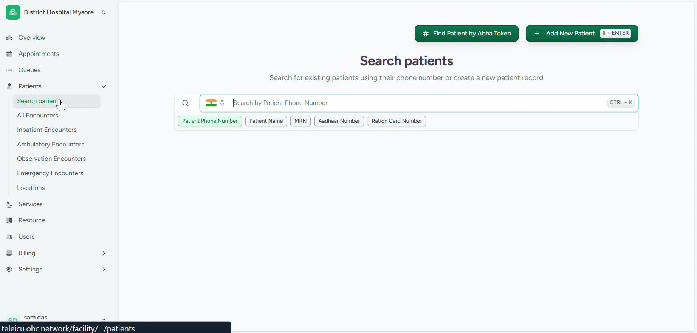
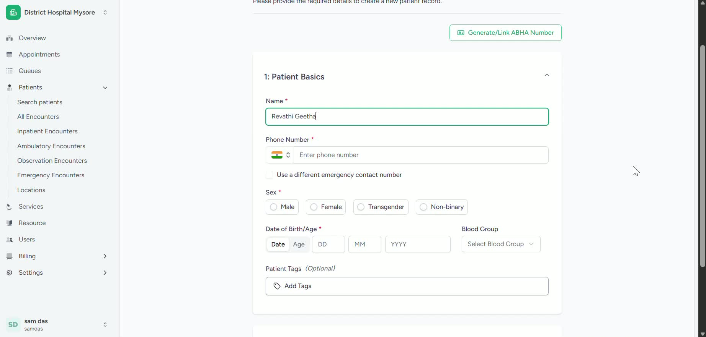
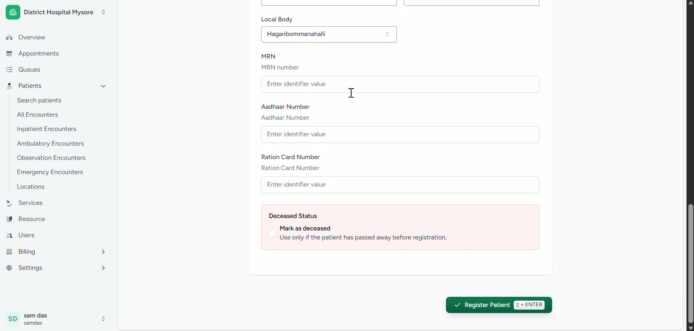

### Objective

To provide a clear, step-by-step process for registering a new patient manually in Care. This SOP ensures accurate patient data entry so the patient can be saved in the system and proceed to the next workflow step.

### Key Steps

**1. Open the Patient Registration Area** [0:01](https://loom.com/share/0715404a6647417d8aeb556c1b841c24?t=1)

- Log in to Bandal Wave and navigate to the **Patients** section.

- Select the appropriate patient registration option to begin creating a new record.

- Confirm you are in the correct routine/workflow before proceeding.

**2. Start a New Patient Registration** [0:08](https://loom.com/share/0715404a6647417d8aeb556c1b841c24?t=8)

- Click the **Add New Patient** button.

- Wait for the patient registration form to appear.

- Verify that all required fields are visible before entering information.

**3. Enter Basic Patient Details** [0:24](https://loom.com/share/0715404a6647417d8aeb556c1b841c24?t=24)

- Fill in the patient’s **name**.

- Enter the patient’s **phone number**.

- Select the patient’s **gender**.

- Enter the patient’s **age**.

- Choose the correct **blood group**.

- If applicable, enter the patient’s **religion** or other demographic details requested by the form.

**4. Enter Address and Location Information** [0:24](https://loom.com/share/0715404a6647417d8aeb556c1b841c24?t=24)

- Enter the patient’s **address**.

- Complete location fields such as **state**, **district**, and **local body**.

- Review the address details for accuracy before moving on.

**5. Add Identification Details** [0:47](https://loom.com/share/0715404a6647417d8aeb556c1b841c24?t=47)

- Enter the patient’s **unique identification number**, if available.

- Confirm the ID number matches the patient’s official record.

**6. Save the Patient Record** [0:47](https://loom.com/share/0715404a6647417d8aeb556c1b841c24?t=47)

- Click the button to **save/register** the patient record.

- Confirm the patient has been successfully added to the system.

- Proceed to the next process in the workflow once registration is complete.

### Cautionary Notes
- Ensure all patient information is entered accurately to avoid duplicate or incorrect records.

- Double-check spelling, phone numbers, age, and identification numbers before saving.

- Do not proceed if required fields are missing, as the registration may fail.

- Follow your organization’s privacy and data-handling policies when entering patient information.

### Tips for Efficiency
- Keep patient documents ready before starting to reduce data entry time.

- Use a consistent format for names, addresses, and identification numbers.

- Verify required fields first so you can complete the form in one pass.

- Save the record immediately after confirming all details are correct to avoid losing data.

### Link to Loom

[https://loom.com/share/0715404a6647417d8aeb556c1b841c24](https://loom.com/share/0715404a6647417d8aeb556c1b841c24)