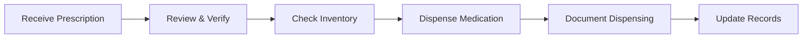

# Pharmacy Management

Guide for pharmacists to review prescriptions, verify medications, and dispense medicines to patients.

## Overview

Manage the complete pharmacy workflow from prescription review to medication dispensing with proper documentation and inventory tracking.

---

## Available Guide

-   **Review & Dispense Medicines**

    Complete pharmacist workflow for reviewing prescriptions and dispensing medications.

    [:octicons-arrow-right-24: Read More](review-dispense-medicines.md)

---

## Pharmacy Workflow

---

## Quick Stats

- **Total Guides**: 1
- **Workflow Stages**: 6 (Receive → Review → Check → Dispense → Document → Update)
- **User Roles**: Pharmacists, Pharmacy Technicians

---

!!! warning "Safety Checks"
    Always verify patient allergies, drug interactions, and dosage before dispensing medications to ensure patient safety.
