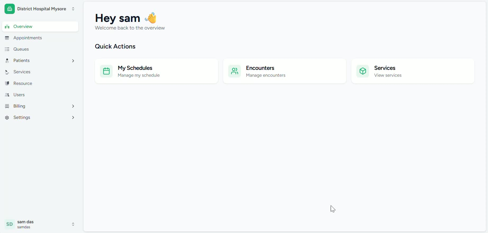
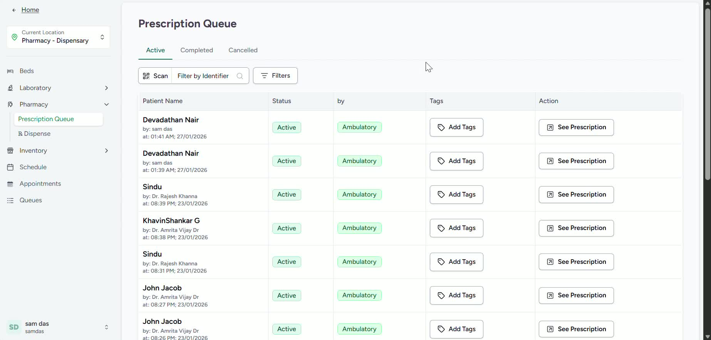
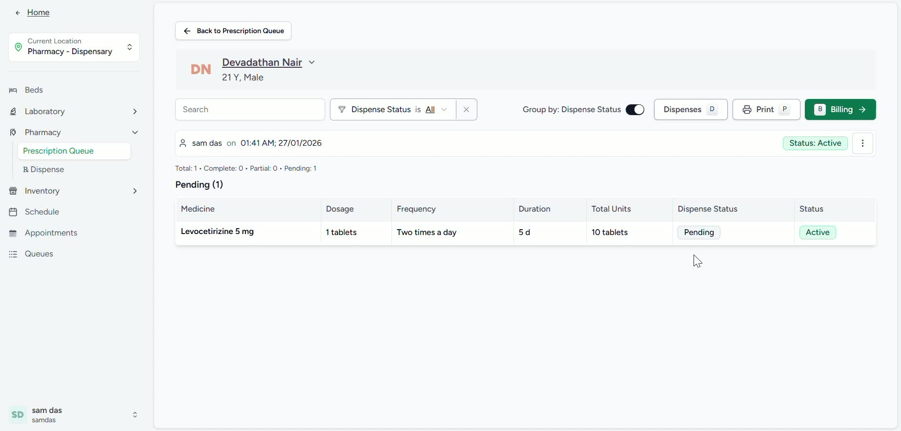
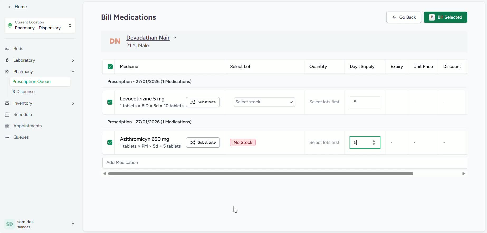
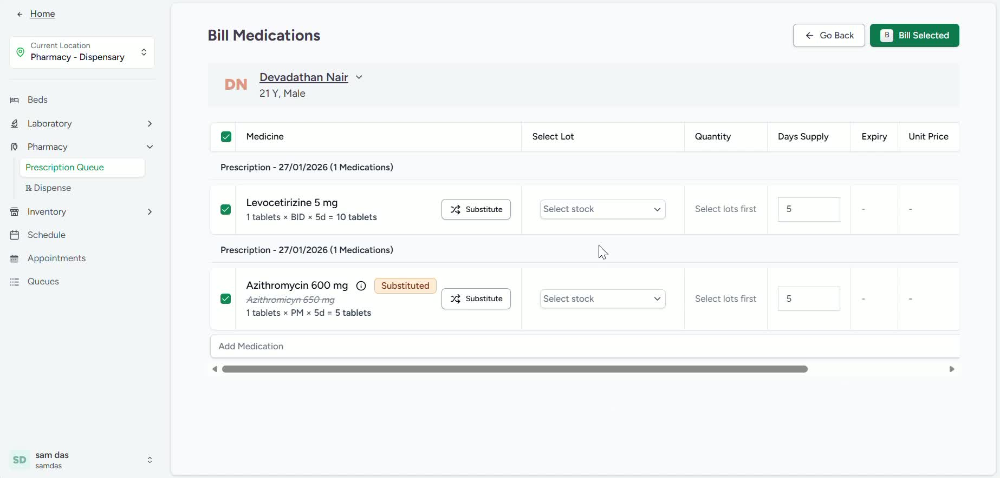
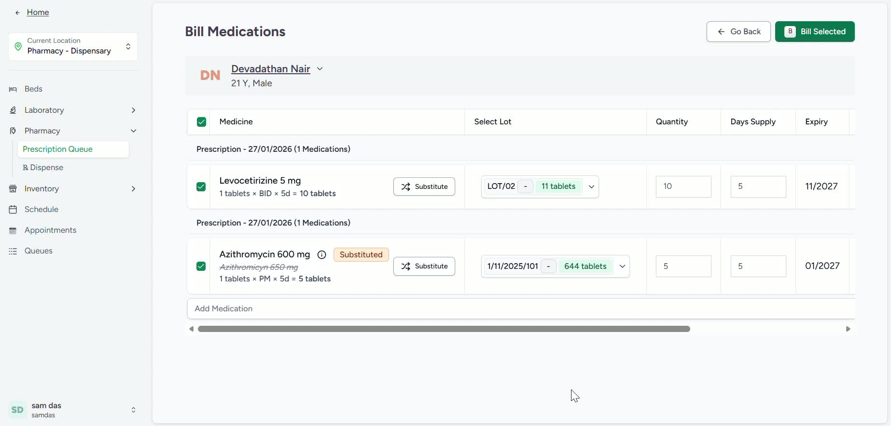
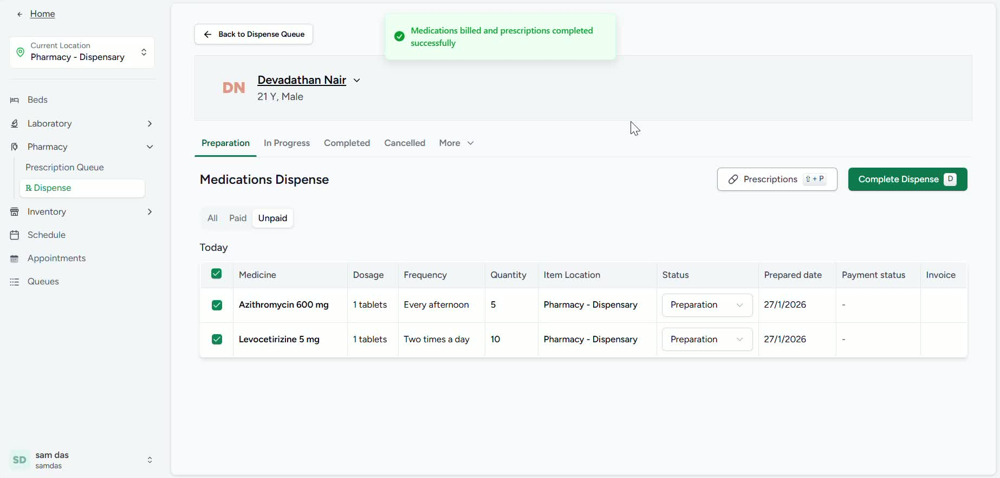
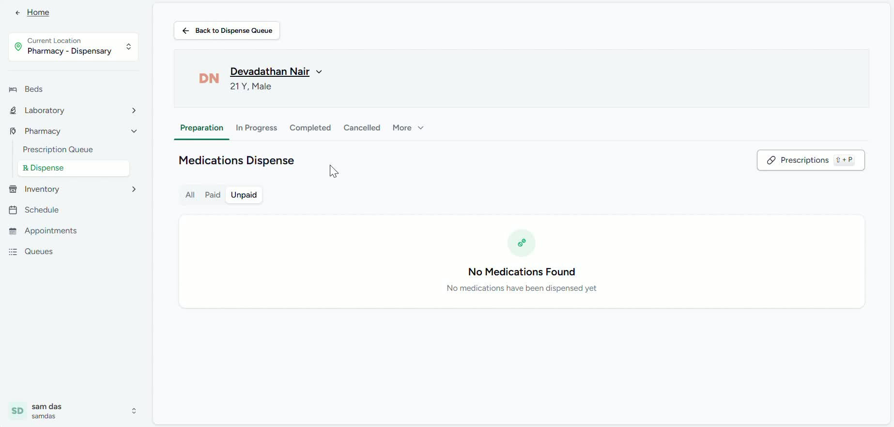

### Objective

To provide a clear, repeatable process for pharmacists to review doctor prescriptions, handle stock shortages through approved substitutions, and dispense medicines to patients accurately. This SOP ensures prescriptions are processed efficiently and completed records are updated in the system.

### Key Steps

**1. Open the prescription list for the selected pharmacy** [0:01](https://loom.com/share/dd88ef3c63194804bf993292e245f334?t=1)

- Navigate to **Services** in the left Navigation bar.

- Select the appropriate healthcare service which is **pharmacy**.

- Click on **View Prescriptions** to display available prescriptions.

- Confirm you are viewing the correct pharmacy queue before proceeding.

**2. Select the patient and review the prescription details** [0:14](https://loom.com/share/dd88ef3c63194804bf993292e245f334?t=14)

- Choose the **patient name** from the prescription list.

- Click **View Prescriptions** to open the doctor’s order.

- Review the prescribed medicine(s), dosage, and any special instructions.

- Verify the prescription belongs to the correct patient before dispensing.

**3. Print the prescription if needed** [0:27](https://loom.com/share/dd88ef3c63194804bf993292e245f334?t=27)

- Review the prescription details on screen.

- If required, click **Print** to generate a hard copy.

- Provide the printed prescription to the patient if required.

- Use the printout for reference during dispensing and verification.

**4. Handle stock shortages and select an approved substitute** [0:42](https://loom.com/share/dd88ef3c63194804bf993292e245f334?t=42)

- Check whether the prescribed medicine is available in stock.

- If the prescribed item is **out of stock**, identify an appropriate substitute with the same or suitable dosage form/strength.

- Select the substitute medicine from the available options.

- Confirm the substitution aligns with pharmacy policy and prescription requirements.

**5. Select the medicines to dispense** [1:05](https://loom.com/share/dd88ef3c63194804bf993292e245f334?t=65)

- Choose the medicine(s) that will be dispensed, including any approved substitute.

- Review the selected dosage and quantity before continuing.

- Ensure the correct medicine and strength are selected for the patient.

- Confirm the selection matches the prescription intent.

**6. Review the auto-calculated quantity and bill selected items** [1:17](https://loom.com/share/dd88ef3c63194804bf993292e245f334?t=77)

- Check the automatically calculated number of medicine units.

- Verify the quantity is correct before finalizing.

- Click **Bill Selected** to proceed with the selected items.

- Confirm there are no missing fields or unresolved selection issues.

**7. Complete the dispense action** [1:29](https://loom.com/share/dd88ef3c63194804bf993292e245f334?t=89)

- Click **Confirm Dispense** to finalize the transaction.

- The system will mark the medicines as dispensed to the patient.

- Verify the status updates correctly after completion.

- Ensure the dispense record is saved in the system.

**8. Verify completion in the completed actions section** [1:40](https://loom.com/share/dd88ef3c63194804bf993292e245f334?t=100)

- Open the **Completed** section to confirm the transaction is listed.

- Check that the prescription has been marked as completed.

- Use this section to audit recent dispensing activity.

- Close the task only after confirming the completed status.

### Cautionary Notes
- Always verify the patient name before dispensing to avoid medication errors.

- Do not substitute a medicine unless it is permitted by pharmacy policy and appropriate for the prescription.

- Double-check dosage, strength, and quantity before confirming dispense.

- Ensure printed prescriptions and patient records are handled according to privacy and compliance requirements.

- Incase medicines can’t be dispensed, prescription can be printed and shared with the patient. 

### Tips for Efficiency
- Use the prescription list filters to quickly locate the correct patient.

- Review stock availability early to reduce delays at the dispensing stage.

- Rely on auto-calculated quantities, but always perform a manual sanity check.

- Keep the completed actions section updated for easier tracking and audit readiness.

### Link to Loom

[https://loom.com/share/dd88ef3c63194804bf993292e245f334](https://loom.com/share/dd88ef3c63194804bf993292e245f334)