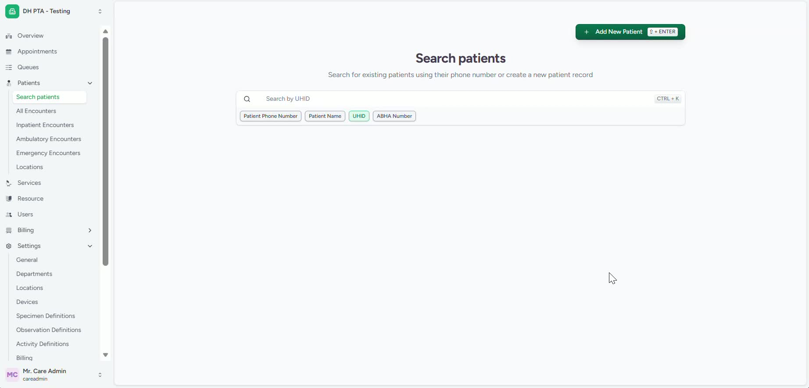
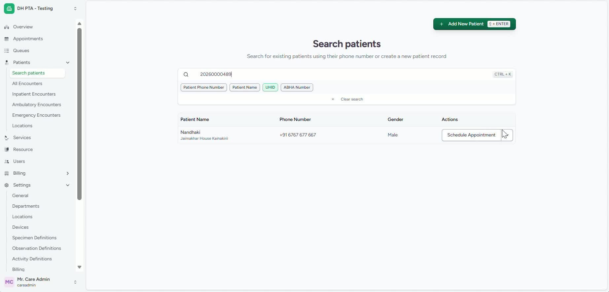
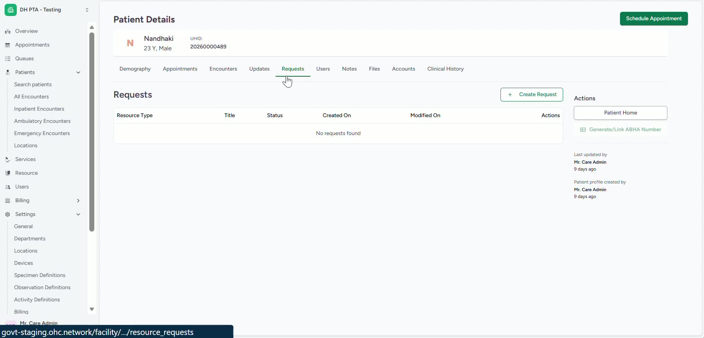
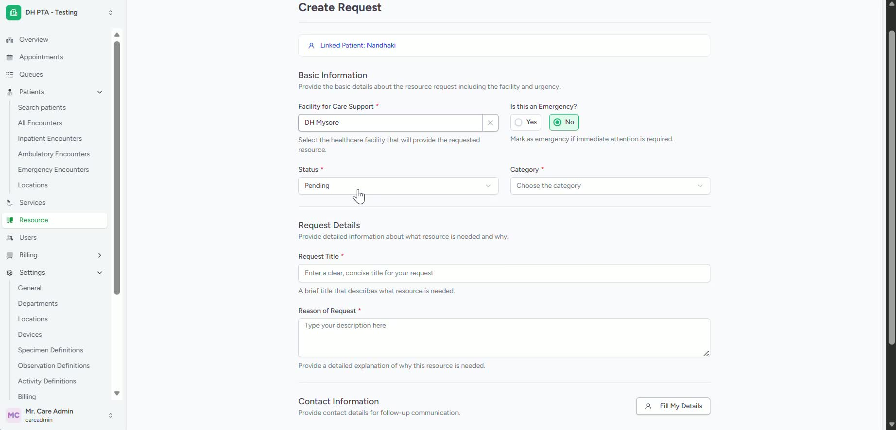
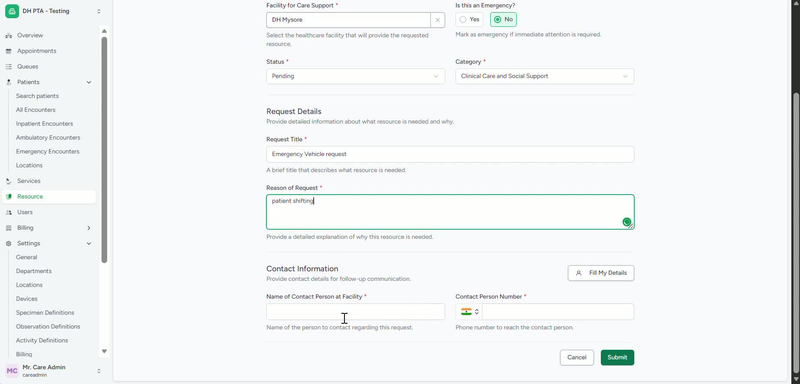
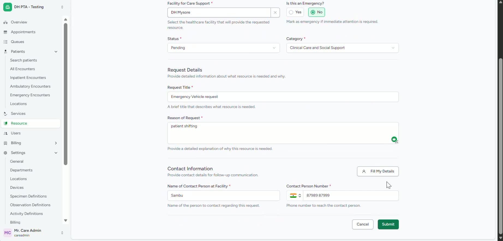
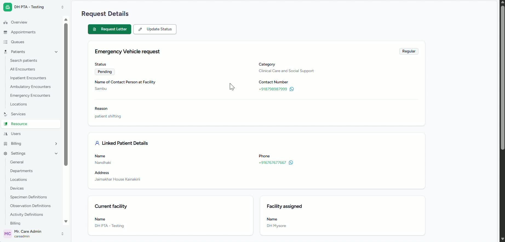
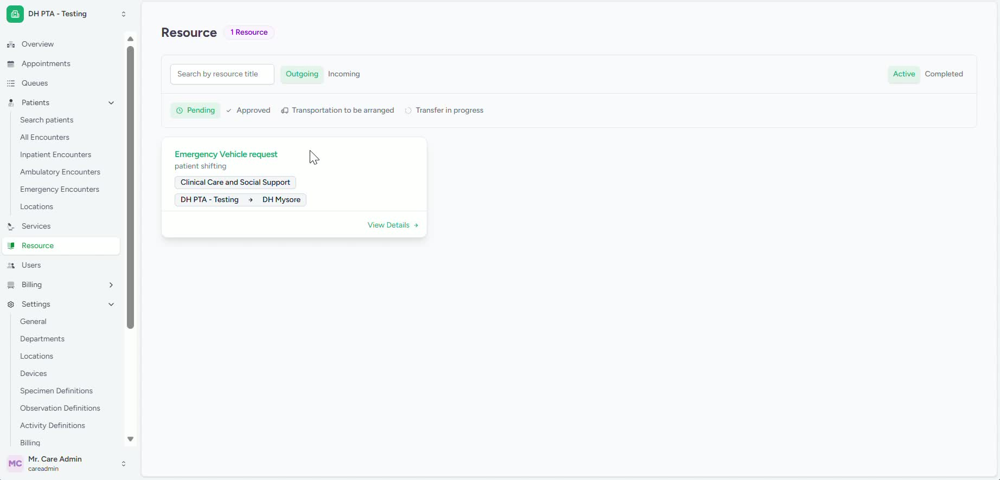

### ObjectiveThis SOP explains how to create a resource request for a patient, submit it to the appropriate facility, and track or update the request status. It ensures staff can complete the process accurately and monitor progress through approval or other outcomes.

### Key Steps**1. Open the Patient Profile** [0:01](https://loom.com/share/d7a9bc42ddbd4790bb2ab98b0e062724?t=1)

- Search for the patient using the patient ID.

- Open the correct patient record.

- Confirm you are working in the right patient profile before creating a request.

**2. Start a New Resource Request** [0:09](https://loom.com/share/d7a9bc42ddbd4790bb2ab98b0e062724?t=9)

- In the patient profile, locate the **Request** section in the middle navigation bar.

- Click **Create Request** to begin a new resource request.

**3. Select the Receiving Facility and Request Type** [0:20](https://loom.com/share/d7a9bc42ddbd4790bb2ab98b0e062724?t=20)

- Choose the facility you are requesting support for.

- Select the appropriate hospital or destination facility.

- Mark the request as **Emergency** if applicable.

- Review or change the request status if needed; it may default to **Pending**.

**4. Enter Request Details** [0:41](https://loom.com/share/d7a9bc42ddbd4790bb2ab98b0e062724?t=41)

- Select the correct request category.

- Add the request details clearly and completely.

- Enter the reason for the request.

- Make sure the information matches the patient’s needs.

**5. Add Contact Information** [1:08](https://loom.com/share/d7a9bc42ddbd4790bb2ab98b0e062724?t=68)

- Enter the contact details for the hospital or staff member raising the request.

- Include the phone number and any other required contact information.

- If you are the same person completing the form, use **Fill My Details** to auto-populate your name and number.

**6. Submit the Request** [1:27](https://loom.com/share/d7a9bc42ddbd4790bb2ab98b0e062724?t=87)

- Review all entered information for accuracy.

- Click **Submit** to send the request to the selected facility.

- Confirm the request has been successfully submitted.

**7. Update and Track Request Status** [1:46](https://loom.com/share/d7a9bc42ddbd4790bb2ab98b0e062724?t=106)

- Monitor the request status after submission.

- Update the status manually if the request is approved through phone or another offline method.

- Use the status update option to change the request to the correct final state.

- Track request progress using the available status views such as **Pending** and **Approved**.

**8. Review Incoming and Outgoing Requests** [2:04](https://loom.com/share/d7a9bc42ddbd4790bb2ab98b0e062724?t=124)

- On the left navigation bar, click on resource as it’s the tracking area to review both outgoing and incoming resource requests.

- There are both outgoing and incoming requests tracked here

- Follow up on requests that remain pending for too long.

### Cautionary Notes
- Verify the patient ID before opening the profile to avoid creating a request for the wrong patient.

- Ensure the receiving facility is selected correctly before submitting.

- Double-check the request category, reason, and contact details for accuracy.

- If a request is approved offline, remember to update the system status so records stay current.

- Do not submit incomplete requests, as this may delay processing.

### Tips for Efficiency
- Use **Fill My Details** when you are the requester to save time and reduce typing errors.

- Keep request details concise but complete to help the receiving facility respond faster.

- Check request status regularly to catch approvals or issues early.

- Standardize how your team enters request reasons and categories for consistency.

- Review both incoming and outgoing requests daily if your workflow depends on timely coordination.

### Link to Loom[https://loom.com/share/d7a9bc42ddbd4790bb2ab98b0e062724](https://loom.com/share/d7a9bc42ddbd4790bb2ab98b0e062724)