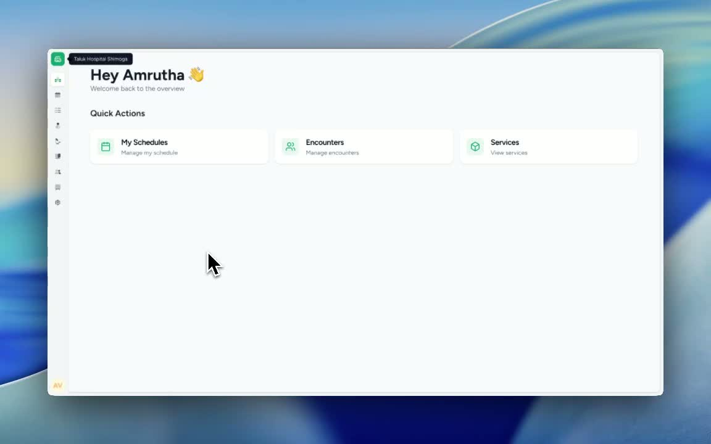
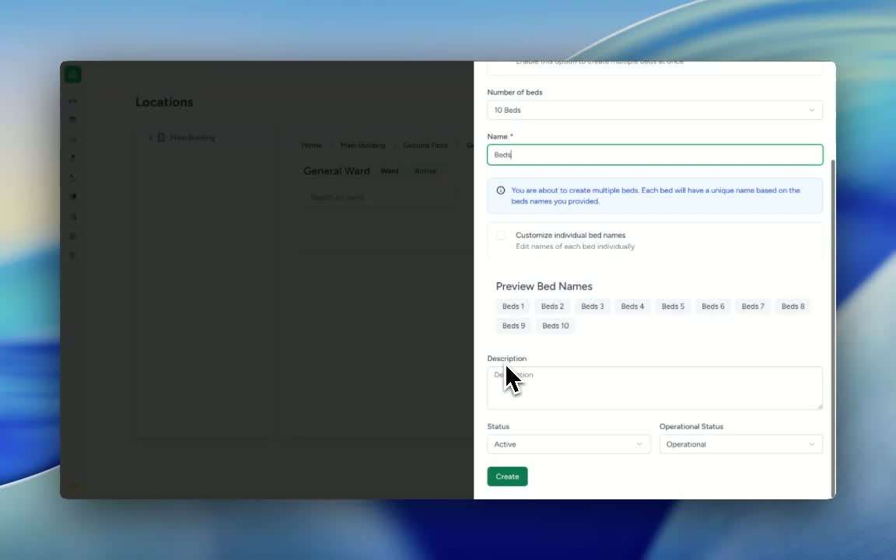
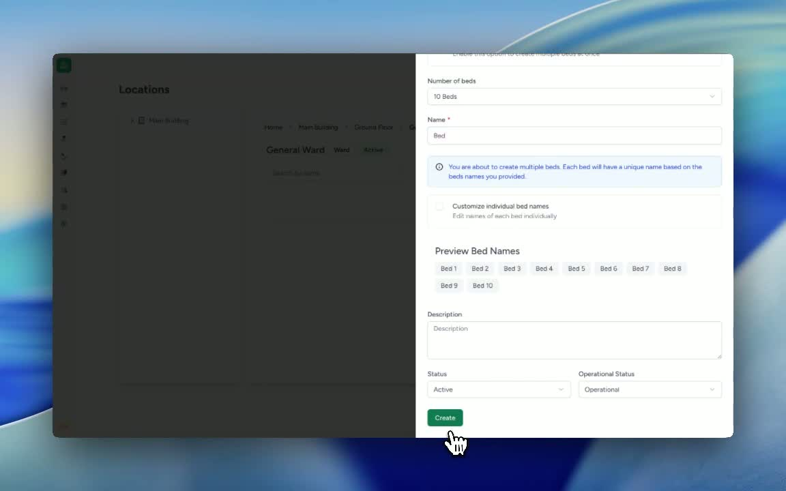

### ObjectiveThis SOP explains how to add multiple beds to a specific location within the system. It guides the user through selecting the correct ward, creating the beds, and optionally customizing bed names for easier identification.

### Key Steps**1. Navigate to the correct location** [0:02](https://loom.com/share/8ca2fdd2cfff42bfbc9879878a41b1fd?t=2)

- Go to **Settings**.

- Select **Locations**.

- Click **Main Building**.

- Choose **Ground Floor**.

- Select **General Ward** as the target location where beds will be added.

**2. Start the bed creation process** [0:39](https://loom.com/share/8ca2fdd2cfff42bfbc9879878a41b1fd?t=39)

- In the selected location, click **Add Location**.

- In the **Location Form**, choose **Bed** as the location type.

- Select the option to **Create Multiple Beds**.

- Enter the number of beds to create (example: **10 beds**).

**3. Customize bed names if needed** [0:50](https://loom.com/share/8ca2fdd2cfff42bfbc9879878a41b1fd?t=50)

- Review the default bed naming format (e.g., **Bed 1** through **Bed 10**).

- Use the option to **customize individual bed names** if specific labels are needed.

- Adjust the naming format as desired before creating the beds.

**4. Confirm and create the beds** [0:59](https://loom.com/share/8ca2fdd2cfff42bfbc9879878a41b1fd?t=59)

- Click **Create** to finalize the setup.

- Verify that the beds have been created successfully in **General Ward**.

- Confirm the bed list displays the expected range (e.g., **Bed 1 to Bed 10**).

### Cautionary Notes
- Ensure you are in the correct location before creating beds to avoid adding them to the wrong ward.

- Double-check the number of beds entered before clicking **Create**.

- If customizing names, verify spelling and numbering to prevent confusion later.

### Tips for Efficiency
- Prepare the desired bed count and naming convention before starting.

- Use consistent naming across wards to make bed management easier.

- Review the created beds immediately after saving to catch any errors early.

### Link to Loom[https://loom.com/share/8ca2fdd2cfff42bfbc9879878a41b1fd](https://loom.com/share/8ca2fdd2cfff42bfbc9879878a41b1fd)