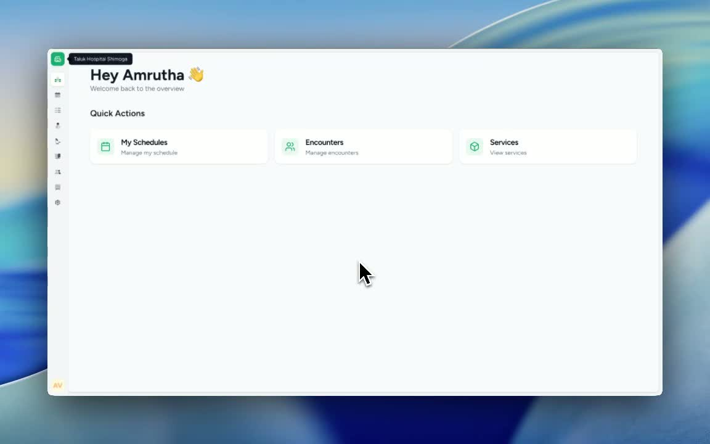
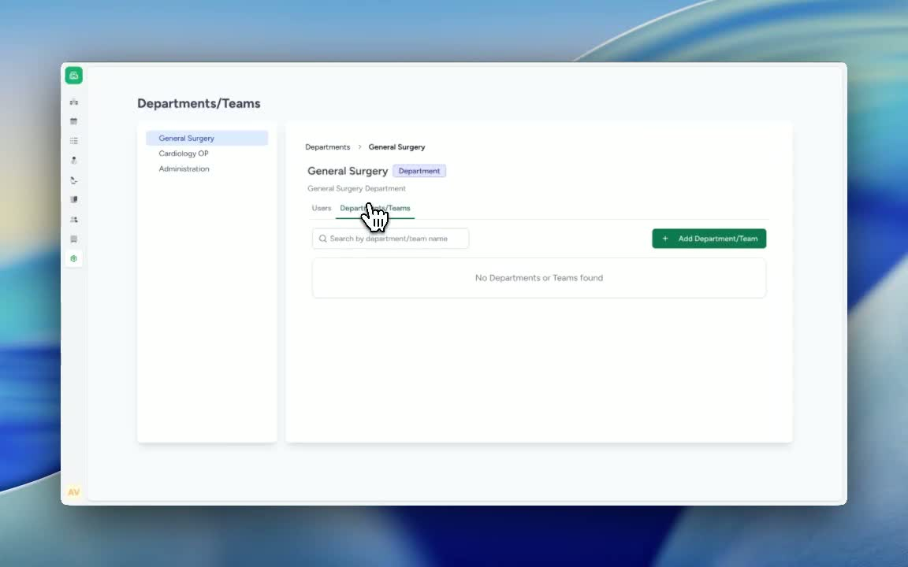
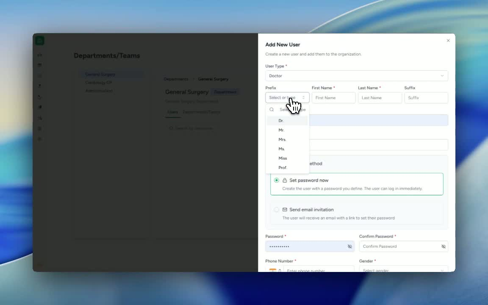
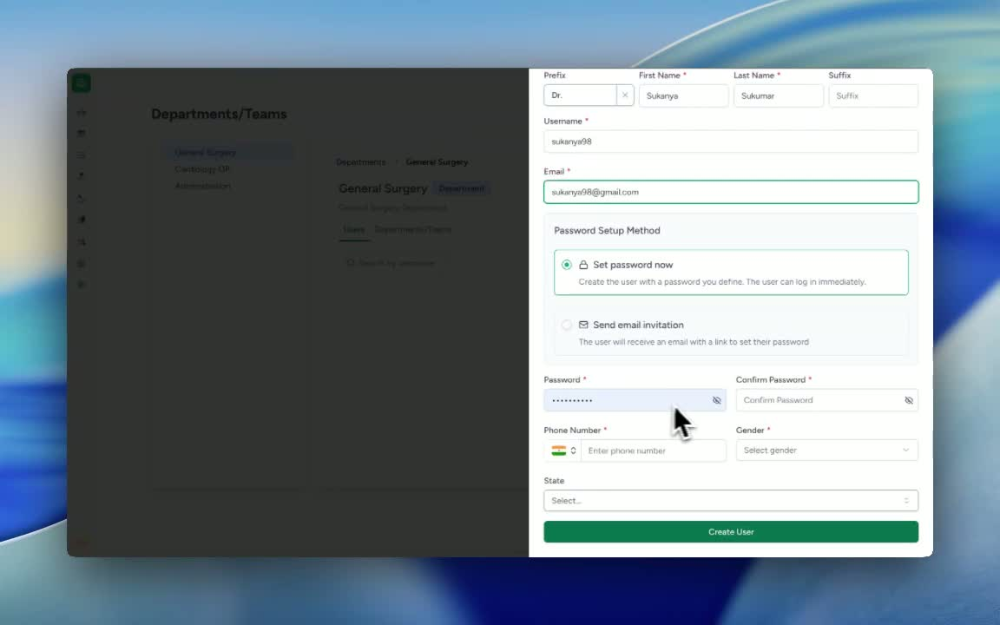
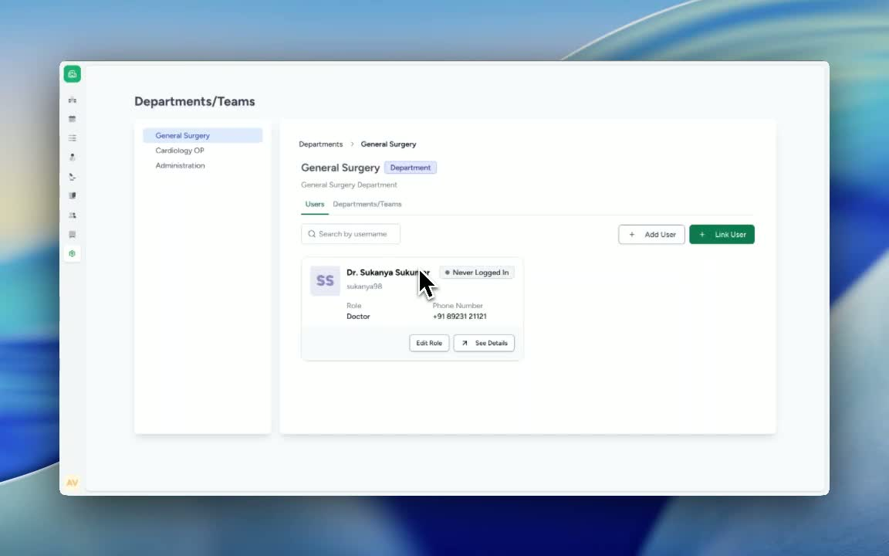

### ObjectiveThis SOP explains how to add a new user to a department or link an existing user to a department from the Settings area. It ensures users are assigned correctly with the appropriate role and access.

### Key Steps**1. Open Department Settings** [0:02](https://loom.com/share/bba88207729545b9bebea6663acd4f56?t=2)

- Navigate to **Settings**.

- Select **Departments**.

- Choose the **relevant department** where the user should be added or linked.

**2. Open the Users Section** [0:14](https://loom.com/share/bba88207729545b9bebea6663acd4f56?t=14)

- Click on **Users** within the selected department.

- Review the two available actions:

**Add User**

- **Link User**

- Decide whether you are creating a new user or connecting an existing user.

**3. Add a New User** [0:31](https://loom.com/share/bba88207729545b9bebea6663acd4f56?t=31)

- Click **Add User**.

- Enter the following details:

**User type**

- **User name (ensure to give a prefix if that’s important)**

- **Email ID** of the doctor

- Choose how the password will be set:

Set the password immediately yourself, or

- Send an email invitation so the user can create their own password.

**4. Set Password and Confirm User Creation** [1:10](https://loom.com/share/bba88207729545b9bebea6663acd4f56?t=70)

- If setting the password manually, enter and confirm the password.

- Save the user record.

- Verify the success message indicating the user was added successfully.

- Assign the appropriate role, such as **Doctor**.

- Confirm the user is now added to the selected department (for example, **General Surgery**).

**5. Link an Existing User to the Department** [2:05](https://loom.com/share/bba88207729545b9bebea6663acd4f56?t=125)

- Click **Link User**.

- Search for the existing user.

- Select the correct **role** for the user.

- Click **Add to Organization** to link the user to the department.

- Confirm the user has been successfully linked.

### Cautionary Notes
- Ensure you select the correct department before adding or linking a user.

- Double-check the user’s name and email address before saving.

- Assign the correct role to avoid access or permission issues.

- If sending an invitation, confirm the email address is valid and accessible by the user.

### Tips for Efficiency
- Use **Link User** for existing users to save time and avoid duplicate accounts.

- Prepare user details in advance to speed up data entry.

- Standardize role selection for common user types to reduce errors.

- If multiple users need to be added, complete one department at a time for better organization.

### Link to Loom[https://loom.com/share/bba88207729545b9bebea6663acd4f56](https://loom.com/share/bba88207729545b9bebea6663acd4f56)