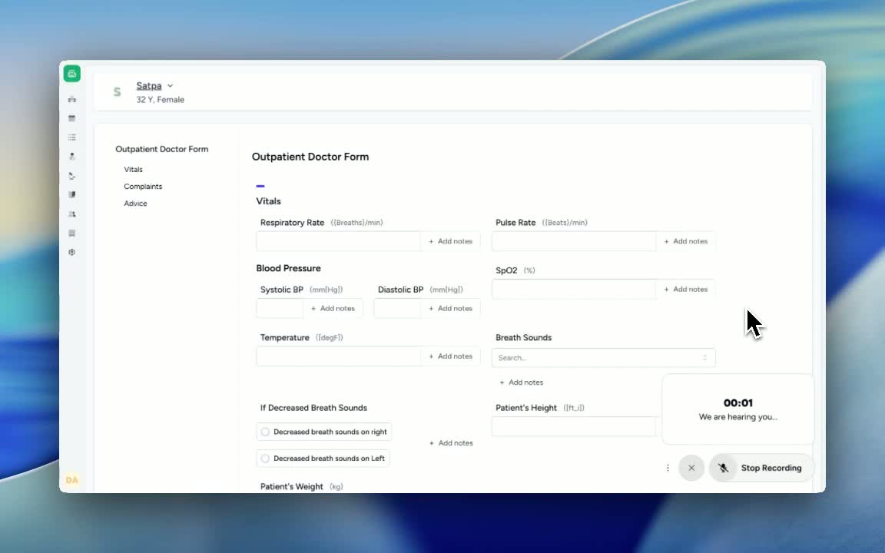
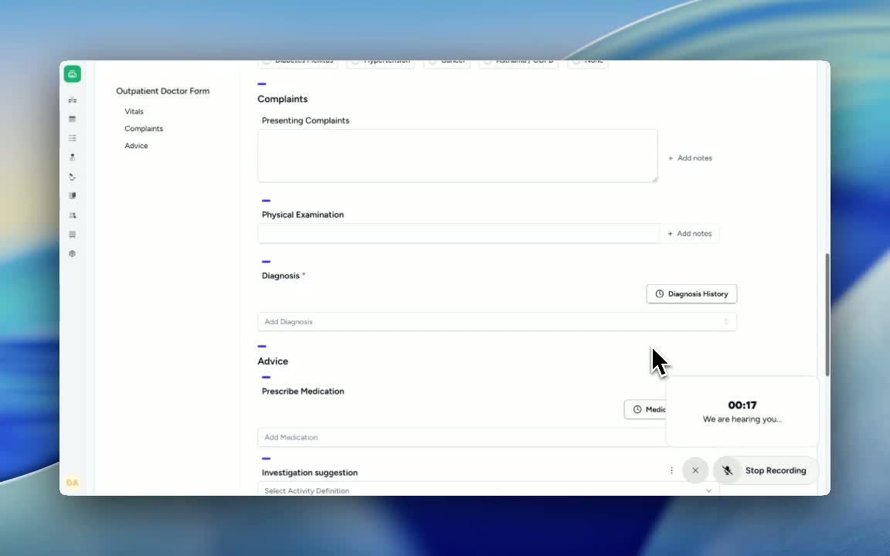
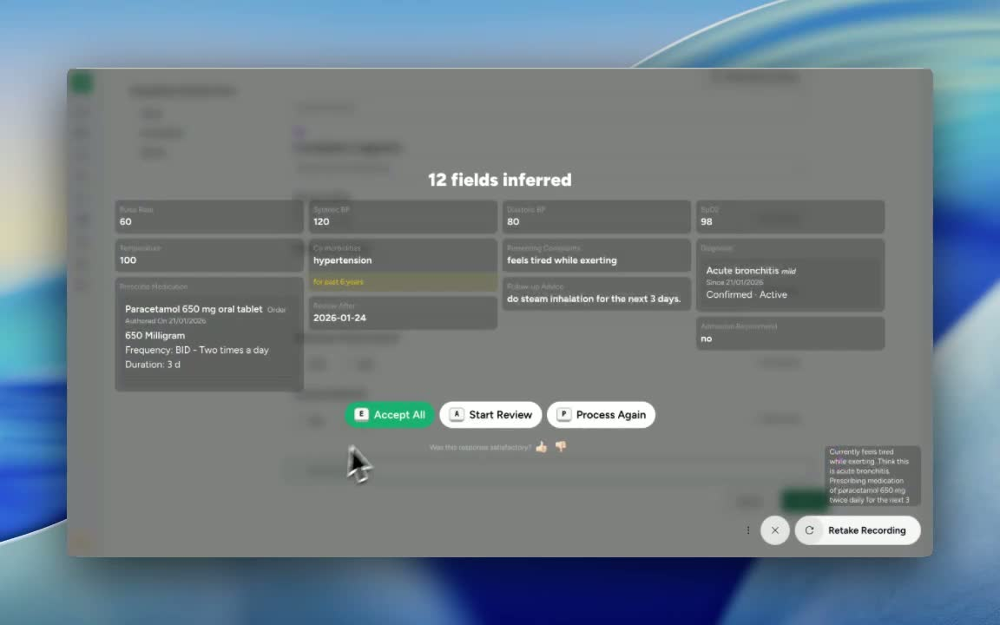

### ObjectiveTo guide a team member in capturing the patient’s vital signs, symptoms, assessment, and short-term treatment plan etc in a clear, structured way via the tool AI scribe which is a multilingual voice to text tool which automatically detects relevant parameters from the voice and updates information in the right fields. 

### Key Steps**Select the relevant Clinical Form. **

- In the right bottom corner, there is a green button named ‘Voice Autofill’ which is AI Scribe button. Enable it. 

- Record the VoiceOver for the clinical fields that needs to be filled, an example cited below -

Pulse rate: 60

- Blood pressure: 120/80

- SpO2: 98%

- Temperature: 100°F

- Record relevant history:

Hypertension for the past 6 years

- No diabetes

- Note the current symptom:

Feels tired on exertion

**2. Document the working diagnosis and treatment plan** [0:21](https://loom.com/share/a2022f4bef3c49c6a3ef01c0ad1ad302?t=21)

- Record the clinician’s impression as a respiratory infection/bronchitis-type condition.

- Enter the prescribed medication:

Paracetamol 650 mg, twice daily for 3 days

- Add supportive care instructions:

Steam inhalation for the next 3 days

- Note the recommended investigation:

CBC (complete blood count)

- Include the follow-up plan:

Review after 3 days

- Document disposition:

No admission recommended

**3. Finalize the note by confirming all key fields are captured** [0:39](https://loom.com/share/a2022f4bef3c49c6a3ef01c0ad1ad302?t=39)

- Verify that the note includes all the required elements:

Vitals

- BP, SpO2, temperature

- Comorbidities

- Presenting complaints

- Diagnosis/impression

- Medication

- 3-day advice and follow-up

- Admission decision

- If using a review workflow, either:

Accept all entries, or

- Review each item one by one for accuracy

- Ensure the final documentation is complete and ready for sign-off.

### Cautionary Notes
- This SOP is based on a short transcript and may contain transcription errors; verify medication dose, diagnosis wording, and investigation names against the original clinical record. Best to verify each entry carefully before clicking on submit button. 

### Tips for Efficiency
- Use a standard template with fixed fields for vitals, history, impression, medication, investigations, and follow-up.

- Double-check transcription of drug names and doses before saving.

- If the workflow allows, use an "accept all" option only after confirming the note is accurate and complete. 

### Link to Loom[https://loom.com/share/a2022f4bef3c49c6a3ef01c0ad1ad302](https://loom.com/share/a2022f4bef3c49c6a3ef01c0ad1ad302)