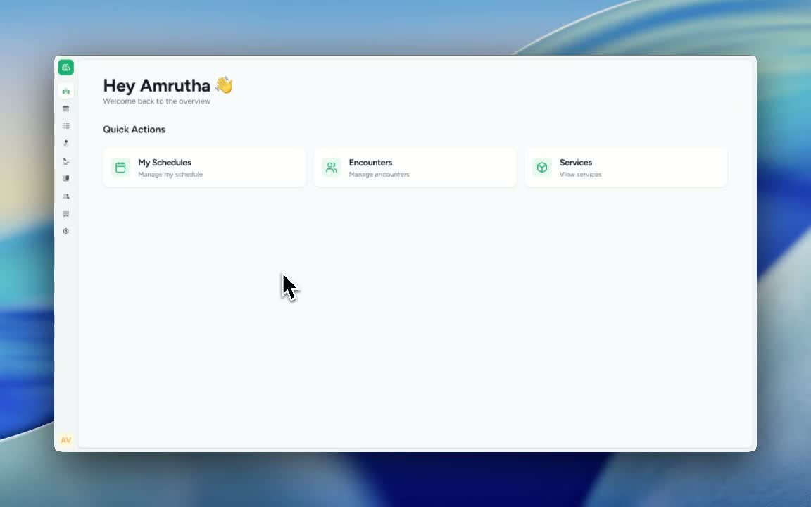
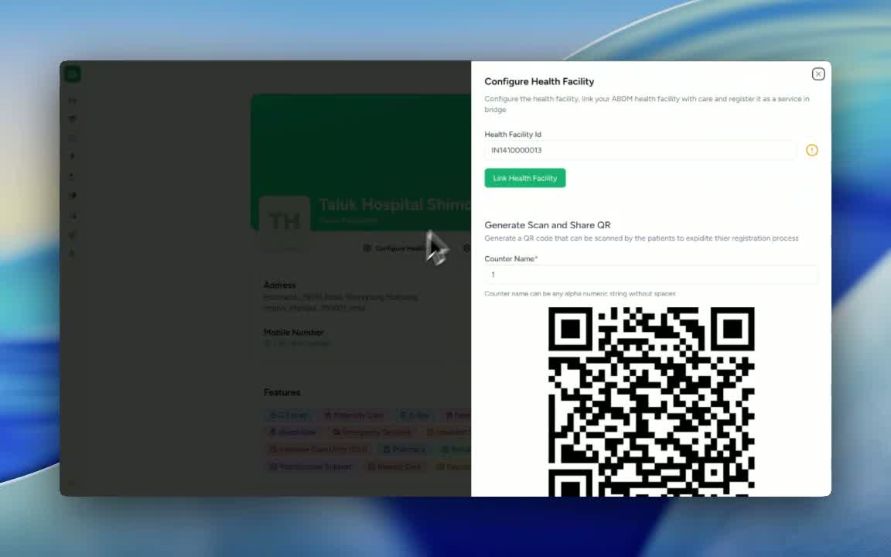

### ObjectiveThis SOP explains how to configure and link the Health Facility ID (HFID) in Care for ABDM through the settings menu. It also covers how to generate and download the health facility QR code after linking is completed.

### Key Steps**1. Open the Health Facility Configuration Settings** [0:02](https://loom.com/share/961dbe90ff8d49098f934386bebb7550?t=2)

- Navigate to **Settings**.

- Select **General**.

- Click **Configure Health Facility**.

- This is the starting point for linking the HFID in Care for ABDM.

**2. Add the Health Facility ID (HFID) and Link the Health Facility to Care** [0:14](https://loom.com/share/961dbe90ff8d49098f934386bebb7550?t=14)

- Enter the **Health Facility ID (HFID)** in the available field.

- Click **Health Facility**.

- Select **Link Health Facility** to complete the linking process.

- Once linked, the system will generate a **QR code** for the health facility.

**3. Download the Generated QR Code** [0:14](https://loom.com/share/961dbe90ff8d49098f934386bebb7550?t=14)

- After the QR code is generated, use the **Download** option to save it.

- If the QR code is already generated, verify that it is available for download.

- Store the downloaded QR code in the appropriate location for future use or display.

### Cautionary Notes
- Ensure the HFID entered is correct before linking the health facility.

- Do not proceed with QR code download until the health facility has been successfully linked.

- If the QR code is already generated, confirm that it matches the correct facility before using it.

### Tips for Efficiency
- Keep the HFID ready before opening the configuration screen to reduce setup time.

- Verify the facility details immediately after linking to avoid rework.

- Download and archive the QR code as soon as it is generated for easy access later.

### Link to Loom[https://loom.com/share/961dbe90ff8d49098f934386bebb7550](https://loom.com/share/961dbe90ff8d49098f934386bebb7550)