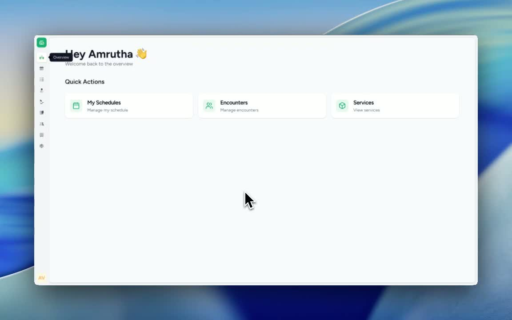
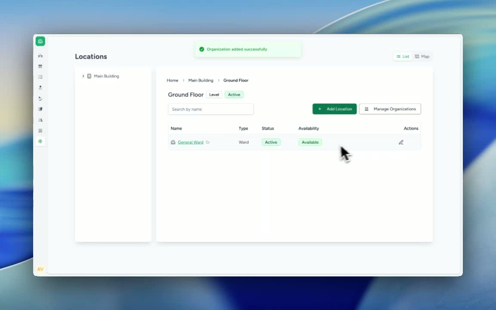

### ObjectiveThis SOP explains how to assign one or more departments to a specific location in Care. It ensures the selected location is properly associated with the required departments for accurate organization setup and management.

### Key Steps**1. Open the Locations Settings** [0:02](https://loom.com/share/11fe8ef4471f4cb29ca167401336d416?t=2)

- Navigate to **Settings**.

- Click **Locations**.

- Select the specific location you want to update (for example, a ward).

**2. Open Manage Organizations for the Selected Location** [0:18](https://loom.com/share/11fe8ef4471f4cb29ca167401336d416?t=18)

- With the location selected, click **Manage Organizations**.

- Review the organization assignment options available for that location.

**3. Select Multiple Departments to Link** [0:18](https://loom.com/share/11fe8ef4471f4cb29ca167401336d416?t=18)

- Choose **All Organizations** or the relevant organization list.

- Select the departments you want to link to the location.

- Example: add **General Surgery** and **Cardiology** to the same ward.

**4. Confirm the Departments Are Linked** [0:36](https://loom.com/share/11fe8ef4471f4cb29ca167401336d416?t=36)

- Verify that all selected departments now appear under the chosen location.

- Confirm the location is associated with multiple departments as intended.

- Save or exit if the system requires confirmation.

### Cautionary Notes
- Ensure you are editing the correct location before assigning departments.

- Double-check department selections to avoid linking the wrong organization to a ward.

- If the system requires a save/confirm action, complete it before leaving the page.

### Tips for Efficiency
- Prepare the list of departments in advance before opening the location settings.

- Use the organization selection screen to add multiple departments in one session instead of repeating the process.

- Verify the final assignment immediately after saving to reduce correction time later.

### Link to Loom[https://loom.com/share/11fe8ef4471f4cb29ca167401336d416](https://loom.com/share/11fe8ef4471f4cb29ca167401336d416)