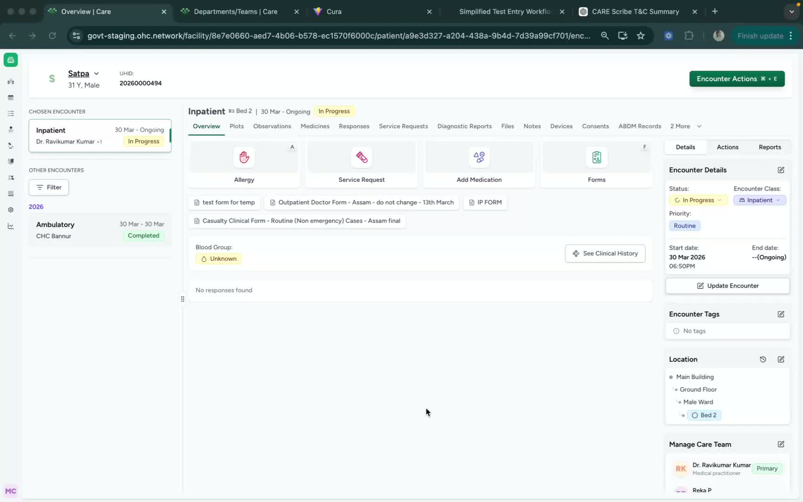
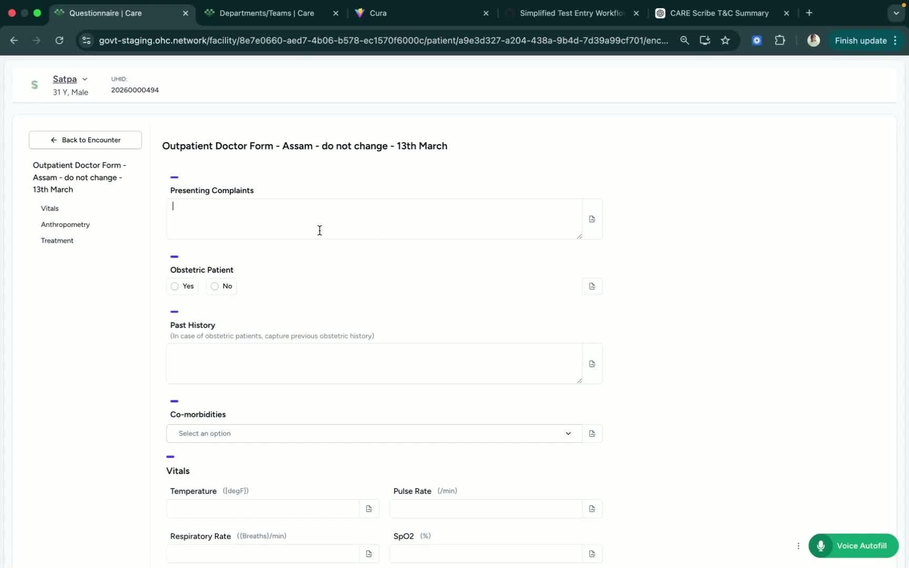
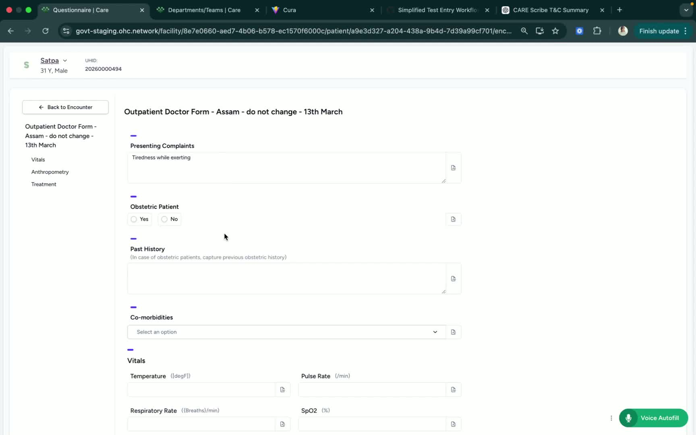
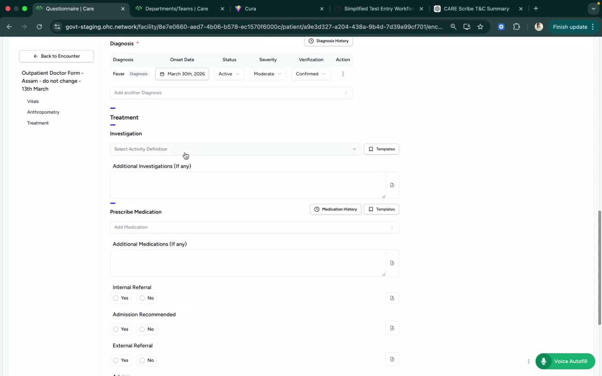
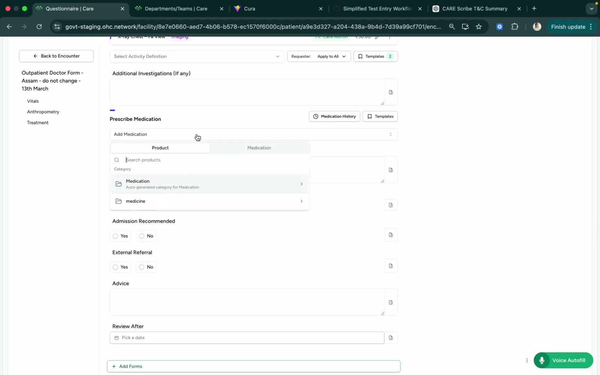

### ObjectiveThis SOP explains how to complete and submit clinical forms from the patient encounter page. It guides the user through opening the form, entering required clinical details, adding investigations and treatment information, and submitting the completed form.

### Key Steps**1. Open the Clinical Forms Section** [0:02](https://loom.com/share/62743f5ebd3a4d95a34caf77d4bc4b53?t=2)

- From the patient encounter page, click **Forms**.

- You can also use the shortcut key **F** to open the forms section quickly.

- Confirm that the clinical form you need is available before proceeding.

**2. Enter the Required Patient Details** [0:32](https://loom.com/share/62743f5ebd3a4d95a34caf77d4bc4b53?t=32)

- Fill in the necessary patient details in the form.

- You may either:

Type the information manually, or

- Use **AIScribe** if available.

- Ensure the entered information is accurate and complete before moving to the next section.

**3. Document Clinical History and Current Findings** [0:46](https://loom.com/share/62743f5ebd3a4d95a34caf77d4bc4b53?t=46)

- Add the patient’s **past history**.

- Include any **comorbidities**.

- Record **vitals**.

- Enter the **diagnosis**, if one is available.

- Select the appropriate verification status:

**Provisional**

- **Differential**

- **Confirmed**

**4. Add Investigation Suggestions** [1:38](https://loom.com/share/62743f5ebd3a4d95a34caf77d4bc4b53?t=98)

- Enter any recommended investigations based on the patient’s condition.

- Include tests or procedures as needed.

- Example entries from the transcript include:

**Complete Blood Count (CBC)**

- **Chest X-ray**

- Make sure the investigation list matches the clinical assessment.

**5. Prescribe Medication and Add Referral or Admission Details** [1:54](https://loom.com/share/62743f5ebd3a4d95a34caf77d4bc4b53?t=114)

- Add any prescribed medication.

- Specify the **dosage** and **frequency**.

- Enter the **number of days** for the prescription, if applicable.

- Add any **internal reference** if needed.

- Indicate whether **admission is needed**.

- Add any **external reference** if required.

- Include **advice** and set the **review date**, such as after three days.

- Once all fields are complete, submit the form.

### Cautionary Notes
- Ensure all clinical information is accurate before submitting.

- Verify whether the diagnosis should be marked as provisional, differential, or confirmed.

- Double-check medication dosage, frequency, and duration to avoid prescribing errors.

### Tips for Efficiency
- Use the **F** shortcut to open Forms faster.

- Use **AIScribe(tool for transcribing voice to text for automatic data updation)** if available to speed up documentation.

- Enter information in a consistent order: history, vitals, diagnosis, investigations, then treatment.

- Review the form once before submission to reduce errors and rework.

### Link to Loom[https://loom.com/share/62743f5ebd3a4d95a34caf77d4bc4b53](https://loom.com/share/62743f5ebd3a4d95a34caf77d4bc4b53)