### ObjectiveThis SOP explains how to create and organize facility locations in Care, including buildings, floors, wards, rooms, beds, and organizational assignments. It ensures the facility hierarchy is accurate so beds, departments, and services can be managed efficiently.

### Key Steps**1. Prepare to Configure Facility Locations** [0:30](https://loom.com/share/65478bd0980649cf83a50a8cbcc94675?t=30)

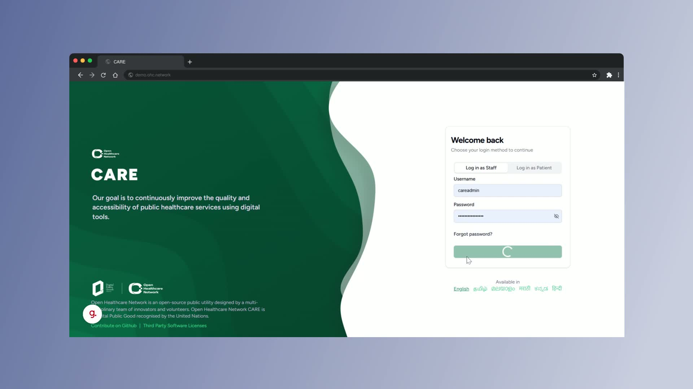
- Confirm you have valid access credentials and the correct admin permissions.

- Review the facility structure you need to build before making changes.

- Log in to Care as the facility admin.

**2. Open Facility Configuration Settings** [0:41](https://loom.com/share/65478bd0980649cf83a50a8cbcc94675?t=41)

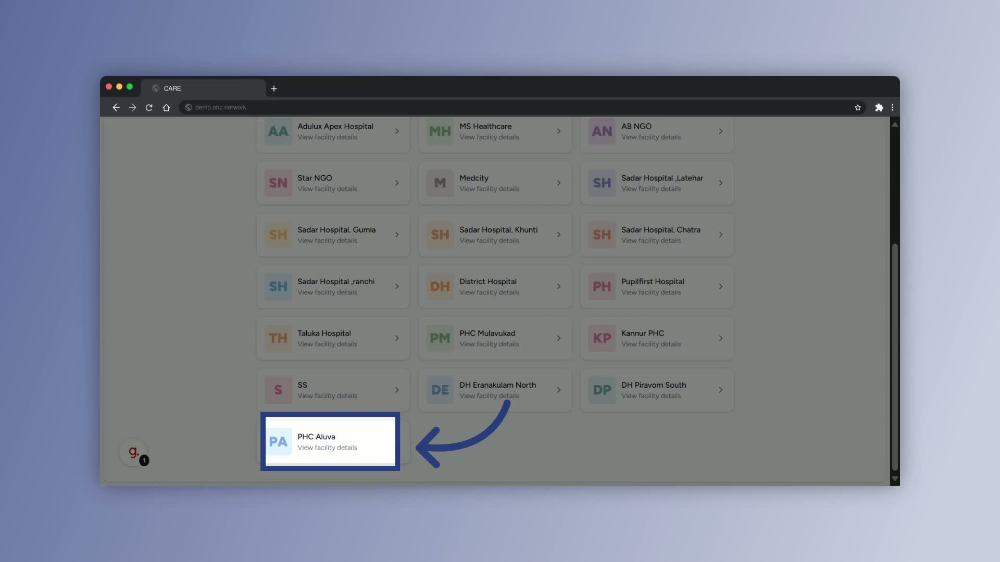
- Go to the **Facility Details** section.

- Open the **Settings** menu.

- Select **Manage Facility Configurations** to access location settings.

**3. Open the Locations Module and Start a New Location** [0:51](https://loom.com/share/65478bd0980649cf83a50a8cbcc94675?t=51)

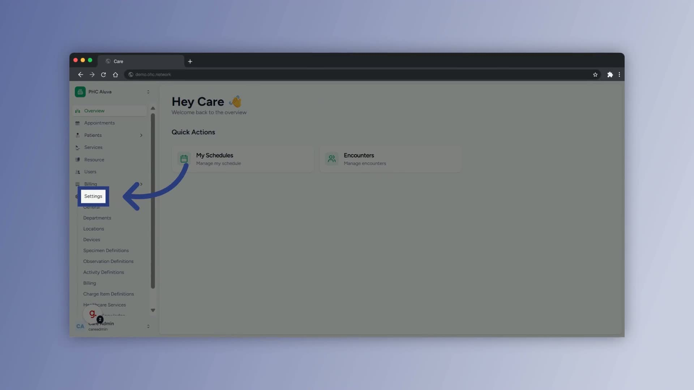
- Select **Locations** to view existing facility locations.

- Click **Add Location** to begin creating a new entry.

- Choose the correct location category based on what you are adding.

**4. Create the Main Building** [1:03](https://loom.com/share/65478bd0980649cf83a50a8cbcc94675?t=63)

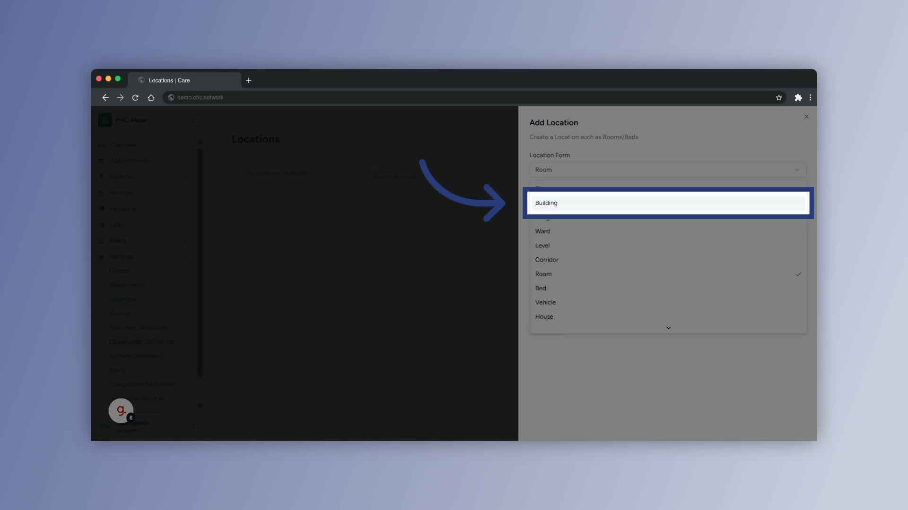
- Select the **Building** category.

- Enter a clear, descriptive building name such as **Main Building** or **Primary Structure**.

- Confirm the creation to add the building to the hierarchy.

**5. Add Floors or Levels Under the Building** [1:24](https://loom.com/share/65478bd0980649cf83a50a8cbcc94675?t=84)

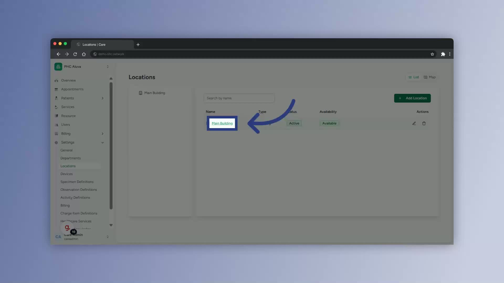
- Open the newly created building.

- Add a new location within the building.

- Select the **Level** category to create a floor or level.

- Enter a clear level name such as **Ground Floor** or **First Floor**.

- Confirm the creation and repeat as needed for additional floors.

**6. Add Additional Floors to Complete the Building Structure** [1:58](https://loom.com/share/65478bd0980649cf83a50a8cbcc94675?t=118)

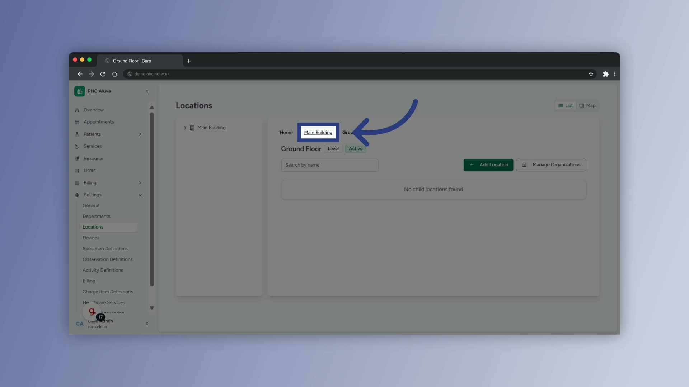
- Return to the main building level.

- Add another **Level** entry for each additional floor.

- Use consistent naming such as **First Floor** and **Second Floor**.

- Confirm each level so it appears correctly in the building hierarchy.

**7. Add Rooms or Functional Areas on the Ground Floor** [2:45](https://loom.com/share/65478bd0980649cf83a50a8cbcc94675?t=165)

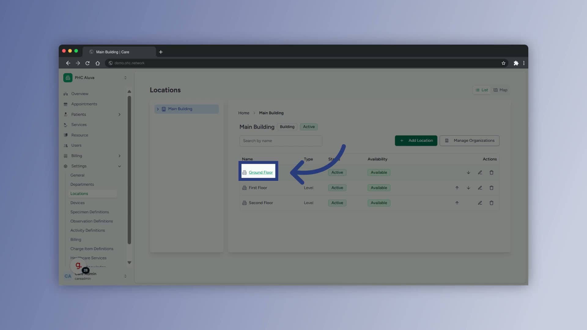
- Open the **Ground Floor** level.

- Add a new location within that floor.

- Select the appropriate category or area type for the space.

- Enter a descriptive name such as **Outpatient Pharmacy**.

- Confirm the creation to save the area.

**8. Add More Ground Floor Areas** [3:21](https://loom.com/share/65478bd0980649cf83a50a8cbcc94675?t=201)

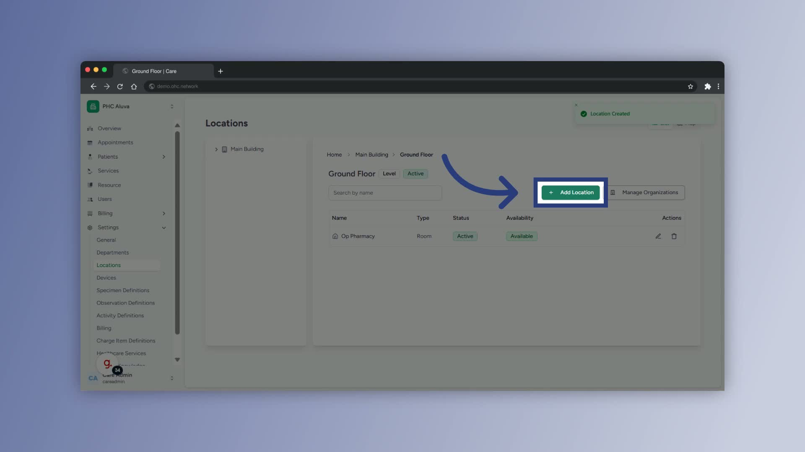
- Add another location within the **Ground Floor**.

- Select the correct area type or category.

- Enter a clear name such as **Outpatient Department**.

- Confirm the creation to include the room or area in the layout.

**9. Add a Ward on the Ground Floor** [3:39](https://loom.com/share/65478bd0980649cf83a50a8cbcc94675?t=219)

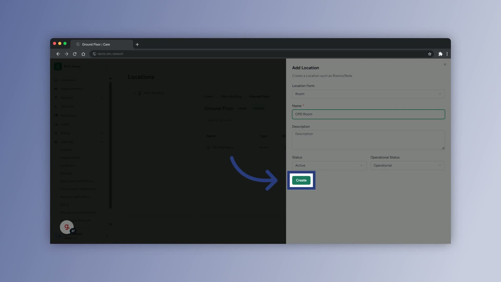
- Add an additional location within the **Ground Floor**.

- Enter the name of the ward or area.

- Use a descriptive label such as **Outpatient Ward**.

- Confirm the creation to save the ward.

**10. Add a Department or Ward on the First Floor** [3:58](https://loom.com/share/65478bd0980649cf83a50a8cbcc94675?t=238)

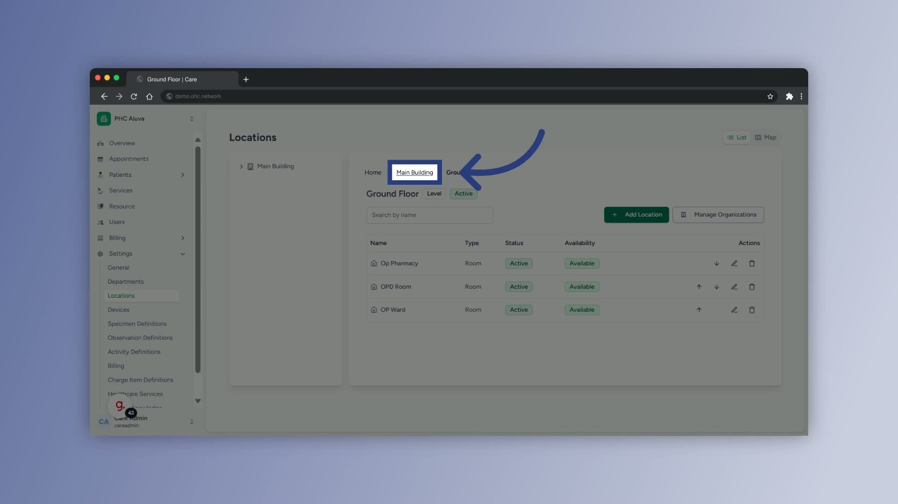
- Navigate back to the main building and open the **First Floor**.

- Add a new location within that floor.

- Select the appropriate category, such as **Ward**.

- Enter a department or area name such as **Cardiology**.

- Confirm the creation to add it to the first floor.

**11. Add Beds Within a Ward** [4:34](https://loom.com/share/65478bd0980649cf83a50a8cbcc94675?t=274)

- Open the **Cardiology** ward.

- Add a new location within the ward.

- Select the **Bed** category to create patient bed locations.

- Choose the option to create **multiple beds** if adding several at once.

- Enter a base name for the beds to keep naming consistent.

- Confirm the creation to add the beds.

**12. Assign an Organization to the Location** [5:08](https://loom.com/share/65478bd0980649cf83a50a8cbcc94675?t=308)

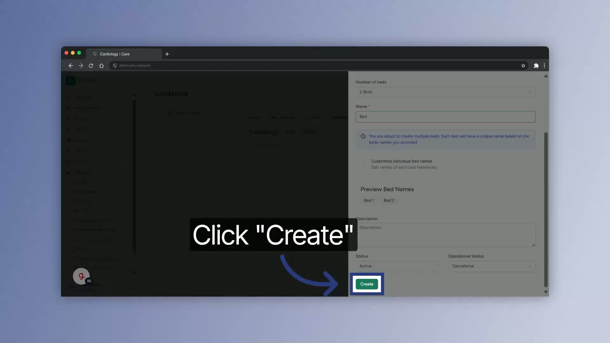
- Return to the **Cardiology** ward.

- Open **Manage Organization**.

- Select the department assignment option.

- Choose the **Cardiology** department to link it to the location.

- Save or confirm the assignment before exiting.

**13. Log Out and Verify the Facility Hierarchy** [5:22](https://loom.com/share/65478bd0980649cf83a50a8cbcc94675?t=322)

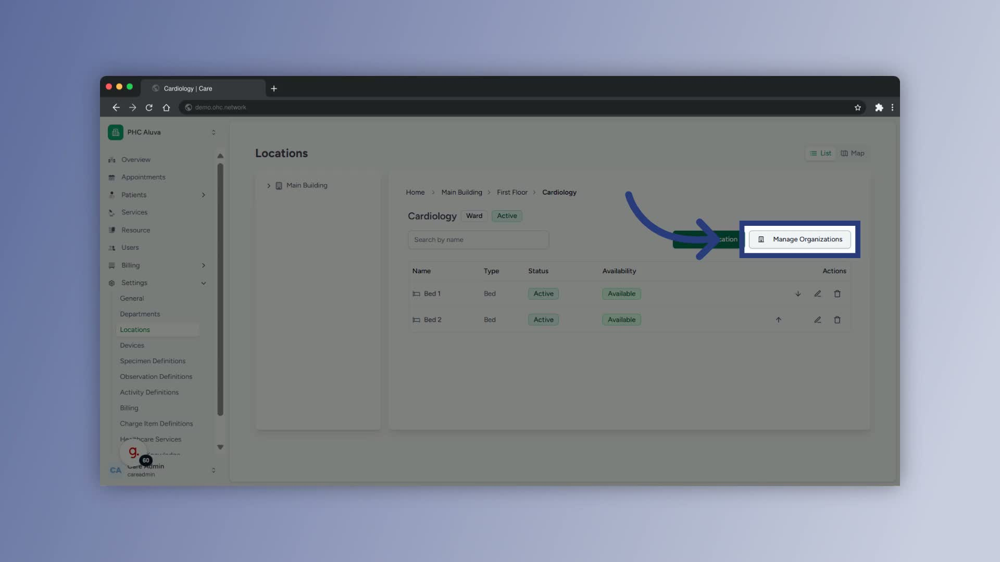
- Log out of the system securely after completing all updates.

- Review the facility hierarchy to ensure buildings, floors, wards, rooms, and beds are correctly placed.

- Practice in a test environment before making live changes.

### Cautionary Notes
- **Do not** create locations without confirming the correct parent level first.

- Use consistent naming conventions to avoid confusion later.

- Verify each creation before moving to the next step to prevent hierarchy errors.

- Only assign organizations to the correct location to avoid reporting and operational issues.

### Tips for Efficiency
- Plan the full facility hierarchy on paper or in a spreadsheet before entering data.

- Use clear, standardized names such as floor numbers, ward names, and department names.

- Add multiple beds at once when the system allows it to save time.

- Build and test the structure in a non-production environment first.

- Review the hierarchy after each major section to catch mistakes early.

### Link to Loom[https://loom.com/share/65478bd0980649cf83a50a8cbcc94675](https://loom.com/share/65478bd0980649cf83a50a8cbcc94675)