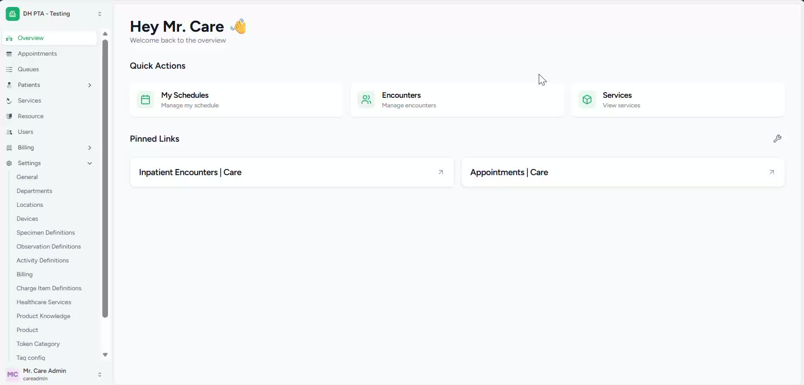
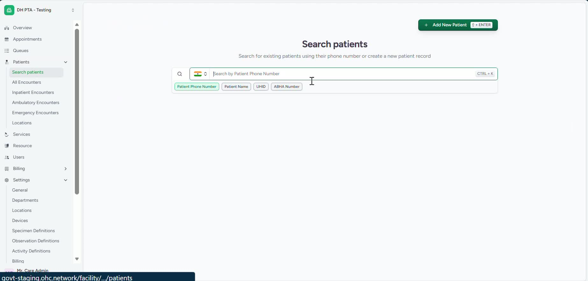
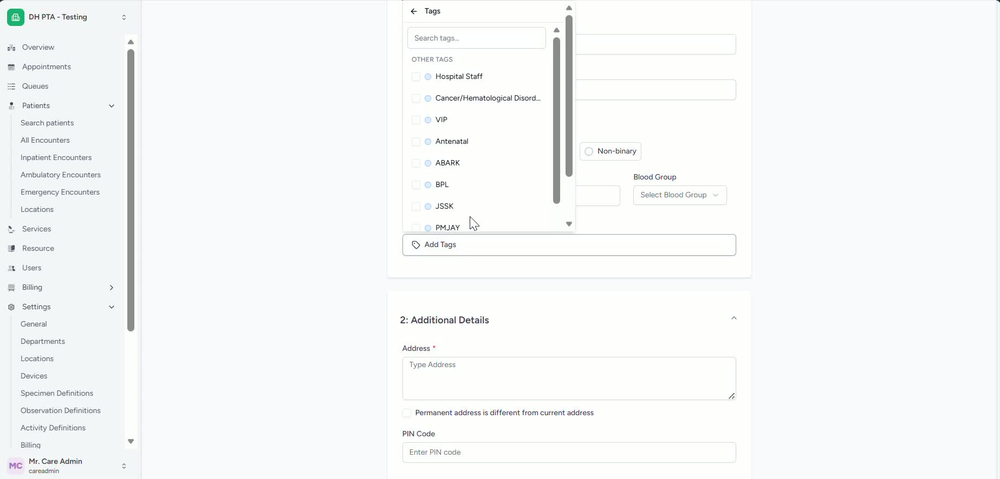
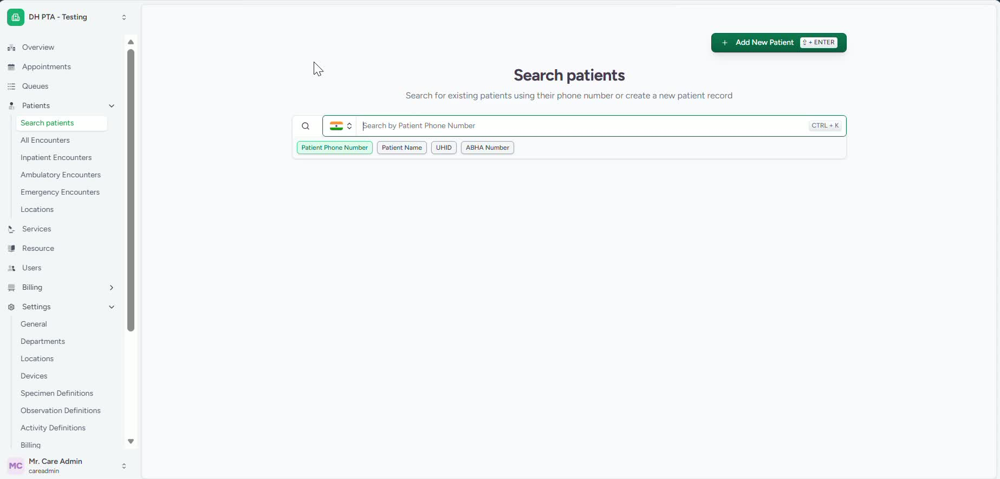
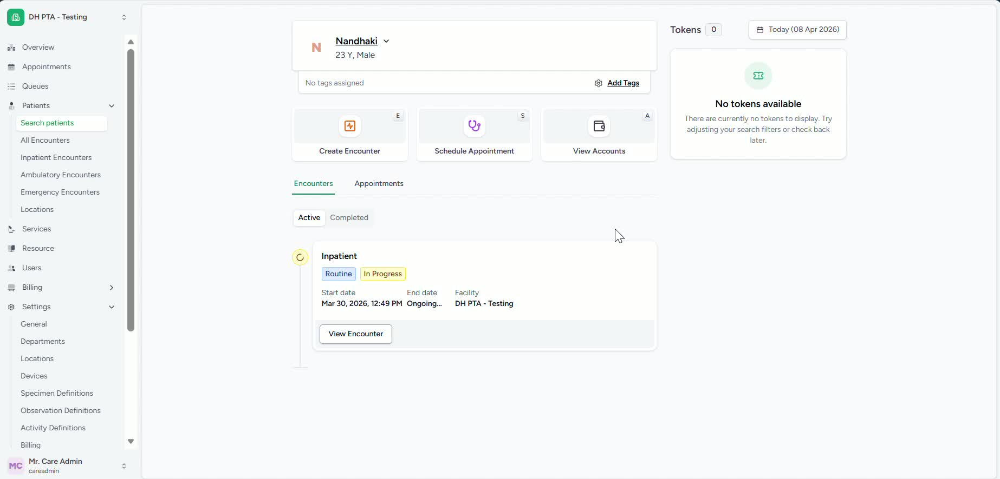

### ObjectiveTo guide registration staff in locating and selecting the correct patient tags during new patient registration or after registration via scan-and-share workflows. This ensures the patient record is assigned the appropriate tax category accurately and consistently.

### Key Steps**1. Open the Patient Search/Registration Area** [0:00](https://loom.com/share/04346009549e48c18decad287c6023fd?t=0)

- Log in using your registration staff credentials.

- Navigate to **Patients**.

- Select **Search Patient** to access the patient registration workflow.

- Confirm you are in the correct registration screen before proceeding.

**2. Start a New Patient Registration** [0:10](https://loom.com/share/04346009549e48c18decad287c6023fd?t=10)

- Click **New Patients** to begin manual patient registration.

- Enter the patient’s details as required.

- Locate the **Patient tags** option under the **Date of Birth** field.

- Review the available tax options shown in the drop-down list.

**3. Choose the Correct Patient Tax** [0:19](https://loom.com/share/04346009549e48c18decad287c6023fd?t=19)

- Open the **Patient tags** drop-down.

- Select the tax category that applies to the patient.

- Verify the selected tax matches the patient’s eligibility or registration requirements.

- Continue with the remaining registration steps after confirming the selection.

**4. Review Patient Tax After Registration or via Scan-and-Share** [0:30](https://loom.com/share/04346009549e48c18decad287c6023fd?t=30)

- If the patient was registered through **Scan and Share**, open the patient’s registration window.

- Locate the **iTax** option in the registration view.

- Confirm that the patient tax options are available in this section as well.

- Use this area to review the patient’s tax assignment after registration.

**5. Select Tags from the Add Tags List** [0:48](https://loom.com/share/04346009549e48c18decad287c6023fd?t=48)

- Click the **Add Tags** option.

- Review the list of available patient taxes.

- Select the appropriate tax from the list.

- Save or proceed according to the registration workflow to ensure the tax is applied correctly.

### Cautionary Notes
- Ensure the selected tax is correct before completing registration, as incorrect tax assignment may affect billing or eligibility.

- Use the tax options provided by the hospital only; do not enter unsupported or custom values.

- For Scan-and-Share registrations, confirm you are viewing the correct patient record before making changes.

- If the expected tax option is not visible, follow internal escalation or support procedures.

### Tips for Efficiency
- Familiarize yourself with the hospital’s available tax categories to speed up selection.

- Verify patient details first so you can choose the correct tags without backtracking.

- Use the iTax view for quick review when checking tax assignment after registration.

- Keep the registration screen organized by completing tax selection immediately after entering patient details.

### Link to Loom[https://loom.com/share/04346009549e48c18decad287c6023fd](https://loom.com/share/04346009549e48c18decad287c6023fd)