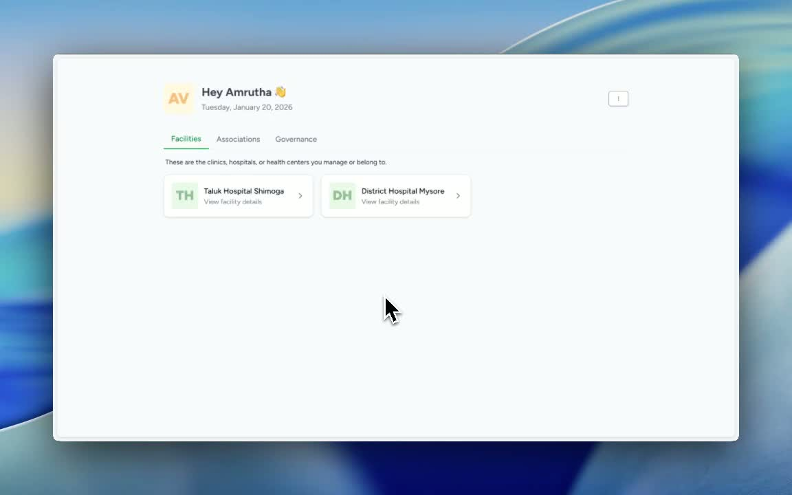
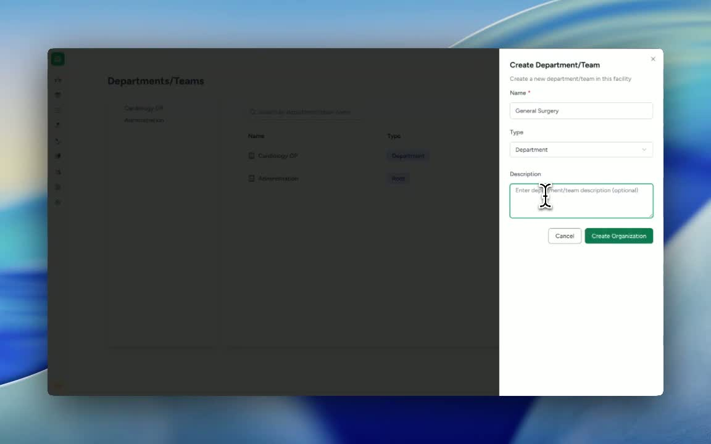

### ObjectiveThis SOP explains how to create a new department within Care. Follow these steps to ensure the department is added correctly and can be used by your facility team.

### Key Steps**1. Select the relevant Facility** [0:02](https://loom.com/share/f69d4dcdfd08471a85bfd3b1d753c39e?t=2)

- Login to **Care** and **select your facility** first.

- Confirm you are working in the correct location before making any changes.

**2. Open Department Settings** [0:02](https://loom.com/share/f69d4dcdfd08471a85bfd3b1d753c39e?t=2)

- Go to **Settings**.

- Select **Departments** from the available options.

- This is where department and team records are managed.

**3. Add a New Department/Team** [0:02](https://loom.com/share/f69d4dcdfd08471a85bfd3b1d753c39e?t=2)

- Click **Add Department / Team**.

- Enter the **name of the relevant department**.

- Add a **description** if needed to clarify the department’s purpose.

**4. Create the Department** [0:26](https://loom.com/share/f69d4dcdfd08471a85bfd3b1d753c39e?t=26)

- Click **Create Organization** to save the new department.

- Wait for the confirmation message that the department was created successfully.

### Cautionary Notes
- **Verify the facility** before creating the department to avoid adding it to the wrong location.

- Ensure the **department name is accurate and consistent** with your organization’s naming conventions.

- If a description is entered, keep it clear and relevant so team members understand the department’s purpose.

### Tips for Efficiency
- Prepare the **department name and description** before starting to save time.

- Use a **standard naming format** across all departments for easier searching and reporting.

- After creation, **confirm the success message** before navigating away from the page.

### Link to Loom[https://loom.com/share/f69d4dcdfd08471a85bfd3b1d753c39e](https://loom.com/share/f69d4dcdfd08471a85bfd3b1d753c39e)